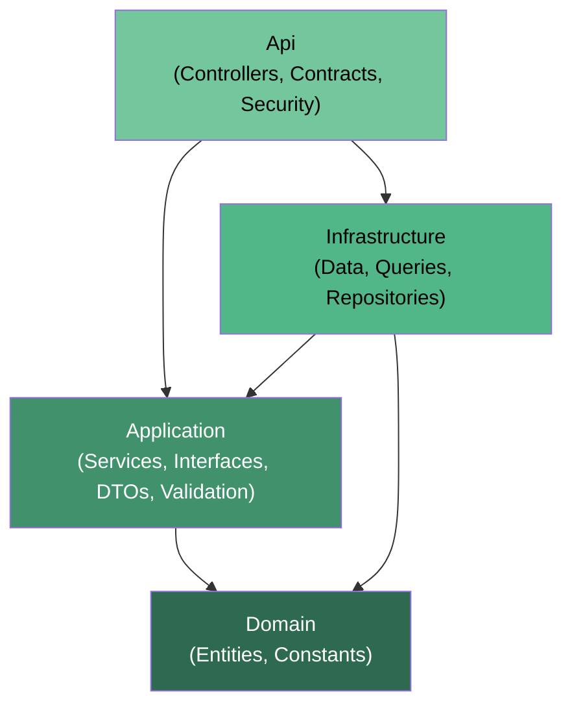
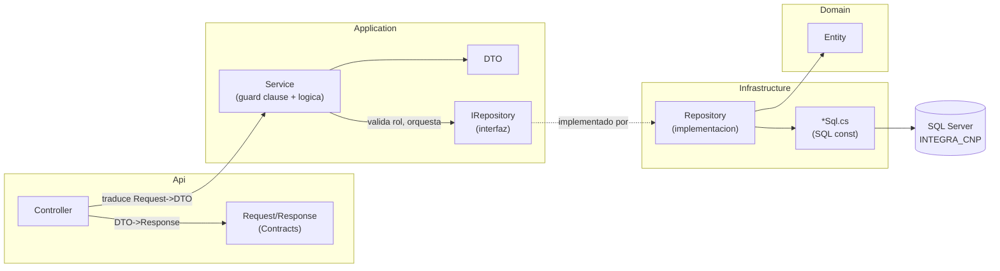
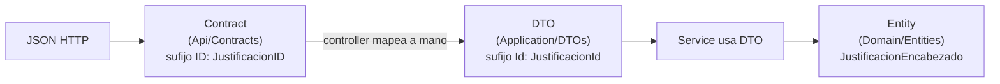

## En breve

El backend de SIFCNP (proyecto `IntegradorMarcas`) esta organizado con **Clean Architecture**: una forma de partir el codigo en capas donde las reglas del negocio (que es una boleta, quien puede aprobarla) quedan separadas de los detalles tecnicos (SQL Server, HTTP, headers). La idea practica es que cambiar un detalle tecnico (por ejemplo, pasar de SQL Server a otra base) no obligue a tocar las reglas del negocio. Son cuatro proyectos `.csproj` (`Domain`, `Application`, `Infrastructure`, `Api`) que dependen unos de otros siempre **hacia adentro**, hacia el centro donde vive el negocio.

> 📌 En la practica: si manana cambia el motor de base de datos o la forma de autenticar, idealmente solo se toca la capa de afuera (`Infrastructure` o `Api`); el corazon de las reglas (`Domain` y `Application`) queda intacto.

## Que es Clean Architecture y por que se usa aca

Clean Architecture es un patron de organizacion de codigo en circulos concentricos. El principio que lo gobierna es la **regla de dependencia**: el codigo de afuera (detalles, frameworks, base de datos) puede conocer y depender del codigo de adentro (reglas del negocio), **pero nunca al reves**. El centro no sabe que existe SQL Server, ni HTTP, ni Dapper.

En este proyecto eso se materializa en cuatro proyectos `.csproj`, y la regla de dependencia se hace cumplir a nivel de `<ProjectReference>` en cada archivo de proyecto. Si alguien intenta que `Domain` referencie `Infrastructure`, el `.csproj` no lo permite porque esa referencia no existe (y agregarla seria una violacion visible).

La descripcion canonica del proyecto esta en [CLAUDE.md](../CLAUDE.md), seccion "Arquitectura":

```
Domain          (entidades, constantes; SIN referencias)
   ^
Application      (DTOs, Interfaces, Services, Validation, Common) -> Domain
   ^
Infrastructure   (Data, Queries, Repositories)                    -> Domain + Application
   ^
Api              (Controllers, Contracts, Security)               -> Application + Infrastructure
```

> 💡 Tip de lectura del diagrama: la flecha `^` significa "depende de lo de abajo". `Api` depende de `Application` + `Infrastructure`; `Application` depende solo de `Domain`; `Domain` no depende de nadie.

## Las cuatro capas

Cada capa es un proyecto `.csproj` bajo `backend/src/`. Esta es la responsabilidad de cada una y a quien referencia, verificado contra los archivos de proyecto reales.

| Capa (proyecto) | Que contiene | A quien referencia | Verificado en |
| --- | --- | --- | --- |
| **Domain** | Entidades de negocio (`JustificacionEncabezado`, `JustificacionDetalle`), constantes (`RolesSistema`, `EstadoIds`) | A nadie (cero `ProjectReference`) | [IntegradorMarcas.Domain.csproj](../backend/src/IntegradorMarcas.Domain/IntegradorMarcas.Domain.csproj) |
| **Application** | DTOs, Interfaces, Services, Validation, Common (`AppException`) | `Domain` | [IntegradorMarcas.Application.csproj:3-5](../backend/src/IntegradorMarcas.Application/IntegradorMarcas.Application.csproj) |
| **Infrastructure** | Acceso a datos (`Data`, `Queries`, `Repositories`); paquetes Dapper + SqlClient | `Domain` + `Application` | [IntegradorMarcas.Infrastructure.csproj:3-6](../backend/src/IntegradorMarcas.Infrastructure/IntegradorMarcas.Infrastructure.csproj) |
| **Api** | Controllers, Contracts (Requests/Responses), Security (headers); SDK Web + Swagger | `Application` + `Infrastructure` | [IntegradorMarcas.Api.csproj:14-17](../backend/src/IntegradorMarcas.Api/IntegradorMarcas.Api.csproj) |

Los cuatro proyectos target `net8.0` con `Nullable` e `ImplicitUsings` habilitados (ver cualquiera de los `.csproj`). No hay archivo `.sln`: cada comando `dotnet` apunta a un `.csproj` explicito (ver [CLAUDE.md](../CLAUDE.md), "Comandos esenciales").

### Domain — el corazon del negocio

Lo que NO cambia aunque cambie la tecnologia. Aca viven las entidades como [JustificacionEncabezado.cs](../backend/src/IntegradorMarcas.Domain/Entities/JustificacionEncabezado.cs) y [JustificacionDetalle.cs](../backend/src/IntegradorMarcas.Domain/Entities/JustificacionDetalle.cs), y las constantes del dominio como los roles ([RolesSistema.cs](../backend/src/IntegradorMarcas.Domain/Constants/RolesSistema.cs)) y los IDs de estado ([EstadoIds.cs](../backend/src/IntegradorMarcas.Domain/Constants/EstadoIds.cs)). Su `.csproj` no tiene ningun `ProjectReference`: es el unico proyecto que no depende de nada. Detalle completo en [Modulo Dominio](modulo-dominio.html).

### Application — los casos de uso y las reglas

Coordina el flujo del negocio (crear boleta, aprobar, listar historico) y define **las interfaces** (los contratos) que la capa de afuera debe implementar. Contiene:

- **Services** (`JustificacionService`, `AdminAprobacionesService`, `AdminOrganizacionService`): orquestan cada caso de uso.
- **Interfaces** (`IJustificacionRepository`, `IUserContext`, `IErrorLogRepository`, etc.): los contratos.
- **DTOs**: objetos de transporte entre capas.
- **Validation** (`JustificacionValidator`) y **Common** (`AppException`).

Solo referencia `Domain`. Detalle completo en [Modulo Application](modulo-application.html).

### Infrastructure — los detalles tecnicos de datos

La implementacion concreta de "como hablar con SQL Server". Aca viven los repositorios (`JustificacionRepository`, `AdminAprobacionesRepository`, ...), la fabrica de conexiones (`SqlConnectionFactory`) y **todo el SQL** como `const string` en `Queries/*Sql.cs` (por ejemplo [JustificacionesSql.cs](../backend/src/IntegradorMarcas.Infrastructure/Queries/JustificacionesSql.cs)). Trae los paquetes `Dapper` 2.1.72 y `Microsoft.Data.SqlClient` 7.0.0 ([IntegradorMarcas.Infrastructure.csproj:8-12](../backend/src/IntegradorMarcas.Infrastructure/IntegradorMarcas.Infrastructure.csproj)). Detalle completo en [Modulo Infraestructura](modulo-infraestructura.html).

> 📌 Dapper es un "micro-ORM": una libreria liviana que ejecuta tu SQL escrito a mano y mapea las filas resultantes a objetos C#, sin generar SQL por vos (a diferencia de Entity Framework). Aca se eligio justamente para tener control total del SQL. Ver el glosario.

### Api — la puerta de entrada HTTP

El borde mas externo: recibe peticiones HTTP, traduce, delega a `Application` y devuelve respuestas. Contiene los Controllers, los Contracts (la forma exacta del JSON que viaja por el cable) y la seguridad por headers (`HeaderUserContext`). Es el unico proyecto con SDK `Microsoft.NET.Sdk.Web` ([IntegradorMarcas.Api.csproj:1](../backend/src/IntegradorMarcas.Api/IntegradorMarcas.Api.csproj)) y referencia tanto `Application` como `Infrastructure`. Detalle completo en [Modulo API](modulo-api.html).

## Diagrama de dependencias entre proyectos



> 💡 Notese que todas las flechas apuntan hacia `Domain` (directa o indirectamente). Ese es el "hacia adentro" de la regla de dependencia. `Domain` no tiene ninguna flecha saliente.

## Donde viven las interfaces y por que (inversion de dependencias)

Aca esta la parte que mas confunde al principio. Las interfaces como `IJustificacionRepository` se definen en **`Application/Interfaces`**, pero su implementacion concreta (`JustificacionRepository`) vive en **`Infrastructure`**, una capa mas afuera.

¿Por que la interfaz no esta donde esta su implementacion? Porque asi se logra la **inversion de dependencias**: en vez de que `Application` dependa de `Infrastructure` (lo cual romperia la regla, porque el negocio dependeria de un detalle tecnico), es `Infrastructure` la que depende de `Application` para implementar un contrato que el negocio definio.

> 📌 En lenguaje sencillo: el negocio dice "necesito algo que sepa guardar una justificacion y me cumpla ESTE contrato" (`IJustificacionRepository`). No le importa si por debajo es SQL Server, un archivo o memoria. La capa de afuera provee la implementacion concreta. El negocio depende de la abstraccion, no del detalle.

Las interfaces que se definen en [Application/Interfaces/](../backend/src/IntegradorMarcas.Application/Interfaces/IJustificacionRepository.cs) incluyen:

| Interfaz | Definida en | Implementada en |
| --- | --- | --- |
| `IJustificacionRepository` | Application/Interfaces | Infrastructure/Repositories ([JustificacionRepository.cs](../backend/src/IntegradorMarcas.Infrastructure/Repositories/JustificacionRepository.cs)) |
| `IAdminAprobacionesRepository` | Application/Interfaces | Infrastructure/Repositories ([AdminAprobacionesRepository.cs](../backend/src/IntegradorMarcas.Infrastructure/Repositories/AdminAprobacionesRepository.cs)) |
| `IAdminOrganizacionRepository` | Application/Interfaces | Infrastructure/Repositories ([AdminOrganizacionRepository.cs](../backend/src/IntegradorMarcas.Infrastructure/Repositories/AdminOrganizacionRepository.cs)) |
| `IErrorLogRepository` | Application/Interfaces | Infrastructure/Repositories ([ErrorLogRepository.cs](../backend/src/IntegradorMarcas.Infrastructure/Repositories/ErrorLogRepository.cs)) |
| `IAuditEventRepository` | Application/Interfaces | Infrastructure/Repositories ([AuditEventRepository.cs](../backend/src/IntegradorMarcas.Infrastructure/Repositories/AuditEventRepository.cs)) |
| `IAdminActionAuditRepository` | Application/Interfaces | Infrastructure/Repositories ([AdminActionAuditRepository.cs](../backend/src/IntegradorMarcas.Infrastructure/Repositories/AdminActionAuditRepository.cs)) |
| `IUserContext` | Application/Interfaces ([IUserContext.cs](../backend/src/IntegradorMarcas.Application/Interfaces/IUserContext.cs)) | **Api**/Security ([HeaderUserContext.cs](../backend/src/IntegradorMarcas.Api/Security/HeaderUserContext.cs)) |
| `IJustificacionService` y los `IAdmin*Service` | Application/Interfaces | Application/Services |

Fijate un detalle interesante: `IUserContext` se implementa en **`Api`**, no en `Infrastructure`. Tiene sentido porque saber "quien es el usuario" depende de leer headers HTTP, y eso solo lo conoce la capa web. Asi la logica del negocio recibe un `UserContextInfo` ya resuelto sin tener idea de que vino de un header. Ver [Seguridad](seguridad.html).

### El pegamento: inyeccion de dependencias en Program.cs

Las interfaces y sus implementaciones se "casan" en un solo lugar: el contenedor de inyeccion de dependencias en [Program.cs:62-72](../backend/src/IntegradorMarcas.Api/Program.cs). Inyeccion de dependencias (DI) es el mecanismo por el cual una clase recibe lo que necesita ya construido, en vez de crearlo ella misma.

```cs
builder.Services.AddScoped<ISqlConnectionFactory, SqlConnectionFactory>();
builder.Services.AddScoped<IJustificacionRepository, JustificacionRepository>();
builder.Services.AddScoped<IJustificacionService, JustificacionService>();
// ...
builder.Services.AddScoped<IUserContext, HeaderUserContext>();
builder.Services.AddScoped<IErrorLogRepository, ErrorLogRepository>();
```

Cada linea dice "cuando alguien pida esta interfaz, entregale esta implementacion concreta". Todos registrados como `Scoped` (una instancia por peticion HTTP). Asi `JustificacionService` recibe su `IJustificacionRepository` por constructor sin saber cual implementacion le toco ([JustificacionService.cs:11-18](../backend/src/IntegradorMarcas.Application/Services/JustificacionService.cs)).

## Limites entre modulos

Cada agregado de negocio tiene su columna vertical completa que cruza las capas, pero respetando los limites:



Reglas de correspondencia que se respetan en todo el codigo:

- Un Controller por area (`JustificacionesController`, `JefaturaController`, `RrhhController`, `AdminAprobacionesController`, `AdminOrganizacionController`, mas `SessionController` y `AdminMonitoringController`).
- Un Service por caso de uso, con su interfaz en `Application/Interfaces`.
- Un Repository `sealed` por agregado, con su `*Sql.cs` hermano en `Infrastructure/Queries`.
- El SQL **no** vive en los repositorios ni en los controllers (con dos excepciones documentadas: `AdminMonitoringController` y `SessionController` llevan SQL inline; ver [CLAUDE.md](../CLAUDE.md), "Acceso a datos").

## Decisiones de diseno (ADR) ya documentadas

El proyecto documenta varias decisiones arquitectonicas (ADR = registro de decision de arquitectura) en [CLAUDE.md](../CLAUDE.md). Resumen con su justificacion practica:

| Decision | Que se eligio | Por que (practico) |
| --- | --- | --- |
| **Sin EF Core** | ADO.NET crudo + Dapper ([Infrastructure.csproj:8-12](../backend/src/IntegradorMarcas.Infrastructure/IntegradorMarcas.Infrastructure.csproj)) | Control total del SQL; sin "magia" de un ORM pesado que genere consultas opacas |
| **SQL como `const string`** | Todo el SQL vive en `Queries/*Sql.cs` ([JustificacionesSql.cs](../backend/src/IntegradorMarcas.Infrastructure/Queries/JustificacionesSql.cs)) | El SQL queda centralizado, revisable y separado de la logica C# del repositorio |
| **Identidad por headers** | `X-User-Id` / `X-User-Role` via `IUserContext` -> `HeaderUserContext`, sin JWT/cookies ([HeaderUserContext.cs](../backend/src/IntegradorMarcas.Api/Security/HeaderUserContext.cs)) | Simplicidad para MVP/demo; el backend confia en los headers. Inseguro a proposito, ver [Seguridad](seguridad.html) |
| **Clases `sealed` por defecto** | Controllers, services, repositories, entities, DTOs, exceptions ([JustificacionService.cs:9](../backend/src/IntegradorMarcas.Application/Services/JustificacionService.cs)) | Evita herencia accidental; intencion clara. Unica excepcion: `SessionController` |
| **Sin AutoMapper** | Mapeo manual Request->DTO->Response con object initializers en los controllers | Sin libreria intermedia; el mapeo es explicito y trazable |
| **Modelo de objetos en 3 niveles** | Contracts (Api) <-> DTOs (Application) <-> Entities (Domain) | Cada capa tiene su propia forma; cambiar el wire JSON no contamina el dominio |
| **Sin `.sln`** | Comandos `dotnet` con `.csproj` explicito | Build/test deben apuntar al proyecto exacto; ver gotchas en [CLAUDE.md](../CLAUDE.md) |
| **Autorizacion en services, no `[Authorize]`** | Guard clause `RolesSistema.Es*(user.Role)` al inicio de cada metodo, lanza `AppException(403)` ([JustificacionService.cs:22-25](../backend/src/IntegradorMarcas.Application/Services/JustificacionService.cs)) | La regla de "quien puede" es regla de negocio, vive en `Application`, no en middleware web |

### El modelo de objetos en tres niveles, en detalle

Un mismo dato (una justificacion) toma tres formas distintas segun la capa por la que pasa. Esto evita que el formato del JSON externo se filtre hasta las reglas del negocio:



> ⚠️ Detalle de naming que confunde: los **Contracts** usan deliberadamente sufijo `ID` en mayuscula (`JustificacionID`, `AprobadorID`), mientras DTOs y Entities usan `Id` (`JustificacionId`). Los controllers mapean `Id` <-> `ID` a mano. Es intencional, no un error (ver [CLAUDE.md](../CLAUDE.md), "Convenciones de codigo").

### Guard clause como autorizacion

Un "guard clause" es una verificacion al inicio de un metodo que corta la ejecucion temprano si una condicion no se cumple. Aca se usa para autorizar: en vez de atributos `[Authorize]` o middleware, cada metodo de service empieza validando el rol. Ejemplo real en [JustificacionService.cs:22-25](../backend/src/IntegradorMarcas.Application/Services/JustificacionService.cs):

```cs
if (!RolesSistema.EsFuncionario(user.Role) && !RolesSistema.EsJefatura(user.Role))
{
    throw new AppException("Solo funcionario o jefatura pueden crear boletas.", 403);
}
```

Esto mantiene la decision de autorizacion dentro del negocio (`Application`), coherente con Clean Architecture. Detalle del modelo de roles y su scoping en [Seguridad](seguridad.html).

## Como se arma todo en arranque (Program.cs)

El archivo [Program.cs](../backend/src/IntegradorMarcas.Api/Program.cs) es el unico punto donde se ensambla la aplicacion. Resumen de lo que hace, en orden:

1. **Valida la connection string** `IntegraCnp` ([Program.cs:15-31](../backend/src/IntegradorMarcas.Api/Program.cs)): en no-Development aborta (fail-fast); en Development solo advierte. La cadena nunca se versiona, se inyecta por variable de entorno.
2. **Configura ModelState invalido -> `AppException(400)`** ([Program.cs:34-46](../backend/src/IntegradorMarcas.Api/Program.cs)): unifica los errores de validacion del framework en el mismo canal de excepcion del proyecto.
3. **CORS abierto** con politica `LocalFrontend` que permite cualquier origen ([Program.cs:50-60](../backend/src/IntegradorMarcas.Api/Program.cs)). CORS controla que sitios web pueden llamar a esta API desde el navegador; aca esta totalmente abierto para entorno local. Debe restringirse en produccion (ver [Seguridad](seguridad.html)).
4. **Registra DI** todas las interfaces -> implementaciones ([Program.cs:62-72](../backend/src/IntegradorMarcas.Api/Program.cs)).
5. **Manejo global de excepciones** con `UseExceptionHandler` ([Program.cs:80-139](../backend/src/IntegradorMarcas.Api/Program.cs)): mapea `AppException`->su status, `KeyNotFoundException`->404, `OperationCanceledException`->499, resto->500; devuelve `ProblemDetails` con `correlationId` y header `X-Correlation-Id`, y registra el error en BD de forma fire-and-forget (nunca rompe la respuesta).
6. **Convierte 404 sin cuerpo en `AppException(404)`** ([Program.cs:150-157](../backend/src/IntegradorMarcas.Api/Program.cs)) para respuestas consistentes.
7. **Endpoint `/health`** ([Program.cs:161-165](../backend/src/IntegradorMarcas.Api/Program.cs)) devuelve `{status:'ok', utc}`.

> 💡 `AppException` (en `Application/Common`) es la unica excepcion de control de flujo del proyecto: lleva un `StatusCode` y todo el sistema la traduce a la respuesta HTTP correcta. Eso permite que un service lance `AppException("...", 403)` sin saber nada de HTTP, y que la capa Api lo convierta en un 403 real.

## Referencias en el codigo

- [CLAUDE.md](../CLAUDE.md) — descripcion canonica de arquitectura, convenciones y gotchas
- [Program.cs](../backend/src/IntegradorMarcas.Api/Program.cs) — ensamblado, DI, CORS, manejo de errores, health
- [IntegradorMarcas.Domain.csproj](../backend/src/IntegradorMarcas.Domain/IntegradorMarcas.Domain.csproj) — sin referencias (centro)
- [IntegradorMarcas.Application.csproj](../backend/src/IntegradorMarcas.Application/IntegradorMarcas.Application.csproj) — referencia Domain
- [IntegradorMarcas.Infrastructure.csproj](../backend/src/IntegradorMarcas.Infrastructure/IntegradorMarcas.Infrastructure.csproj) — referencia Domain + Application; Dapper + SqlClient
- [IntegradorMarcas.Api.csproj](../backend/src/IntegradorMarcas.Api/IntegradorMarcas.Api.csproj) — SDK Web; referencia Application + Infrastructure
- [IUserContext.cs](../backend/src/IntegradorMarcas.Application/Interfaces/IUserContext.cs) y [HeaderUserContext.cs](../backend/src/IntegradorMarcas.Api/Security/HeaderUserContext.cs) — interfaz en Application, implementacion en Api
- [JustificacionService.cs](../backend/src/IntegradorMarcas.Application/Services/JustificacionService.cs) — service con guard clause de autorizacion
- [JustificacionRepository.cs](../backend/src/IntegradorMarcas.Infrastructure/Repositories/JustificacionRepository.cs) y [JustificacionesSql.cs](../backend/src/IntegradorMarcas.Infrastructure/Queries/JustificacionesSql.cs) — repositorio + SQL como const

Paginas relacionadas: [Modulo Dominio](modulo-dominio.html) · [Modulo Application](modulo-application.html) · [Modulo Infraestructura](modulo-infraestructura.html) · [Modulo API](modulo-api.html) · [Seguridad](seguridad.html) · [Glosario](glosario.html)
