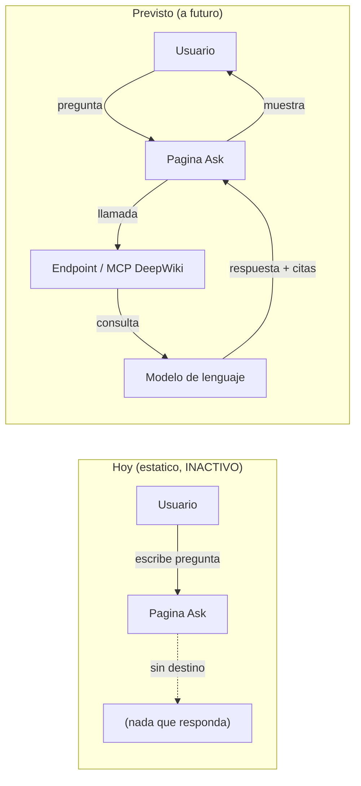

## En breve

La pagina **Ask** es un chat conversacional al estilo DeepWiki: la idea es que vos escribas una pregunta en lenguaje natural ("¿como se valida el rol del usuario?", "¿que pasa si falta el header X-User-Id?") y el wiki te responda con una explicacion redactada y enlaces al codigo. **En esta version local y estatica del wiki, esa funcion NO esta activa.** Esta prevista para mas adelante; por ahora se deja documentada la idea y como se conectaria.

> ⚠️ **Estado: INACTIVO.** No hay backend de IA ni endpoint de chat conectado en esta version. Si entraste buscando hacerle preguntas al wiki, usa el **buscador** (arriba a la izquierda) y navega las paginas. Esa es hoy la mejor forma de "preguntarle" al wiki.

## Por que no esta incluido

Un chat tipo "Ask" no es solo una caja de texto: detras necesita **un modelo de lenguaje (LLM)** que lea tu pregunta, busque los fragmentos relevantes del codigo y redacte la respuesta.

> 📌 **LLM (Large Language Model):** es el "cerebro" que entiende lenguaje natural y genera texto (lo mismo que potencia a ChatGPT, Claude, etc.). En la practica, sin un LLM detras no hay con que "pensar" la respuesta.

Este wiki, en cambio, es **estatico**: son archivos HTML generados una sola vez a partir del Markdown, servidos como paginas planas. No hay servidor que reciba tu pregunta, no hay proceso corriendo que la procese, y no hay conexion a ningun modelo. Conectar "Ask" implica al menos tres cosas que hoy faltan:

| Pieza que falta | Que hace | Por que importa |
| --- | --- | --- |
| Un modelo de fondo (LLM) | Entiende la pregunta y redacta la respuesta | Sin el, no hay nada que conteste |
| Una conexion / red | Llevar la pregunta al modelo y traer la respuesta | El wiki estatico no hace llamadas a servidores |
| Un indice del codigo | Decirle al modelo que fragmentos son relevantes | Para que cite el codigo real y no invente |

> 💡 **Tip:** que el wiki sea estatico es bueno para distribuirlo (lo abris con doble clic, sin instalar nada). El costo es que funciones "vivas" como un chat quedan fuera hasta que haya una pieza con servidor o conexion.

## Como se ve hoy vs. como se veria activo

El diagrama contrasta el estado actual (la pregunta no tiene a donde ir) con el flujo previsto (la pregunta viaja a un endpoint o al MCP de DeepWiki, que consulta un modelo y devuelve la respuesta con citas al codigo).

## Que esta previsto a futuro

La intencion es habilitar "Ask" mas adelante por alguna de estas dos vias:

- **Conectar el MCP de DeepWiki.** DeepWiki ofrece un servidor MCP que ya sabe responder preguntas sobre un repo indexado; el wiki delegaria las preguntas ahi.
  - > 📌 **MCP (Model Context Protocol):** es un "enchufe" estandar para que una herramienta hable con un modelo de IA y le pase contexto (en este caso, el codigo del repo). En la practica, ahorra reinventar toda la plomeria de busqueda + LLM.
- **Una pagina que consuma una API propia.** En vez del MCP, una pagina dinamica (con su servidor) que reciba la pregunta, busque en un indice del codigo y llame a un modelo via una API REST.

> ⚠️ Ambas vias requieren red y un modelo de fondo, asi que **no funcionan en el wiki puramente estatico** tal como esta hoy. Habilitar cualquiera de las dos es una decision pendiente.

## Decisiones pendientes

Lo siguiente depende de decisiones que todavia no se tomaron y se documentan como TODO:

- TODO: que **proveedor de modelo** se usaria (p. ej. el modelo que expone DeepWiki via MCP, o un proveedor de LLM externo). No definido en el codigo del proyecto.
- TODO: que **endpoint / API** consumiria la pagina si se va por la via propia (URL, autenticacion, formato de request/response). No definido.
- TODO: como se **indexaria el codigo** para que las respuestas citen archivos y lineas reales del repo. No definido.
- TODO: donde correria la pieza con servidor (la misma maquina del wiki, un servicio aparte, etc.). No definido.

## Mientras tanto: como "preguntarle" al wiki

Hasta que "Ask" se active, tenes dos caminos que cubren la mayoria de las consultas:

1. **Buscador (arriba a la izquierda).** Escribi un termino o concepto (un nombre de funcion, un rol como `ROL_JEFE`, una palabra del dominio como "justificacion") y saltá directo a la pagina o seccion relevante.
2. **Navegar las paginas del wiki.** El contenido esta organizado por modulo y por tema. Algunos puntos de entrada utiles:

| Si queres entender... | Anda a |
| --- | --- |
| La vision general del sistema | [Inicio](index.html) |
| Como encajan las 3 piezas (front, API, BD) | [Arquitectura](arquitectura.html) |
| Como se autentica y autoriza (headers, roles) | [Seguridad](seguridad.html) |
| Los endpoints REST disponibles | [API REST](api.html) |
| Los flujos de negocio (crear/aprobar boletas) | [Flujos](flujos.html) |
| Que significa un termino tecnico | [Glosario](glosario.html) |

> 💡 **Tip:** combiná las dos cosas. Usa el buscador para aterrizar rapido en una pagina y, una vez ahi, segui los enlaces cruzados y los enlaces al codigo fuente para profundizar.

## Referencias en el codigo

Esta pagina describe una funcionalidad **no implementada**, por lo que no ancla en archivos del repositorio. No hay codigo de "Ask" que citar todavia. Cuando se implemente (via MCP de DeepWiki o API propia), esta seccion debera listar los archivos correspondientes.
