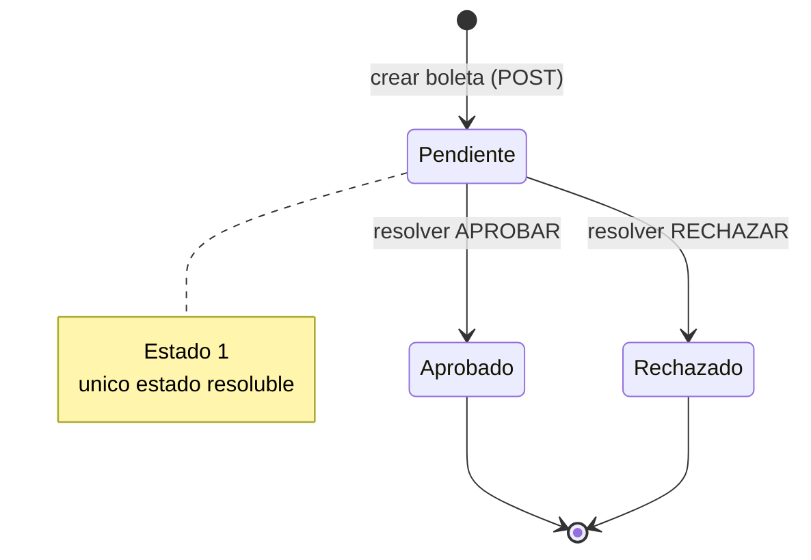
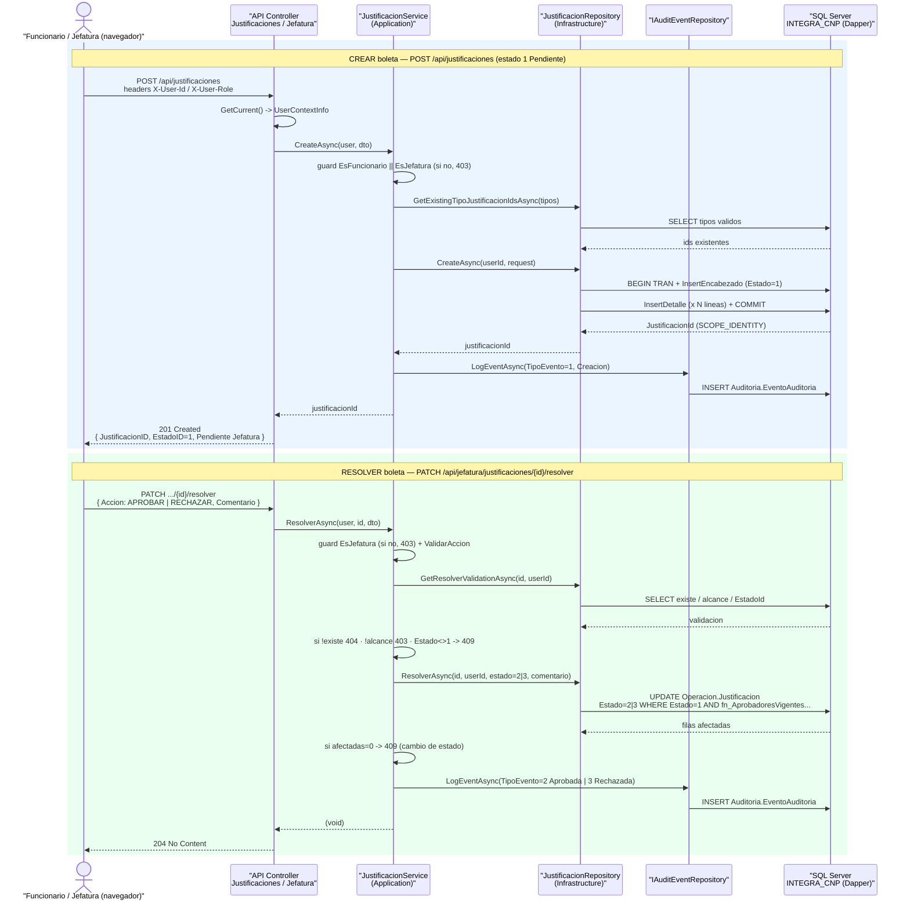
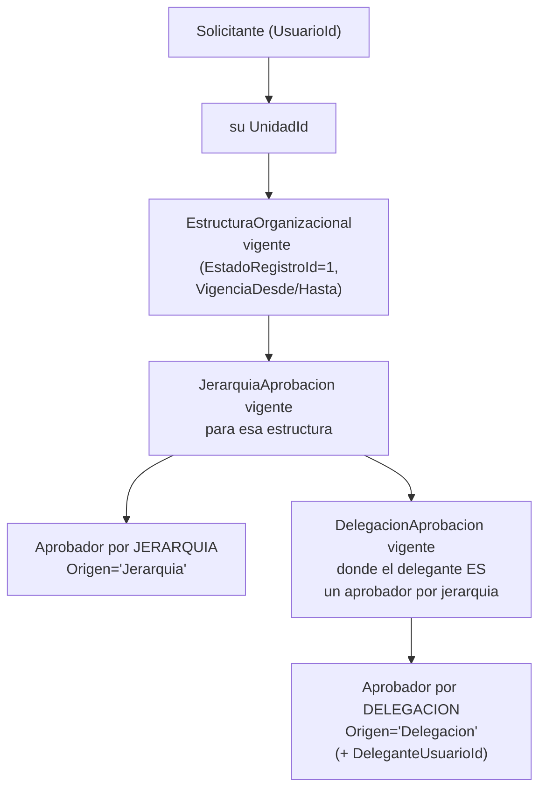

## En breve

Esta pagina sigue, de punta a punta, los dos flujos de negocio centrales del sistema: **crear una boleta** de justificacion de marca (lo hace el funcionario o la jefatura) y **resolverla** (aprobarla o rechazarla, lo hace la jefatura). Vas a ver como una peticion HTTP del navegador atraviesa las cuatro capas — Controller, Service, Repository y SQL Server — hasta cambiar el estado de la boleta, y como una funcion de base de datos (`dbo.fn_AprobadoresVigentesPorSolicitante`) decide quien tiene permiso de aprobar. Es la pagina donde "se juntan" todas las demas: [arquitectura](arquitectura.html), [API](api.html), [Application](modulo-application.html), [Infraestructura](modulo-infraestructura.html) y [modelo de datos](modelo-datos.html).

> 📌 En la practica: si querés entender "que pasa cuando le doy clic a Guardar boleta" o "por que esta jefatura no ve esta boleta", esta es la pagina. Cada paso esta anclado a la linea de codigo real que lo hace.

## El recorrido de una peticion (las 4 capas)

El sistema usa **Clean Architecture**: una forma de organizar el codigo en capas donde las de adentro (reglas de negocio) no conocen a las de afuera (web, base de datos). Eso permite probar la logica sin levantar un servidor ni una BD. Para el detalle ver [arquitectura](arquitectura.html).

En ambos flujos la peticion viaja por la misma cadena. Cada capa tiene una sola responsabilidad:

| Capa | Archivo | Responsabilidad en estos flujos |
| --- | --- | --- |
| **Controller** (Api) | [JustificacionesController.cs](../backend/src/IntegradorMarcas.Api/Controllers/JustificacionesController.cs) · [JefaturaController.cs](../backend/src/IntegradorMarcas.Api/Controllers/JefaturaController.cs) | Recibe el HTTP, lee la identidad por headers (`GetCurrent()`), traduce el Request (wire) a un DTO y devuelve el Response. No hay logica de negocio. |
| **Service** (Application) | [JustificacionService.cs](../backend/src/IntegradorMarcas.Application/Services/JustificacionService.cs) | Aplica las reglas: quien puede (rol), que es valido, que transiciones de estado se permiten. Orquesta repositorio + auditoria. |
| **Repository** (Infrastructure) | [JustificacionRepository.cs](../backend/src/IntegradorMarcas.Infrastructure/Repositories/JustificacionRepository.cs) | Abre la conexion y ejecuta el SQL con **Dapper** (libreria que mapea filas SQL a objetos C# sin un ORM pesado). Mapea filas a DTOs. |
| **SQL** | [JustificacionesSql.cs](../backend/src/IntegradorMarcas.Infrastructure/Queries/JustificacionesSql.cs) | Todo el SQL vive aqui como `const string`. Inserta, consulta y actualiza tablas `Operacion.*`. |

> 💡 Tip: un **DTO** (Data Transfer Object) es un objeto plano que solo transporta datos entre capas; no tiene logica. Asi la forma del JSON de la API (`Contracts`) queda desacoplada de como se mueven los datos por dentro (`DTOs`).

## Estados de una boleta

Toda boleta vive en uno de tres estados, definidos como constantes en [EstadoIds.cs](../backend/src/IntegradorMarcas.Domain/Constants/EstadoIds.cs). El backend nunca usa numeros "magicos": siempre referencia estas constantes.

| Estado | Valor | Constante C# | Quien lo asigna |
| --- | --- | --- | --- |
| Pendiente Jefatura | `1` | `EstadoIds.PendienteJefatura` | Al crear la boleta (`CreateAsync`) |
| Aprobado | `2` | `EstadoIds.Aprobado` | Jefatura, al resolver con accion `APROBAR` |
| Rechazado | `3` | `EstadoIds.Rechazado` | Jefatura, al resolver con accion `RECHAZAR` |

El ciclo de vida es estricto y de un solo paso: una boleta nace en `1` y solo puede pasar a `2` **o** `3`. No hay vuelta atras ni re-edicion; eso lo garantiza la regla **RN-04** (ver mas abajo).



## Diagrama de secuencia (crear y resolver)

Este diagrama muestra los dos flujos completos cruzando las cuatro capas mas el registro de auditoria. Es el mismo que se usa en el manual tecnico ([03-secuencia-crear-resolver.mmd](../docs/manual-tecnico/capturas/03-secuencia-crear-resolver.mmd)).



## Flujo 1 — Crear una boleta

Endpoint: `POST /api/justificaciones`. La crea un funcionario para si mismo (o una jefatura). Una boleta es un **encabezado** (`Operacion.Justificacion`: motivo general, estado, autor) mas una o varias **lineas de detalle** (`Operacion.JustificacionDetalle`: tipo de justificacion + fecha de marca + observacion).

### Paso a paso

1. **Controller recibe y traduce** — [JustificacionesController.cs:23-51](../backend/src/IntegradorMarcas.Api/Controllers/JustificacionesController.cs). `Create` lee la identidad con `_userContext.GetCurrent()` (deriva de los headers `X-User-Id` / `X-User-Role`; ver [seguridad](seguridad.html)), convierte el `CreateJustificacionRequest` (campos con sufijo `ID`, forma del JSON) en un `CreateJustificacionDto` (campos con sufijo `Id`) y llama al servicio. Notá el cruce de naming `ID` -> `Id` que se hace a mano.

2. **Service: guard de rol (autorizacion)** — [JustificacionService.cs:20-25](../backend/src/IntegradorMarcas.Application/Services/JustificacionService.cs). Lo primero es un **guard clause** (una validacion al inicio del metodo que aborta si no se cumple). No hay atributos `[Authorize]`: la autorizacion vive dentro del servicio.

   ```cs
   if (!RolesSistema.EsFuncionario(user.Role) && !RolesSistema.EsJefatura(user.Role))
   {
       throw new AppException("Solo funcionario o jefatura pueden crear boletas.", 403);
   }
   ```

3. **Service: validacion de forma (RN-01)** — [JustificacionService.cs:27](../backend/src/IntegradorMarcas.Application/Services/JustificacionService.cs) invoca `JustificacionValidator.ValidateCreate`. Alli ([JustificacionValidator.cs:14-43](../backend/src/IntegradorMarcas.Application/Validation/JustificacionValidator.cs)) se exige: `MotivoGeneral` presente y <= 500 caracteres; al menos una linea de detalle (**RN-01**); cada `TipoJustificacionId > 0`; `FechaMarca` presente; `ObservacionDetalle` <= 250 caracteres. Cualquier fallo lanza `AppException(400)`.

4. **Service: validacion de catalogo** — [JustificacionService.cs:29-38](../backend/src/IntegradorMarcas.Application/Services/JustificacionService.cs). Toma los `TipoJustificacionId` distintos y consulta cuales existen realmente en `Configuracion.TipoJustificacion` via `GetExistingTipoJustificacionIdsAsync`. Si el conteo no coincide, **400**: "Uno o mas TipoJustificacionID no existen en catalogo." Asi se evita insertar un detalle con un tipo invalido.

5. **Repository: insercion transaccional** — [JustificacionRepository.cs:42-86](../backend/src/IntegradorMarcas.Infrastructure/Repositories/JustificacionRepository.cs). Aqui esta el corazon. Como hay que insertar encabezado **y** N detalles de forma atomica (todo o nada), se abre una **transaccion** explicita:

   ```cs
   await connection.OpenAsync(cancellationToken);
   await using var transaction = await connection.BeginTransactionAsync(cancellationToken);
   try
   {
       var justificacionId = await connection.ExecuteScalarAsync<int>(/* InsertEncabezado */);
       foreach (var detalle in request.Detalles) { /* InsertDetalle */ }
       await transaction.CommitAsync(cancellationToken);
       return justificacionId;
   }
   catch { await transaction.RollbackAsync(cancellationToken); throw; }
   ```

   El `InsertEncabezado` ([JustificacionesSql.cs:5-20](../backend/src/IntegradorMarcas.Infrastructure/Queries/JustificacionesSql.cs)) inserta en `Operacion.Justificacion` con `EstadoJustificacionId = 1` y devuelve el id nuevo con `SELECT CAST(SCOPE_IDENTITY() AS INT)`. Luego un `InsertDetalle` por cada linea ([JustificacionesSql.cs:22-38](../backend/src/IntegradorMarcas.Infrastructure/Queries/JustificacionesSql.cs)). La `FechaMarca` se guarda truncada a fecha (`detalle.FechaMarca.Date`).

   > ⚠️ Si una sola linea de detalle falla, el `catch` hace `RollbackAsync` y **nada** queda persistido: no quedan encabezados huerfanos.

6. **Service: registro de auditoria** — [JustificacionService.cs:42-52](../backend/src/IntegradorMarcas.Application/Services/JustificacionService.cs). Tras crear, registra un evento (`TipoEventoAuditoriaId = 1`, "Creacion de boleta de justificacion.") en `Auditoria.EventoAuditoria` via `IAuditEventRepository.LogEventAsync`. El `PayloadResumen` guarda cuantos detalles y el estado destino.

7. **Controller responde 201** — [JustificacionesController.cs:42-50](../backend/src/IntegradorMarcas.Api/Controllers/JustificacionesController.cs). Devuelve `201 Created` con `CreatedAtAction` apuntando a `ListMine`, y un cuerpo `{ JustificacionID, EstadoID = 1, EstadoDescripcion = "Pendiente Jefatura" }`.

### Resumen de respuestas (crear)

| Situacion | HTTP | Origen |
| --- | --- | --- |
| Creada OK | `201` | Controller (`CreatedAtAction`) |
| Sin headers / identidad invalida | `401` | `GetCurrent()` (ver [seguridad](seguridad.html)) |
| Rol distinto de FUNC/JEFE | `403` | guard en `CreateAsync` |
| Falla validacion de forma (RN-01, longitudes) | `400` | `JustificacionValidator.ValidateCreate` |
| Tipo de justificacion inexistente | `400` | validacion de catalogo en `CreateAsync` |

## Flujo 2 — Resolver una boleta

Endpoint: `PATCH /api/jefatura/justificaciones/{id}/resolver`. Solo la jefatura **con alcance de aprobacion vigente** sobre esa boleta puede aprobarla o rechazarla. El cuerpo lleva `{ Accion, Comentario }` donde `Accion` es `APROBAR` o `RECHAZAR`.

### Paso a paso

1. **Controller recibe** — [JefaturaController.cs:119-133](../backend/src/IntegradorMarcas.Api/Controllers/JefaturaController.cs). `Resolver` lee la identidad, arma un `ResolverJustificacionDto { Accion, Comentario }` y delega en `ResolverAsync`. Si todo va bien responde `204 No Content` (operacion exitosa sin cuerpo).

2. **Service: guard de jefatura (RN-03)** — [JustificacionService.cs:180-185](../backend/src/IntegradorMarcas.Application/Services/JustificacionService.cs). Solo `EsJefatura`; si no, `AppException("RN-03: solo jefatura puede resolver boletas.", 403)`.

3. **Service: validar la accion** — [JustificacionService.cs:187](../backend/src/IntegradorMarcas.Application/Services/JustificacionService.cs) llama `JustificacionValidator.ValidateAccion` ([JustificacionValidator.cs:45-54](../backend/src/IntegradorMarcas.Application/Validation/JustificacionValidator.cs)), que normaliza con `Trim().ToUpperInvariant()` y exige exactamente `APROBAR` o `RECHAZAR`, o lanza **400**.

4. **Service: validacion previa (existe / alcance / estado)** — [JustificacionService.cs:188-203](../backend/src/IntegradorMarcas.Application/Services/JustificacionService.cs). Antes de tocar nada, una sola consulta (`GetResolverValidationAsync`) trae tres datos. El servicio decide en cascada:

   | Condicion | HTTP | Mensaje |
   | --- | --- | --- |
   | `!validation.Exists` | `404` | "No existe la boleta indicada." |
   | `!validation.IsInApprovalScope` | `403` | "La boleta no pertenece al alcance de aprobacion vigente..." |
   | `validation.EstadoId != PendienteJefatura` | `409` | "RN-04: la boleta ya fue resuelta y no puede modificarse." |

   El SQL que produce esa validacion es `GetResolverValidation` ([JustificacionesSql.cs:288-305](../backend/src/IntegradorMarcas.Infrastructure/Queries/JustificacionesSql.cs)): un `LEFT JOIN` a la boleta mas un `OUTER APPLY` sobre `dbo.fn_AprobadoresVigentesPorSolicitante` para saber si el usuario autenticado esta en el alcance, priorizando `Origen='Delegacion'`.

5. **Service: calcular estado destino y normalizar comentario** — [JustificacionService.cs:205-206](../backend/src/IntegradorMarcas.Application/Services/JustificacionService.cs). `APROBAR` -> `EstadoIds.Aprobado` (2); cualquier otro caso valido (`RECHAZAR`) -> `EstadoIds.Rechazado` (3). El comentario se normaliza (trim, vacio -> `null`, <= 500 caracteres) con `NormalizeComentarioResolucion` ([JustificacionValidator.cs:56-75](../backend/src/IntegradorMarcas.Application/Validation/JustificacionValidator.cs)).

6. **Repository: UPDATE condicional** — [JustificacionRepository.cs:318-334](../backend/src/IntegradorMarcas.Infrastructure/Repositories/JustificacionRepository.cs) ejecuta `ResolverPendiente` ([JustificacionesSql.cs:359-376](../backend/src/IntegradorMarcas.Infrastructure/Queries/JustificacionesSql.cs)). El `UPDATE` graba estado, `AprobadorId`, `FechaAprobacion`, comentario y `RolResolucion`, pero **solo si** la boleta sigue en pendiente, el solicitante no es el propio aprobador y el aprobador sigue en alcance:

   ```sql
   UPDATE je
   SET je.EstadoJustificacionId = @EstadoID, je.AprobadorId = @AprobadorUsuarioID,
       je.FechaAprobacion = GETDATE(), je.ComentarioResolucion = @Comentario, je.RolResolucion = @RolResolucion
   FROM Operacion.Justificacion je
   WHERE je.JustificacionId = @JustificacionID
     AND je.EstadoJustificacionId = @EstadoPendiente
     AND je.UsuarioID <> @AprobadorUsuarioID
     AND EXISTS (SELECT 1 FROM dbo.fn_AprobadoresVigentesPorSolicitante(je.UsuarioID, GETDATE()) fa
                 WHERE fa.AprobadorUsuarioId = @AprobadorUsuarioID);
   ```

   > 📌 Esto es **control de concurrencia optimista**: la condicion `EstadoJustificacionId = @EstadoPendiente` esta dentro del propio `UPDATE`. Si entre la validacion del paso 4 y este `UPDATE` otra jefatura ya resolvio la boleta, el `UPDATE` afecta **0 filas**.

7. **Service: detectar carrera** — [JustificacionService.cs:209-212](../backend/src/IntegradorMarcas.Application/Services/JustificacionService.cs). Si `affected == 0`, lanza **409** "No fue posible resolver la boleta porque ya cambió de estado." Es la red de seguridad por si dos jefaturas resuelven a la vez.

8. **Service: auditoria** — [JustificacionService.cs:214-226](../backend/src/IntegradorMarcas.Application/Services/JustificacionService.cs). Registra `TipoEventoAuditoriaId = 2` (aprobada) o `3` (rechazada), con `PayloadResumen` que incluye el `ScopeSource` (jerarquia o delegacion) y el delegante si aplica.

### Resumen de respuestas (resolver)

| Situacion | HTTP | Origen |
| --- | --- | --- |
| Resuelta OK | `204` | Controller (`NoContent`) |
| Sin headers / identidad invalida | `401` | `GetCurrent()` |
| Rol no jefatura (RN-03) | `403` | guard en `ResolverAsync` |
| Accion no es APROBAR/RECHAZAR | `400` | `ValidateAccion` |
| Boleta inexistente | `404` | validacion previa |
| Fuera del alcance de aprobacion | `403` | validacion previa |
| Ya resuelta (RN-04) | `409` | validacion previa o `affected == 0` |

## Flujo 3 — Alcance de aprobacion (quien puede aprobar)

La pregunta clave del negocio es: dada una boleta de un solicitante, **¿quien es su aprobador valido hoy?** La respuesta no se calcula en C#: vive en la funcion de tabla `dbo.fn_AprobadoresVigentesPorSolicitante(@SolicitanteUsuarioId, @FechaRef)` ([02_EstructuraCompleta.sql:517-568](../docs/db/02_EstructuraCompleta.sql)). Todas las consultas de jefatura (listar pendientes, ver detalle, validar resolucion) la invocan; por eso es el "guardian" del flujo 2.

> 📌 Por que en la BD y no en C#: el alcance depende de jerarquia organizacional y delegaciones que ya viven en tablas SQL, con vigencias por fecha. Resolverlo con un `EXISTS` contra la funcion evita traer esos datos a memoria y mantiene la regla en un solo lugar. La funcion esta en el esquema `dbo` (no `Operacion`) **a proposito**, porque el backend la invoca asi.

### Como decide la funcion

La funcion combina dos origenes de aprobacion y los devuelve unidos (`UNION ALL`), cada fila con su `Origen`:



1. **Jerarquia** ([02_EstructuraCompleta.sql:526-545](../docs/db/02_EstructuraCompleta.sql)): del solicitante toma su `UnidadId`, resuelve la(s) `RecursosHumanos.EstructuraOrganizacional` vigente(s) (estado activo y dentro de `VigenciaDesde`/`VigenciaHasta`), y de ahi las `Operacion.JerarquiaAprobacion` vigentes. Esos aprobadores salen con `Origen = 'Jerarquia'` y `DeleganteUsuarioId = NULL`.

2. **Delegacion** ([02_EstructuraCompleta.sql:547-566](../docs/db/02_EstructuraCompleta.sql)): toma las `Operacion.DelegacionAprobacion` vigentes **cuyo delegante es a su vez un aprobador por jerarquia**. El delegado sale con `Origen = 'Delegacion'` y se conserva quien delego (`DeleganteUsuarioId`). Es decir, una delegacion solo es valida si quien delega realmente tenia la potestad.

### Prioridad y consumo desde el backend

Cuando el codigo necesita **un solo** aprobador o el origen del alcance, ordena dando prioridad a la delegacion: `ORDER BY CASE WHEN fa.Origen = 'Delegacion' THEN 0 ELSE 1 END`. Esto aparece en `GetResolverValidation` ([JustificacionesSql.cs:297-305](../backend/src/IntegradorMarcas.Infrastructure/Queries/JustificacionesSql.cs)) y en `GetCurrentApproverBySolicitante` ([JustificacionesSql.cs:347-353](../backend/src/IntegradorMarcas.Infrastructure/Queries/JustificacionesSql.cs)).

La funcion se usa en cuatro puntos del flujo:

| Consulta SQL | Para que | Referencia |
| --- | --- | --- |
| `ListPendientesJefatura` | Una jefatura solo ve las boletas pendientes de solicitantes para los que esta en alcance | [JustificacionesSql.cs:103-107](../backend/src/IntegradorMarcas.Infrastructure/Queries/JustificacionesSql.cs) |
| `GetDetalleJefaturaEncabezado` | Ver el detalle solo si esta en alcance | [JustificacionesSql.cs:270-274](../backend/src/IntegradorMarcas.Infrastructure/Queries/JustificacionesSql.cs) |
| `GetResolverValidation` | Validar 403/404/409 antes de resolver | [JustificacionesSql.cs:297-305](../backend/src/IntegradorMarcas.Infrastructure/Queries/JustificacionesSql.cs) |
| `ResolverPendiente` | Filtro final en el propio `UPDATE` | [JustificacionesSql.cs:372-375](../backend/src/IntegradorMarcas.Infrastructure/Queries/JustificacionesSql.cs) |

> ⚠️ En todas las consultas hay tambien la condicion `je.UsuarioID <> @AprobadorUsuarioID`: una jefatura **no** puede aprobarse a si misma, aunque por estructura figurara como su propio aprobador.

El endpoint `GET /api/justificaciones/aprobador-actual` ([JustificacionesController.cs:83-109](../backend/src/IntegradorMarcas.Api/Controllers/JustificacionesController.cs)) expone esta logica al funcionario: le dice quien resolveria su boleta hoy, el `Origen` y, si es por delegacion, quien delego. Lo sirve `GetCurrentApproverAsync` ([JustificacionService.cs:57-65](../backend/src/IntegradorMarcas.Application/Services/JustificacionService.cs)).

## Reglas de negocio mencionadas

Las reglas referenciadas en codigo con su codigo `RN-xx`:

| Codigo | Regla | Donde se aplica |
| --- | --- | --- |
| **RN-01** | Una boleta debe incluir al menos una linea de detalle | [JustificacionValidator.cs:21-24](../backend/src/IntegradorMarcas.Application/Validation/JustificacionValidator.cs) |
| **RN-03** | Solo jefatura puede resolver boletas | [JustificacionService.cs:182-185](../backend/src/IntegradorMarcas.Application/Services/JustificacionService.cs) |
| **RN-04** | Una boleta ya resuelta no puede modificarse | [JustificacionService.cs:200-203](../backend/src/IntegradorMarcas.Application/Services/JustificacionService.cs) y filtro del `UPDATE` |

> TODO: en el codigo solo aparecen explicitamente RN-01, RN-03 y RN-04. No se localiza una "RN-02" en estos archivos; revisar specs/PRP si existe en la documentacion de negocio.

## Referencias en el codigo

- [JustificacionesController.cs](../backend/src/IntegradorMarcas.Api/Controllers/JustificacionesController.cs) — `Create` (POST), `GetCurrentApprover`, `ListMine`.
- [JefaturaController.cs](../backend/src/IntegradorMarcas.Api/Controllers/JefaturaController.cs) — `Resolver` (PATCH), `ListPendientes`, `GetDetalle`.
- [JustificacionService.cs](../backend/src/IntegradorMarcas.Application/Services/JustificacionService.cs) — `CreateAsync`, `ResolverAsync`, `GetCurrentApproverAsync` (guards, validaciones, auditoria).
- [JustificacionValidator.cs](../backend/src/IntegradorMarcas.Application/Validation/JustificacionValidator.cs) — RN-01, `ValidateAccion`, normalizacion de comentario.
- [JustificacionRepository.cs](../backend/src/IntegradorMarcas.Infrastructure/Repositories/JustificacionRepository.cs) — insercion transaccional, `ResolverAsync`, mapeo de filas.
- [JustificacionesSql.cs](../backend/src/IntegradorMarcas.Infrastructure/Queries/JustificacionesSql.cs) — todo el SQL: `InsertEncabezado`, `InsertDetalle`, `GetResolverValidation`, `ResolverPendiente`, `GetCurrentApproverBySolicitante`.
- [EstadoIds.cs](../backend/src/IntegradorMarcas.Domain/Constants/EstadoIds.cs) — constantes de estado (1/2/3).
- [02_EstructuraCompleta.sql:517-568](../docs/db/02_EstructuraCompleta.sql) — definicion de `dbo.fn_AprobadoresVigentesPorSolicitante`.
- [03-secuencia-crear-resolver.mmd](../docs/manual-tecnico/capturas/03-secuencia-crear-resolver.mmd) — diagrama de secuencia fuente.

Paginas relacionadas: [API](api.html) · [Application](modulo-application.html) · [Infraestructura](modulo-infraestructura.html) · [modelo de datos](modelo-datos.html) · [seguridad](seguridad.html) · [glosario](glosario.html).
