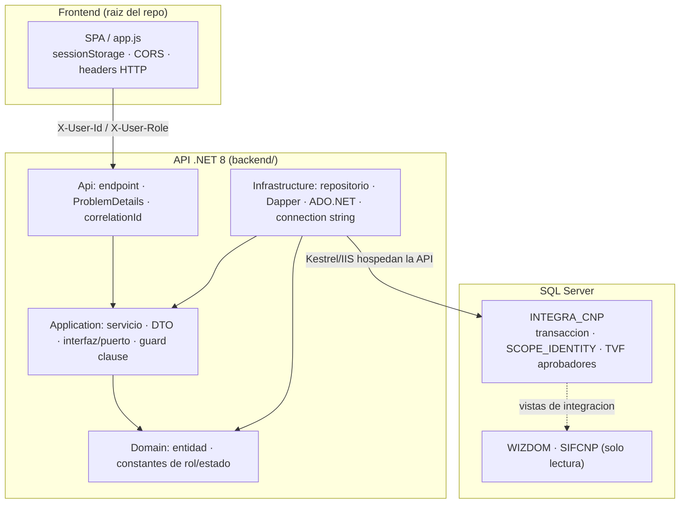

## En breve

Esta pagina es el diccionario de apoyo del wiki: te explica en lenguaje sencillo cada termino tecnico y cada palabra del dominio que aparece en el resto de las paginas. La idea es que un programador novato pueda leer cualquier seccion sin trabarse y que un dev senior tenga a mano la definicion exacta tal como la usa ESTE proyecto (no la teoria general). Cada termino arranca por lo practico ("para que sirve") y, cuando aplica, apunta al codigo real donde vive.

El glosario esta partido en dos grandes grupos: **Stack / tecnico** (conceptos de .NET, web, SQL, arquitectura) y **Dominio** (lo propio del negocio de justificacion de marcas de CNP/FANAL). Dentro de cada grupo va alfabetico.

---

## Mapa de los terminos del proyecto

El siguiente diagrama ubica los terminos mas importantes dentro de las tres piezas del sistema, para que veas a que parte pertenece cada palabra antes de leer su definicion.



> 📌 La **regla de dependencia** (las flechas apuntan "hacia adentro": todo conoce a Domain, Domain no conoce a nadie) es la columna vertebral de la [arquitectura](arquitectura.html). Si entendes esa flecha, entendes el resto.

---

## Stack / tecnico

### ADO.NET
Es la libreria base de .NET para hablar con una base de datos: abrir una conexion, mandar SQL, leer filas. Este proyecto lo usa "crudo" (sin un [ORM](#orm) pesado encima), apoyado en [Dapper](#dapper) para el mapeo. Provee `SqlConnection`, `OpenAsync`, etc. Ver [SqlConnectionFactory.cs](../backend/src/IntegradorMarcas.Infrastructure/Data/SqlConnectionFactory.cs).

### Capa (layer)
Una "capa" es un grupo de codigo con una responsabilidad clara que solo se comunica con sus vecinas siguiendo reglas. Aca hay cuatro capas en el backend: **Domain**, **Application**, **Infrastructure** y **Api**. Separarlas evita que un cambio en la base de datos rompa la logica de negocio. Ver [arquitectura](arquitectura.html) y [CLAUDE.md](../CLAUDE.md).

### Clean Architecture
Estilo de organizacion del codigo donde las reglas de negocio quedan en el centro y los detalles tecnicos (BD, web, UI) quedan afuera, dependiendo siempre hacia adentro. Sirve para que el nucleo del sistema no dependa de frameworks ni de la base de datos concreta. El backend la implementa con las cuatro capas descritas en [arquitectura](arquitectura.html). Ver [CLAUDE.md](../CLAUDE.md).

### connection string (cadena de conexion)
El texto con los datos para conectarse a SQL Server (servidor, base, credenciales). Aca la base es `INTEGRA_CNP` y la cadena se llama `IntegraCnp`. **No se versiona**: se inyecta por la variable de entorno `ConnectionStrings__IntegraCnp`. Ver [SqlConnectionFactory.cs](../backend/src/IntegradorMarcas.Infrastructure/Data/SqlConnectionFactory.cs) y [seguridad](seguridad.html).

### CORS (Cross-Origin Resource Sharing)
Mecanismo de seguridad del navegador que controla si una pagina servida desde un origen (p. ej. `localhost:8000`) puede llamar a una API en otro origen (p. ej. `localhost:5093`). En este proyecto la politica `LocalFrontend` esta **abierta** (acepta cualquier origen) y eso debe restringirse en produccion. Ver [seguridad](seguridad.html) y el gotcha de CORS en [CLAUDE.md](../CLAUDE.md).

### correlationId
Un identificador unico que la API genera por cada peticion. Sirve para rastrear una sola llamada a traves de logs y respuestas de error: aparece tanto en el cuerpo del error ([ProblemDetails](#problemdetails), campo `extensions.correlationId`) como en el header `X-Correlation-Id`. Ver el manejador de errores en [Program.cs](../backend/src/IntegradorMarcas.Api/Program.cs) y [modulo-api](modulo-api.html).

### Dapper
Una libreria liviana ("micro-ORM") que convierte filas de SQL en objetos C# con poco codigo, pero dejandote escribir el SQL a mano. Resuelve el tedio de mapear columnas a propiedades sin esconder el SQL como haria un [ORM](#orm) completo. Aca se usa Dapper 2.1.72 con metodos como `QueryAsync`/`ExecuteScalarAsync`. Ver [modulo-infraestructura](modulo-infraestructura.html) y [CLAUDE.md](../CLAUDE.md).

### DTO (Data Transfer Object)
Un objeto simple cuyo unico trabajo es transportar datos entre capas, sin logica. Sirve para que la capa Application mueva informacion sin exponer ni las [entidades](#entidad) del dominio ni la forma del JSON de la API. Viven en `Application/DTOs`. Ojo: las propiedades de DTO usan sufijo `Id` (`JustificacionId`), mientras los Contracts de la API usan `ID`. Ver [modulo-application](modulo-application.html).

### endpoint
Una direccion concreta de la API a la que se le hace una peticion HTTP, p. ej. `GET /health` o las rutas de justificaciones. Cada endpoint es un metodo de un controller. Todos los endpoints de negocio devuelven **401** si faltan los headers de identidad. Ver [api](api.html) y [modulo-api](modulo-api.html).

### entidad (entity)
Un objeto que representa una "cosa" del negocio con identidad propia y vive en la capa Domain, p. ej. `JustificacionEncabezado` y `JustificacionDetalle`. Es el modelo mas cercano al negocio, sin saber nada de BD ni de web. Ver [modulo-dominio](modulo-dominio.html).

### guard clause (clausula de guarda)
Una verificacion al inicio de un metodo que corta la ejecucion si algo no se cumple (en vez de anidar `if`s). Aca es el corazon de la **autorizacion**: cada servicio de Application valida el rol al entrar (`RolesSistema.Es*`) y lanza `AppException(403)` si no aplica. Ver [RolesSistema.cs](../backend/src/IntegradorMarcas.Domain/Constants/RolesSistema.cs) y [seguridad](seguridad.html).

### header HTTP
Un par clave-valor que viaja con cada peticion/respuesta HTTP, aparte del cuerpo. Aca son centrales porque la **identidad** del usuario viaja en dos headers: `X-User-Id` y `X-User-Role` (sin login real, sin JWT). Ver [HeaderUserContext.cs](../backend/src/IntegradorMarcas.Api/Security/HeaderUserContext.cs) y [seguridad](seguridad.html).

### IIS (Internet Information Services)
El servidor web de Windows que hospeda la API en produccion. En desarrollo la API corre con [Kestrel](#kestrel); para produccion se publica con `dotnet publish` y la corre IIS (el servidor de produccion no tiene SDK). Ver [CLAUDE.md](../CLAUDE.md).

### interfaz / puerto (interface / port)
Un "contrato" que dice **que** operaciones existen sin decir **como** se implementan (p. ej. `IJustificacionRepository`, `IUserContext`). Sirve para que la capa Application pida cosas sin atarse a una implementacion concreta; eso es la base de la [inversion de dependencias](#inversion-de-dependencias). Las interfaces se definen en `Application/Interfaces` y se implementan hacia afuera. Ver [modulo-application](modulo-application.html).

### inversion de dependencias (Dependency Inversion)
Principio que dice: las capas de adentro definen las interfaces y las de afuera las implementan, de modo que la flecha de dependencia "se invierte" respecto al flujo de datos. En la practica: Application declara `IJustificacionRepository` (una [interfaz](#interfaz--puerto-interface--port)) e Infrastructure provee la clase concreta. Asi el nucleo no depende de la BD. Ver [arquitectura](arquitectura.html).

### Kestrel
El servidor web liviano que trae .NET y que corre la API en desarrollo (puertos 5093 http / 7129 https). Es lo que arranca cuando haces `dotnet run`. En produccion el rol lo toma [IIS](#iis-internet-information-services). Ver la tabla de puertos en [CLAUDE.md](../CLAUDE.md).

### Mermaid
Un lenguaje de texto para dibujar diagramas (flujos, secuencias, jerarquias) que el wiki convierte en imagenes. Sirve para explicar arquitectura y flujos sin tener que adjuntar imagenes externas. Los bloques se escriben con ```` ```mermaid ````. Lo usa este mismo wiki en varias paginas.

### ORM (Object-Relational Mapper)
Una herramienta que traduce automaticamente entre tablas de BD y objetos del lenguaje, a veces generando el SQL por vos (ejemplo tipico: Entity Framework). **Este proyecto NO usa un ORM completo (sin EF Core)**: prefiere [ADO.NET](#adonet) + [Dapper](#dapper) para tener control total del SQL. Ver [modulo-infraestructura](modulo-infraestructura.html).

### ProblemDetails
El formato estandar (RFC 7807) en que la API devuelve los errores como JSON: incluye titulo, estado y extensiones. Aca cada error sale como `ProblemDetails` con `extensions.correlationId` y header `X-Correlation-Id`. Lo arma el manejador global en [Program.cs](../backend/src/IntegradorMarcas.Api/Program.cs). Ver [modulo-api](modulo-api.html).

### repositorio (repository)
La clase que sabe como leer/escribir un grupo de datos en la BD (un "agregado"), aislando el resto del codigo del SQL. Aca hay uno `sealed` por agregado (`JustificacionRepository`, `AdminAprobacionesRepository`, etc.), cada uno recibe `ISqlConnectionFactory` y usa [Dapper](#dapper). Ver [modulo-infraestructura](modulo-infraestructura.html).

### sealed (clase sellada)
Modificador de C# que impide que otra clase herede de esta. Aca es la **convencion por defecto**: controllers, services, repositories, entities, DTOs y excepciones son `sealed` (unica excepcion: `SessionController`). Mantiene el diseno cerrado y predecible. Ver [AppException.cs](../backend/src/IntegradorMarcas.Application/Common/AppException.cs) y [CLAUDE.md](../CLAUDE.md).

### servicio (Application service)
Una clase de la capa Application que orquesta un caso de uso del negocio (p. ej. crear una boleta, listar el historico): valida el rol con [guard clauses](#guard-clause-clausula-de-guarda), llama a los [repositorios](#repositorio-repository) y devuelve [DTOs](#dto-data-transfer-object). Es donde vive la logica, no en el controller ni en la BD. Ver [modulo-application](modulo-application.html).

### sessionStorage
Un almacen del navegador donde el frontend guarda datos que duran lo que dura la pestania (se borran al cerrarla). Aca guarda el usuario/rol y otros estados de sesion, con claves prefijadas `sjm_`. Ver [app.js](../app.js) y [modulo-frontend](modulo-frontend.html).

### SCOPE_IDENTITY
Funcion de SQL Server que devuelve el ID autogenerado de la **ultima fila insertada en el contexto actual**. Sirve para saber que ID recibio una boleta recien creada. Aca los inserts hacen `ExecuteScalarAsync<int>` con `SELECT CAST(SCOPE_IDENTITY() AS INT)`. Ver [modulo-infraestructura](modulo-infraestructura.html).

### SPA (Single Page Application)
Una app web que vive en una sola pagina y actualiza el contenido con JavaScript en vez de recargar paginas enteras. Aca es una SPA muy simple: `dashboard.html` + `app.js` cambian de "vista" segun el rol, sin framework ni bundler. Ojo: no hay SPA fallback (404 en rutas desconocidas). Ver [modulo-frontend](modulo-frontend.html).

### transaccion (transaction)
Un grupo de operaciones de BD que se confirman todas juntas o se deshacen todas juntas ("todo o nada"). Sirve para no dejar datos a medias: si insertar el encabezado funciona pero falla el detalle, se revierte todo. Aca los multi-insert usan `BeginTransactionAsync`/Commit/Rollback explicito. Ver [modulo-infraestructura](modulo-infraestructura.html).

### TVF (Table-Valued Function)
Una funcion de SQL Server que devuelve una **tabla** en vez de un valor simple. La clave del negocio es `dbo.fn_AprobadoresVigentesPorSolicitante(usuarioId, GETDATE())`, que devuelve quienes pueden aprobar las boletas de una persona hoy. Ver [modelo-datos](modelo-datos.html) y [02_EstructuraCompleta.sql](../docs/db/02_EstructuraCompleta.sql).

> 💡 Cuando una pagina diga "headers de identidad" se refiere a `X-User-Id` / `X-User-Role`. Cuando diga "guard clause de rol" se refiere a la validacion `RolesSistema.Es*` al inicio de cada servicio. Son los dos mecanismos que reemplazan al login tradicional.

---

## Dominio

### aprobador
La persona habilitada para aprobar o rechazar las boletas de otra. Quien puede aprobar a quien lo resuelve la [TVF](#tvf-table-valued-function) `dbo.fn_AprobadoresVigentesPorSolicitante`, que considera la [jerarquia](#jerarquia-de-aprobacion) y las [delegaciones](#delegacion). Ver [flujos](flujos.html) y [modelo-datos](modelo-datos.html).

### boleta de justificacion
El documento que un funcionario crea para justificar una [marca](#marca) de asistencia. Es la entidad central del sistema: tiene un encabezado (`JustificacionEncabezado`) con el [motivo general](#motivo-general) y una o varias [lineas de detalle](#linea-de-detalle). Ver [modulo-dominio](modulo-dominio.html) y [flujos](flujos.html).

### CNP
Consejo Nacional de Produccion: la institucion para la que existe este sistema. Junto con FANAL son las organizaciones cuyas marcas se justifican. Ver [CLAUDE.md](../CLAUDE.md).

### delegacion
Un permiso temporal por el cual una persona aprueba boletas en lugar de otra (p. ej. mientras la jefatura titular esta de vacaciones). En la [TVF](#tvf-table-valued-function) de aprobadores, una fila con `Origen='Delegacion'` **tiene prioridad** sobre la [jerarquia](#jerarquia-de-aprobacion). La gestiona el rol [ROL_ADMIN](#rol_admin). Ver [modelo-datos](modelo-datos.html) y [flujos](flujos.html).

### estado
La situacion en que esta una boleta dentro del flujo de aprobacion. Hay tres, definidos en [EstadoIds.cs](../backend/src/IntegradorMarcas.Domain/Constants/EstadoIds.cs):

| Constante | Id | Significado |
| --- | --- | --- |
| `PendienteJefatura` | 1 | Creada, esperando que la jefatura la revise |
| `Aprobado` | 2 | La jefatura la aprobo |
| `Rechazado` | 3 | La jefatura la rechazo |

Ver [modulo-dominio](modulo-dominio.html) y [flujos](flujos.html).

### estructura organizacional
El organigrama de la institucion (unidades, dependencias y quien depende de quien). De ahi se deriva la [jerarquia de aprobacion](#jerarquia-de-aprobacion). Vive en tablas como `RecursosHumanos.EstructuraOrganizacional` (y un shim legado `dbo.Estructuras_Organizacionales`). La administra [ROL_ADMIN](#rol_admin). Ver [modelo-datos](modelo-datos.html).

### FANAL
Fabrica Nacional de Licores: la otra organizacion (junto con [CNP](#cnp)) cuyas marcas de asistencia se justifican en este sistema. Ver [CLAUDE.md](../CLAUDE.md).

### INTEGRA_CNP
El nombre de la **base de datos SQL Server** propia de este sistema, donde ocurre toda la escritura. Tiene cinco esquemas funcionales: `Configuracion`, `RecursosHumanos`, `Operacion`, `Auditoria` e `Integracion`. Ver [modelo-datos](modelo-datos.html) y los scripts en [02_EstructuraCompleta.sql](../docs/db/02_EstructuraCompleta.sql).

### jerarquia de aprobacion
La cadena de mando que define, segun la [estructura organizacional](#estructura-organizacional), que jefatura aprueba las boletas de cada funcionario. Es la fuente "normal" de [aprobadores](#aprobador), pero una [delegacion](#delegacion) puede sobreescribirla. Ver [flujos](flujos.html).

### linea de detalle
Cada renglon dentro de una [boleta](#boleta-de-justificacion) que justifica una marca puntual (fecha/hora especifica). Se modela como `JustificacionDetalle` y una boleta puede tener varias. Ver [modulo-dominio](modulo-dominio.html).

### marca (time-mark)
El registro de entrada/salida de un funcionario (la "marca" del reloj de asistencia). El sistema completo existe para **justificar** marcas que quedaron incompletas o irregulares. Ver [CLAUDE.md](../CLAUDE.md).

### motivo general
La razon de alto nivel por la que se crea la [boleta](#boleta-de-justificacion), guardada en el encabezado (a diferencia de las [lineas de detalle](#linea-de-detalle), que son por marca). Ver [modulo-dominio](modulo-dominio.html).

### ROL_ADMIN
Rol de administrador. Gestiona jerarquias, delegaciones y la organizacion. Valor exacto `ROL_ADMIN`; helper `EsAdmin`; sinonimos aceptados `ADMIN`, `4`. Ver [RolesSistema.cs](../backend/src/IntegradorMarcas.Domain/Constants/RolesSistema.cs) y [seguridad](seguridad.html).

### ROL_FUNC
Rol de funcionario. Crea sus propias [boletas](#boleta-de-justificacion) y solo ve su propio historico. Valor exacto `ROL_FUNC`; helper `EsFuncionario`; sinonimos aceptados `FUNCIONARIO`, `1`. Ver [RolesSistema.cs](../backend/src/IntegradorMarcas.Domain/Constants/RolesSistema.cs).

### ROL_JEFE
Rol de jefatura. Aprueba o rechaza las boletas de los funcionarios a su cargo (su set de aprobador, excluyendose a si misma). Valor exacto `ROL_JEFE`; helper `EsJefatura`; sinonimos `JEFATURA`, `2`. Ver [RolesSistema.cs](../backend/src/IntegradorMarcas.Domain/Constants/RolesSistema.cs) y [flujos](flujos.html).

### ROL_RRHH
Rol de Recursos Humanos. Consulta global (ve el historico de todos), sin aprobar. Valor exacto `ROL_RRHH`; helper `EsRrhh`; sinonimos `RRHH`, `3`. Ver [RolesSistema.cs](../backend/src/IntegradorMarcas.Domain/Constants/RolesSistema.cs).

### SIFCNP
El nombre del sistema (Sistema de... CNP) y tambien una base externa de **solo lectura** de la que `INTEGRA_CNP` lee via vistas de integracion (nunca escribe ahi). Por compatibilidad con SIFCNP existe la vista legada `dbo.V_JUSTIFICACIONES_DETALLE` en MAYUSCULAS_SNAKE. Ver [modelo-datos](modelo-datos.html) y [CLAUDE.md](../CLAUDE.md).

### WIZDOM
Otra base de datos externa de **solo lectura** que alimenta datos a `INTEGRA_CNP` a traves de las vistas del esquema `Integracion`. El sistema nunca hace INSERT/UPDATE/DELETE sobre WIZDOM. Ver [modelo-datos](modelo-datos.html) y [CLAUDE.md](../CLAUDE.md).

> ⚠️ WIZDOM y SIFCNP son **solo lectura**: cualquier escritura ocurre exclusivamente en [INTEGRA_CNP](#integra_cnp). Confundir esto es un error de diseno con consecuencias.

---

## Referencias en el codigo

- [CLAUDE.md](../CLAUDE.md) — fuente principal de la mayoria de los terminos (dominio, stack, convenciones).
- [RolesSistema.cs](../backend/src/IntegradorMarcas.Domain/Constants/RolesSistema.cs) — valores exactos de los roles `ROL_*` y helpers `Es*`.
- [EstadoIds.cs](../backend/src/IntegradorMarcas.Domain/Constants/EstadoIds.cs) — los tres estados de una boleta (Pendiente/Aprobado/Rechazado).
- [AppException.cs](../backend/src/IntegradorMarcas.Application/Common/AppException.cs) — la excepcion `sealed` con `StatusCode` que sostiene los errores 401/403/400.
- [HeaderUserContext.cs](../backend/src/IntegradorMarcas.Api/Security/HeaderUserContext.cs) — lectura de los headers de identidad `X-User-Id` / `X-User-Role`.
- [SqlConnectionFactory.cs](../backend/src/IntegradorMarcas.Infrastructure/Data/SqlConnectionFactory.cs) — connection string `IntegraCnp` y creacion de conexiones ADO.NET.
- [02_EstructuraCompleta.sql](../docs/db/02_EstructuraCompleta.sql) — TVF de aprobadores, vistas de integracion y vista legada SIFCNP.
- [app.js](../app.js) — frontend SPA: sessionStorage `sjm_`, CORS, headers de identidad.
