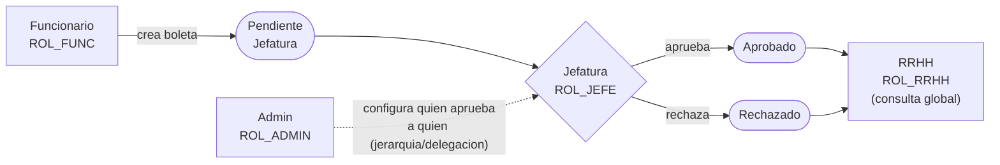
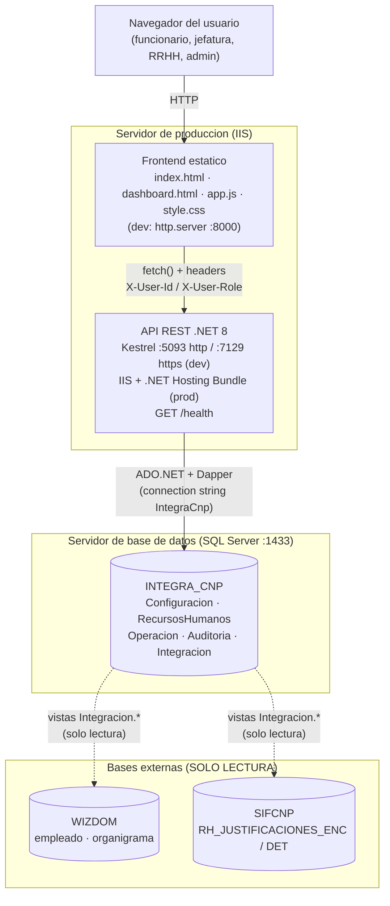
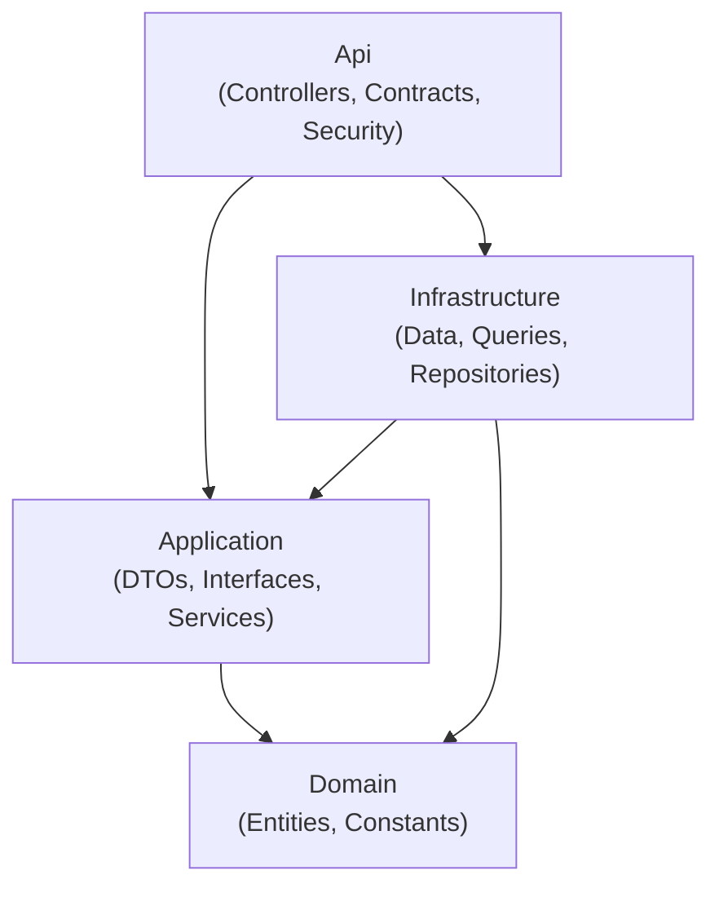

## En breve

SIFCNP (Sistema de Justificacion de Marcas) es una aplicacion web para que el personal de CNP/FANAL justifique sus *marcas* de asistencia (las marcas de entrada/salida del reloj marcador) cuando algo sale de lo normal: llegaron tarde, se les olvido marcar, salieron antes, etc. En lugar de tramitar eso en papel, el funcionario crea una boleta digital, su jefatura la aprueba o rechaza, RRHH la consulta de forma global y un administrador configura quien aprueba a quien. Existe porque el flujo de aprobacion de justificaciones necesita trazabilidad, control por rol y conexion con los sistemas de RH existentes ([README.md](../README.md), [CLAUDE.md:1-7](../CLAUDE.md)).

> 📌 En la practica: es la version digital del tramite "se me paso marcar, justifico el motivo y mi jefe lo firma", con bitacora de quien hizo que.

## Que problema resuelve

Una *marca* es el registro de hora de entrada o salida de un empleado. Cuando una marca falta o es anomala (llegada tarde, omision de marca, ausencia), debe quedar **justificada** para efectos de planilla y control de asistencia. SIFCNP centraliza ese tramite:

| Situacion real | En el sistema |
| --- | --- |
| Llegue tarde y necesito explicarlo | El funcionario crea una boleta con el tipo "Marca Tardia" |
| Se me olvido marcar la entrada | Tipo "Omision Marca de Entrada" |
| Mi jefe debe revisar mis justificaciones | La jefatura ve sus pendientes y aprueba/rechaza |
| RRHH necesita ver todo para reportes | RRHH consulta de forma global |

Los tipos de justificacion estan definidos en el frontend en [app.js:152-158](../app.js) (`JUSTIFICACION_TIPO_IDS`): `Marca Tardia`, `Omision Marca de Entrada`, `Omision Marca de Salida`, `Marca antes Hora de Salida` y `Ausencia`.

## Los 4 roles y el flujo de negocio

El sistema gira alrededor de cuatro roles. Sus valores exactos (constantes `ROL_*`) viven en el dominio, en `RolesSistema` ([CLAUDE.md:113-122](../CLAUDE.md)), y el frontend los reconoce por nombre de usuario en `MOCK_USER_DIRECTORY` ([app.js:141-150](../app.js)):

| Rol | Constante | Que hace |
| --- | --- | --- |
| Funcionario | `ROL_FUNC` | Crea boletas de justificacion y consulta su propio historial |
| Jefatura | `ROL_JEFE` | Revisa, aprueba o rechaza las solicitudes de su gente |
| RRHH | `ROL_RRHH` | Consulta todas las justificaciones (vista global) y descarga reportes |
| Administrador | `ROL_ADMIN` | Gestiona dependencias, jerarquias y delegaciones de aprobacion |

El flujo tipico es secuencial:



Los estados de una boleta (`Pendiente Jefatura`, `Aprobado`, `Rechazado`) estan en `ESTADOS` en [app.js:96-100](../app.js). Quien aprueba a quien no esta cableado a mano: lo resuelve la funcion de base de datos `dbo.fn_AprobadoresVigentesPorSolicitante`, donde una *delegacion* (cuando un jefe delega temporalmente la aprobacion en otro) tiene prioridad sobre la jerarquia normal ([CLAUDE.md:136](../CLAUDE.md)). Vea [Flujos](flujos.html) para el detalle paso a paso y [Seguridad](seguridad.html) para como se controla cada rol.

## Las 3 piezas y el stack

El proyecto son tres piezas que se despliegan por separado ([CLAUDE.md:3](../CLAUDE.md)):

| Pieza | Tecnologia | Version | Ubicacion |
| --- | --- | --- | --- |
| Frontend | HTML + CSS + JavaScript *vanilla* (sin framework, sin bundler) | v1.0.0 (login) | raiz del repo: [index.html](../index.html), [dashboard.html](../dashboard.html), [app.js](../app.js), [style.css](../style.css) |
| API REST | .NET / ASP.NET Core | net8.0 | [backend/src/](../backend/src/IntegradorMarcas.Api/Program.cs) (Clean Architecture, 4 proyectos) |
| Base de datos | SQL Server | 2022 | scripts en [docs/db/](../docs/db/02_EstructuraCompleta.sql) (base `INTEGRA_CNP`) |
| Acceso a datos | Dapper sobre ADO.NET (`Microsoft.Data.SqlClient`) | Dapper 2.1.72 · SqlClient 7.0.0 | capa Infrastructure ([CLAUDE.md:130](../CLAUDE.md)) |
| Documentacion API | Swashbuckle (Swagger) | 10.1.7 | [IntegradorMarcas.Api.csproj:11](../backend/src/IntegradorMarcas.Api/IntegradorMarcas.Api.csproj) |

> 💡 *Vanilla* JavaScript significa "JavaScript a secas, sin librerias ni paso de compilacion". *Clean Architecture* es un estilo de organizar el codigo en capas concentricas donde las dependencias apuntan siempre hacia adentro (lo de negocio no conoce lo de infraestructura). *Dapper* es un mini-mapeador que ejecuta SQL escrito a mano y convierte las filas en objetos C#, sin el peso de un ORM completo como EF Core. Vea el [Glosario](glosario.html) para mas terminos.

Notas importantes del stack: **no hay archivo `.sln`** (cada comando `dotnet` apunta al `.csproj` explicito), **no se usa EF Core** (SQL a mano con Dapper), y la **identidad va por headers HTTP** `X-User-Id` / `X-User-Role`, sin JWT ni cookies ([CLAUDE.md:5](../CLAUDE.md), [CLAUDE.md:104-109](../CLAUDE.md)).

## Arquitectura de alto nivel

El navegador habla con el frontend estatico; el frontend llama por HTTP a la API enviando los headers de identidad; la API consulta la base `INTEGRA_CNP` con Dapper; y esa base lee (solo lectura) de dos bases externas, `WIZDOM` y `SIFCNP`, a traves de vistas de integracion ([docs/manual-tecnico/capturas/01-diagrama-despliegue.mmd](../docs/manual-tecnico/capturas/01-diagrama-despliegue.mmd)):



Dentro de la API, la regla de dependencia de Clean Architecture es: **Domain &larr; Application &larr; Infrastructure &larr; Api** (las flechas apuntan hacia lo mas interno; Domain no referencia a nadie). Vea [Arquitectura](arquitectura.html) para el detalle por capa.



## Puntos de entrada

| Pieza | Punto de entrada | Que ocurre ahi |
| --- | --- | --- |
| Frontend | [index.html](../index.html) | Pantalla de login. El boton "Ingresar" llama a `handleLogin()` |
| Frontend | [dashboard.html](../dashboard.html) | La app por roles; carga el unico script global [app.js](../app.js) |
| API | [Program.cs:1-167](../backend/src/IntegradorMarcas.Api/Program.cs) | Arranque del host: valida la connection string, registra servicios (DI), configura CORS, el manejador global de errores y mapea controllers + `/health` |

Detalles de los puntos de entrada anclados al codigo:

- **Login (frontend):** `handleLogin()` ([app.js:521-550](../app.js)) **no envia el password a ningun lado**; solo valida localmente que usuario tenga >=3 caracteres y password >=4, deriva el rol del nombre de usuario con `inferRole()` ([app.js:160-169](../app.js)) y guarda la sesion en `sessionStorage`. Es un diseno de MVP/demo: cualquier password sirve. Vea la advertencia en [Seguridad](seguridad.html).

- **Arranque de la API (`Program.cs`):** primero lee la connection string `IntegraCnp` ([Program.cs:15-31](../backend/src/IntegradorMarcas.Api/Program.cs)); si falta, **aborta** fuera de Development (fail-fast) y solo **advierte** en Development. Luego registra los servicios y repositorios en el contenedor de inyeccion de dependencias ([Program.cs:62-72](../backend/src/IntegradorMarcas.Api/Program.cs)), define la politica CORS abierta `LocalFrontend` ([Program.cs:50-60](../backend/src/IntegradorMarcas.Api/Program.cs)) y monta el manejador global de excepciones que devuelve `ProblemDetails` con un `correlationId` y registra el error en BD ([Program.cs:80-139](../backend/src/IntegradorMarcas.Api/Program.cs)).

> ⚠️ *CORS* (Cross-Origin Resource Sharing) es el mecanismo del navegador que decide si una pagina puede llamar a una API en otro origen. Aca la politica `LocalFrontend` permite **cualquier** origen, header y metodo (`SetIsOriginAllowed(_ => true)`); el propio codigo anota que debe restringirse en despliegues expuestos ([Program.cs:52-59](../backend/src/IntegradorMarcas.Api/Program.cs)).

## Mapa: que modulo hace que

Cada area del sistema tiene su pagina en este wiki. Use esta tabla como indice:

| Modulo / area | Que hace | Pagina |
| --- | --- | --- |
| Frontend | Login, dashboard por roles, llamadas a la API (`apiFetch`, `buildApiHeaders`), toasts, sesion | [modulo-frontend](modulo-frontend.html) |
| Api (capa externa) | Controllers REST, Contracts (Requests/Responses), seguridad por header, manejo de errores | [modulo-api](modulo-api.html) |
| Application | DTOs, interfaces, servicios de negocio, validacion y *guard clauses* de autorizacion por rol | [modulo-application](modulo-application.html) |
| Infrastructure | Acceso a datos con Dapper, fabrica de conexiones, repositorios, SQL en `*Sql.cs` | [modulo-infraestructura](modulo-infraestructura.html) |
| Domain | Entidades (`JustificacionEncabezado`, `JustificacionDetalle`) y constantes (`RolesSistema`) | [modulo-dominio](modulo-dominio.html) |
| Base de datos | Esquemas, tablas, funcion de aprobadores, vistas de integracion, scripts `docs/db/` | [modelo-datos](modelo-datos.html) |
| API REST (catalogo) | Lista de endpoints, rutas, headers y respuestas | [api](api.html) |
| Flujos de negocio | Crear boleta, aprobar/rechazar, consultar, configurar | [flujos](flujos.html) |
| Seguridad | Identidad por header, autorizacion por rol, CORS, *gotchas* de seguridad | [seguridad](seguridad.html) |
| Arquitectura | Clean Architecture, capas y regla de dependencia | [arquitectura](arquitectura.html) |
| Glosario | Terminos del stack explicados | [glosario](glosario.html) |

Los controllers que exponen la API (cada uno con ruta `api/[controller]`, p. ej. [JustificacionesController.cs:10-12](../backend/src/IntegradorMarcas.Api/Controllers/JustificacionesController.cs)) son: `JustificacionesController`, `JefaturaController`, `RrhhController`, `AdminAprobacionesController`, `AdminOrganizacionController`, `AdminMonitoringController` y `SessionController`. Vea [api](api.html) para el catalogo completo.

## Como correrlo en desarrollo

El arranque recomendado es la tarea compuesta `start-full-stack` (compila la API, la levanta y sirve el frontend, en orden), definida en [.vscode/tasks.json:164-172](../.vscode/tasks.json). Manualmente, los tres comandos clave ([README.md:51-60](../README.md), [CLAUDE.md:39-72](../CLAUDE.md)):

```powershell
# 1) Compilar la API (task: build-api)
dotnet build backend/src/IntegradorMarcas.Api/IntegradorMarcas.Api.csproj --configuration Debug

# 2) Levantar la API (task: run-api; usa --no-build, asi que compila primero)
dotnet run --project backend/src/IntegradorMarcas.Api/IntegradorMarcas.Api.csproj --no-build

# 3) Servir el frontend desde la raiz del repo (task: serve-frontend)
python -m http.server 8000 --directory .
```

Una vez arriba ([README.md:40-43](../README.md)):

| Recurso | URL |
| --- | --- |
| App (frontend) | `http://localhost:8000/index.html` |
| API — estado (health probe) | `http://localhost:5093/health` |
| API — documentacion (Swagger) | `http://localhost:5093/swagger` |

Puertos por defecto ([CLAUDE.md:93-98](../CLAUDE.md)): la **API** escucha en **5093** (http) / 7129 (https) y el **frontend** en **8000**. El frontend usa `http://localhost:5093` como API por defecto (`API_CONFIG.defaultBaseUrl` en [app.js:131-134](../app.js)); para apuntar a otra API se puede abrir `dashboard.html?api=http://localhost:5093` ([CLAUDE.md:84](../CLAUDE.md)).

**Health probe:** `GET /health` responde `{ status: "ok", utc: <fecha UTC> }` ([Program.cs:161-165](../backend/src/IntegradorMarcas.Api/Program.cs)). Es la forma minima de confirmar que el proceso esta vivo.

> ⚠️ Casi todo error **401** en la API significa que faltan los headers `X-User-Id` y `X-User-Role` ([README.md:131](../README.md)). Para BD, la connection string `IntegraCnp` se inyecta por la variable de entorno `ConnectionStrings__IntegraCnp`, nunca versionada en archivos ([CLAUDE.md:184](../CLAUDE.md)).

## Referencias en el codigo

- [CLAUDE.md](../CLAUDE.md) — guia tecnica del proyecto (arquitectura, comandos, convenciones, gotchas)
- [README.md](../README.md) — guia practica de arranque y uso
- [index.html](../index.html) — pantalla de login (punto de entrada del frontend)
- [dashboard.html](../dashboard.html) — app por roles
- [app.js](../app.js) — logica del frontend (roles, login, tipos, estados, API base)
- [backend/src/IntegradorMarcas.Api/Program.cs](../backend/src/IntegradorMarcas.Api/Program.cs) — arranque de la API (DI, CORS, errores, /health)
- [backend/src/IntegradorMarcas.Api/IntegradorMarcas.Api.csproj](../backend/src/IntegradorMarcas.Api/IntegradorMarcas.Api.csproj) — target net8.0 y paquetes
- [backend/src/IntegradorMarcas.Api/Controllers/JustificacionesController.cs](../backend/src/IntegradorMarcas.Api/Controllers/JustificacionesController.cs) — ejemplo de ruta `api/[controller]`
- [docs/manual-tecnico/capturas/01-diagrama-despliegue.mmd](../docs/manual-tecnico/capturas/01-diagrama-despliegue.mmd) — diagrama de despliegue (fuente del mermaid)
- [.vscode/tasks.json](../.vscode/tasks.json) — tareas de build/run/serve y `start-full-stack`
