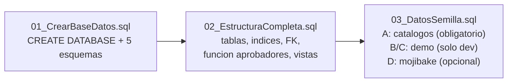

## En breve

`INTEGRA_CNP` es la base de datos SQL Server donde vive TODO el estado del sistema: usuarios, estructura organizacional, las boletas de justificacion de marca y sus aprobaciones, mas la bitacora de auditoria. Esta organizada en **cinco esquemas funcionales** (carpetas logicas dentro de la base que agrupan tablas por area de negocio) y se levanta con **tres scripts en orden**: crear base, crear estructura, sembrar datos. El backend la consulta con ADO.NET + Dapper (sin EF Core); ver [Infraestructura](modulo-infraestructura.html).

> 📌 En la practica: si necesitas saber donde se guarda un dato o que tabla toca un endpoint, esta es la pagina. Cada afirmacion cita el script SQL real en `docs/db/`.

## Diagrama entidad-relacion

El siguiente diagrama ER (modelo de entidades y como se relacionan) resume las tablas principales y sus claves foraneas (FK = columna que apunta a la clave primaria de otra tabla, creando la relacion). Esta tomado de [02-modelo-datos.mmd](../docs/manual-tecnico/capturas/02-modelo-datos.mmd).

```mermaid
erDiagram
    Rol {
        int RolId PK
        varchar Descripcion
    }
    EstadoJustificacion {
        int EstadoJustificacionId PK
        varchar Descripcion
    }
    TipoJustificacion {
        int TipoJustificacionId PK
        varchar Descripcion
    }
    EstadoRegistro {
        int EstadoRegistroId PK
        varchar Descripcion
    }
    TipoEventoAuditoria {
        int TipoEventoAuditoriaId PK
        varchar Descripcion
    }
    ResultadoAuditoria {
        int ResultadoAuditoriaId PK
        varchar Descripcion
    }
    Usuario {
        int UsuarioId PK
        int JefaturaId FK
        int RolId FK
        int UnidadId "logico CodigoOrigen"
        varchar Compania
    }
    EstructuraOrganizacional {
        int EstructuraOrganizacionalId PK
        int EstructuraPadreId FK
        int EstadoRegistroId FK
        varchar CodigoOrigen
    }
    Justificacion {
        int JustificacionId PK
        int UsuarioId FK
        int EstadoJustificacionId FK
        int AprobadorId FK
    }
    JustificacionDetalle {
        int JustificacionDetalleId PK
        int JustificacionId FK
        int TipoJustificacionId FK
        date FechaMarca
    }
    JerarquiaAprobacion {
        int JerarquiaAprobacionId PK
        int AprobadorUsuarioId FK
        int EstructuraOrganizacionalId FK
        int EstadoRegistroId FK
    }
    DelegacionAprobacion {
        int DelegacionAprobacionId PK
        int DeleganteUsuarioId FK
        int DelegadoUsuarioId FK
        int JerarquiaAprobacionId FK
        int EstadoRegistroId FK
    }
    EventoAuditoria {
        bigint EventoAuditoriaId PK
        int UsuarioId FK
        int TipoEventoAuditoriaId FK
        int ResultadoAuditoriaId FK
    }
    AdminAccionAuditoria {
        bigint AdminAccionAuditoriaId PK
        int UsuarioActorId FK
        int ResultadoAuditoriaId FK
    }
    ErrorApi {
        int ErrorApiId PK
        uniqueidentifier CorrelationId
    }

    Rol                      ||--o{ Usuario : "clasifica"
    Usuario                  ||--o{ Usuario : "jefe directo"
    EstructuraOrganizacional ||--o{ EstructuraOrganizacional : "padre"
    EstadoRegistro           ||--o{ EstructuraOrganizacional : "vigencia"
    Usuario                  ||--o{ Justificacion : "solicita"
    Usuario                  |o--o{ Justificacion : "aprueba"
    EstadoJustificacion      ||--o{ Justificacion : "estado"
    Justificacion            ||--o{ JustificacionDetalle : "contiene"
    TipoJustificacion        ||--o{ JustificacionDetalle : "tipifica"
    Usuario                  ||--o{ JerarquiaAprobacion : "aprobador"
    EstructuraOrganizacional ||--o{ JerarquiaAprobacion : "ambito"
    EstadoRegistro           ||--o{ JerarquiaAprobacion : "vigencia"
    Usuario                  ||--o{ DelegacionAprobacion : "delegante"
    Usuario                  ||--o{ DelegacionAprobacion : "delegado"
    JerarquiaAprobacion      |o--o{ DelegacionAprobacion : "sobre jerarquia"
    EstadoRegistro           ||--o{ DelegacionAprobacion : "vigencia"
    Usuario                  |o--o{ EventoAuditoria : "actor"
    TipoEventoAuditoria      ||--o{ EventoAuditoria : "tipo"
    ResultadoAuditoria       ||--o{ EventoAuditoria : "resultado"
    Usuario                  ||--o{ AdminAccionAuditoria : "actor"
    ResultadoAuditoria       ||--o{ AdminAccionAuditoria : "resultado"
```



> 💡 La notacion de las puntas: `||--o{` = uno-a-muchos obligatorio (un `Rol` clasifica a muchos `Usuario`, y todo `Usuario` tiene rol). `|o--o{` = uno-a-muchos opcional (una `Justificacion` puede o no tener `Aprobador`). El autobucle (`Usuario ||--o{ Usuario`) modela "jefe directo": un usuario puede ser jefe de varios, y cada quien tiene a lo sumo un jefe.

## Los cinco esquemas funcionales

Un **esquema** en SQL Server es un contenedor de nombres dentro de la base: agrupa tablas por area y se referencia como `Esquema.Tabla` (por ejemplo `Operacion.Justificacion`). El script [01_CrearBaseDatos.sql:62-87](../docs/db/01_CrearBaseDatos.sql) crea estos cinco; `dbo` queda reservado a objetos de sistema y a vistas legadas de compatibilidad.

| Esquema | Que guarda | Tablas principales |
| --- | --- | --- |
| `Configuracion` | Catalogos y parametros de baja cardinalidad (valores fijos de referencia) | `Rol`, `EstadoJustificacion`, `TipoJustificacion`, `EstadoRegistro`, `TipoEventoAuditoria`, `ResultadoAuditoria` |
| `RecursosHumanos` | Personal y estructura organizacional | `Usuario`, `EstructuraOrganizacional` |
| `Operacion` | Las boletas de justificacion + jerarquia y delegacion de aprobacion | `Justificacion`, `JustificacionDetalle`, `JerarquiaAprobacion`, `DelegacionAprobacion` |
| `Auditoria` | Trazabilidad: eventos de negocio, errores de la API, acciones admin | `EventoAuditoria`, `ErrorApi`, `AdminAccionAuditoria` |
| `Integracion` | Vistas de **solo lectura** sobre bases externas (WIZDOM / SIFCNP) | `v_EmpleadoWizdom`, `v_OrganigramaWizdom`, `v_JustificacionEncabezadoSifcnp`, `v_JustificacionDetalleSifcnp` |

> 📌 Para que sirve la separacion: cada area tiene fronteras claras de permisos y de responsabilidad. La escritura ocurre solo en `INTEGRA_CNP`; `Integracion.*` nunca modifica WIZDOM/SIFCNP (son ventanas de lectura).

## Configuracion: los catalogos

Tablas de referencia con pocos registros que el backend usa como diccionarios. Sus IDs son **fijos de negocio** (no autoincrementales) salvo `TipoJustificacion`, que es extensible y usa `IDENTITY`. Definidas en [02_EstructuraCompleta.sql:63-145](../docs/db/02_EstructuraCompleta.sql) y sembradas en [03_DatosSemilla.sql:44-123](../docs/db/03_DatosSemilla.sql).

| Tabla | PK | Valores semilla |
| --- | --- | --- |
| `Configuracion.Rol` | `RolId` (1..4) | 1=Funcionario, 2=Jefatura, 3=RRHH, 4=Administrador |
| `Configuracion.EstadoJustificacion` | `EstadoJustificacionId` | 1=Pendiente Jefatura, 2=Aprobada, 3=Rechazada |
| `Configuracion.TipoJustificacion` | `TipoJustificacionId` (IDENTITY) | Marca Tardia, Omision Marca de Entrada, Omision Marca de Salida, Marca antes Hora de Salida, Ausencia |
| `Configuracion.EstadoRegistro` | `EstadoRegistroId` | 1=Activo, 2=Inactivo (baja logica) |
| `Configuracion.TipoEventoAuditoria` | `TipoEventoAuditoriaId` | 1..7 eventos funcionales + 8..11 acciones admin |
| `Configuracion.ResultadoAuditoria` | `ResultadoAuditoriaId` | 1=Exito, 2=Fallo, 3=Denegado |

> 💡 Por que IDs fijos: el backend referencia constantes como "estado 1 = Pendiente" directamente en consultas y servicios. Si esos IDs cambiaran entre ambientes, la logica se rompe. Por eso `Rol`, `EstadoJustificacion`, etc. usan PK manual sembrada con `MERGE` (ver mas abajo). Los roles de [Dominio](modulo-dominio.html) (`ROL_FUNC`, etc.) son una capa aparte que el frontend envia por header; estos IDs numericos son el catalogo de BD.

## RecursosHumanos: personal y organizacion

### `RecursosHumanos.Usuario`
El registro de cada persona. Definida en [02_EstructuraCompleta.sql:154-179](../docs/db/02_EstructuraCompleta.sql).

| Columna | Tipo | Rol |
| --- | --- | --- |
| `UsuarioId` | INT IDENTITY | PK |
| `Cedula` | VARCHAR(64) | Identificador externo (cedula / codigo) |
| `NombreCompleto` | VARCHAR(150) | — |
| `JefaturaId` | INT NULL | **Auto-FK**: jefe directo (apunta a otro `Usuario`) |
| `UnidadId` | INT | Codigo de la unidad organizacional (enlace logico con `EstructuraOrganizacional.CodigoOrigen`) |
| `RolId` | INT | FK a `Configuracion.Rol` |
| `Compania` | VARCHAR(10) | CHECK: solo `'CNP'` o `'FANAL'` |
| `EsActivo` | BIT | Baja logica (default 1) |

> ⚠️ Relacion floja unidad-estructura: `Usuario.UnidadId` (INT) se vincula a `EstructuraOrganizacional.CodigoOrigen` (VARCHAR) por **convencion logica**, NO por una FK fisica. El join se hace en codigo con `CAST(u.UnidadId AS VARCHAR(50)) = eo.CodigoOrigen` (ver la funcion de aprobadores). Es una desviacion de 3FN documentada en los comentarios del script.

### `RecursosHumanos.EstructuraOrganizacional`
El organigrama jerarquico. Definida en [02_EstructuraCompleta.sql:185-204](../docs/db/02_EstructuraCompleta.sql).

| Columna | Rol |
| --- | --- |
| `EstructuraOrganizacionalId` | PK (IDENTITY) |
| `CodigoOrigen` | Codigo de la unidad en el sistema origen (lo que matchea `Usuario.UnidadId`) |
| `EstructuraPadreId` | **Auto-FK**: nodo padre (permite arbol de dependencias) |
| `EstadoRegistroId` | FK a `EstadoRegistro` (vigencia activo/inactivo) |
| `VigenciaDesde` / `VigenciaHasta` | Versionado temporal del nodo (rango en que esta vigente) |

## Operacion: la boleta y su aprobacion

Aqui vive el corazon del negocio. El modelo es **encabezado/detalle**: una boleta (`Justificacion`) agrupa varias lineas (`JustificacionDetalle`), una por fecha de marca a justificar. Ver el [flujo de aprobacion](flujos.html).

### `Operacion.Justificacion` (encabezado)
Una fila por solicitud. [02_EstructuraCompleta.sql:215-241](../docs/db/02_EstructuraCompleta.sql).

| Columna | Rol |
| --- | --- |
| `JustificacionId` | PK |
| `UsuarioId` | FK -> `Usuario` (el solicitante) |
| `MotivoGeneral` | Texto del motivo |
| `EstadoJustificacionId` | FK -> `EstadoJustificacion` (1/2/3) |
| `AprobadorId` | FK NULL -> `Usuario` (quien resolvio) |
| `ComentarioResolucion`, `RolResolucion`, `FechaAprobacion` | **Snapshot** del momento de resolver |

### `Operacion.JustificacionDetalle` (lineas)
Una marca/fecha por fila. [02_EstructuraCompleta.sql:245-262](../docs/db/02_EstructuraCompleta.sql).

| Columna | Rol |
| --- | --- |
| `JustificacionDetalleId` | PK |
| `JustificacionId` | FK -> `Justificacion` (a que boleta pertenece) |
| `TipoJustificacionId` | FK -> `TipoJustificacion` (que tipo de marca) |
| `FechaMarca` | DATE: la fecha que se justifica |
| `ObservacionDetalle` | Nota opcional de la linea |

### `Operacion.JerarquiaAprobacion`
Define **quien aprueba para que estructura**. [02_EstructuraCompleta.sql:267-290](../docs/db/02_EstructuraCompleta.sql). Relaciona un `AprobadorUsuarioId` con una `EstructuraOrganizacionalId`, con `TipoRelacion` (`'Vertical'` o `'Horizontal'`, via CHECK) y vigencia temporal.

### `Operacion.DelegacionAprobacion`
Permite que un jefe (delegante) ceda su capacidad de aprobar a otro usuario (delegado) por un periodo. [02_EstructuraCompleta.sql:295-319](../docs/db/02_EstructuraCompleta.sql). Si `JerarquiaAprobacionId` es NULL, la delegacion aplica a **todas** las jerarquias del delegante.

## La funcion dbo.fn_AprobadoresVigentesPorSolicitante

Es el cerebro del scoping de aprobacion: dado un solicitante y una fecha, devuelve **quienes pueden aprobarle** en ese momento. Definida en [02_EstructuraCompleta.sql:517-568](../docs/db/02_EstructuraCompleta.sql) como una *table-valued function* (TVF: funcion que retorna una tabla, usable en un `FROM ... JOIN`).

Devuelve tres columnas por aprobador:

| Columna | Significado |
| --- | --- |
| `AprobadorUsuarioId` | El usuario que puede aprobar |
| `Origen` | `'Jerarquia'` (por organigrama) o `'Delegacion'` (cedida) |
| `DeleganteUsuarioId` | Si es delegacion, de quien proviene; NULL si es jerarquia |

Internamente encadena tres CTEs (subconsultas con nombre): (1) resuelve la(s) estructura(s) vigentes del solicitante por su `UnidadId`; (2) busca las jerarquias activas sobre esas estructuras; (3) suma las delegaciones vigentes cuyo delegante sea un aprobador por jerarquia. Une jerarquia y delegacion con `UNION ALL`.

> 📌 Delegacion tiene prioridad sobre jerarquia: la funcion devuelve **ambos** origenes, pero el backend, al consumir el resultado, da precedencia a `Origen='Delegacion'`. Esto esta documentado en `CLAUDE.md` y en los comentarios del script. La regla de negocio: si hay una delegacion vigente, manda sobre la cadena jerarquica normal.

> ⚠️ Por que vive en `dbo` y no en `Operacion`: porque el backend la invoca literalmente como `dbo.fn_AprobadoresVigentesPorSolicitante(...)` en [JustificacionesSql.cs:105,202,272,...](../backend/src/IntegradorMarcas.Infrastructure/Queries/JustificacionesSql.cs) (7 consultas). El script crea la version `dbo` y **elimina** una version obsoleta `Operacion.fn_...` si existe ([02_EstructuraCompleta.sql:508-515](../docs/db/02_EstructuraCompleta.sql)). Ver [Infraestructura](modulo-infraestructura.html).

## Auditoria

Tres tablas de bitacora. Varias columnas son **snapshots inmutables** (se copia el valor del momento, no se normaliza a FK) para que el historico no cambie aunque el usuario despues se modifique.

| Tabla | PK | Para que |
| --- | --- | --- |
| `Auditoria.EventoAuditoria` | `EventoAuditoriaId` (BIGINT) | Eventos funcionales de negocio (crear/resolver boleta, altas admin). Guarda `NombreUsuario`/`RolCodigo` como snapshot. [02:330-352](../docs/db/02_EstructuraCompleta.sql) |
| `Auditoria.ErrorApi` | `ErrorApiId` | Log de errores de la API. **Columnas en ingles a proposito** (`HttpMethod`, `StatusCode`, `UsuarioID`, `Ip`...) por contrato del codigo C#. [02:357-378](../docs/db/02_EstructuraCompleta.sql) |
| `Auditoria.AdminAccionAuditoria` | `AdminAccionAuditoriaId` (BIGINT) | Acciones admin con snapshots JSON antes/despues (`ValoresAnteriores`/`ValoresNuevos`). [02:414-437](../docs/db/02_EstructuraCompleta.sql) |

> ⚠️ La desviacion del ingles en `ErrorApi` es DELIBERADA y no debe "corregirse": las columnas deben calzar con las propiedades del repositorio en C#. El script incluso renombra columnas legadas en espanol si encuentra una BD vieja ([02:381-410](../docs/db/02_EstructuraCompleta.sql)).

## Integracion y vistas legadas

### Vistas de Integracion (WIZDOM / SIFCNP, solo lectura)
WIZDOM y SIFCNP son bases externas que el sistema **solo lee**, nunca escribe. Las vistas en `Integracion.*` exponen sus columnas con alias PascalCase. [02_EstructuraCompleta.sql:594-704](../docs/db/02_EstructuraCompleta.sql).

| Vista | Sobre | Notas |
| --- | --- | --- |
| `Integracion.v_EmpleadoWizdom` | `WIZDOM.dbo.empleado` | Datos de personal del sistema origen |
| `Integracion.v_OrganigramaWizdom` | `WIZDOM.dbo.organigrama` | Nodos del organigrama |
| `Integracion.v_JustificacionEncabezadoSifcnp` | `SIFCNP.dbo.RH_JUSTIFICACIONES_ENC` | Historico de justificaciones (encabezado) |
| `Integracion.v_JustificacionDetalleSifcnp` | `SIFCNP.dbo.RH_JUSTIFICACIONES_DET` | Historico (detalle) |

> 💡 Guardas `DB_ID`: `CREATE VIEW` valida las columnas de origen al crearse, asi que estas vistas se crean **solo si la BD externa existe** (`IF DB_ID('WIZDOM') IS NOT NULL`). En un entorno local sin WIZDOM/SIFCNP, el script las omite con un `PRINT` y no aborta. Usan `COLLATE SQL_Latin1_General_CP1_CI_AS` para joins entre bases.

### `dbo.V_JUSTIFICACIONES_DETALLE` (vista legada)
Vista de compatibilidad para consumidores SIFCNP. Usa nomenclatura `MAYUSCULAS_SNAKE` en esquema `dbo` **a proposito** (no aplicar PascalCase aqui). [02_EstructuraCompleta.sql:706-750](../docs/db/02_EstructuraCompleta.sql). Depende de tablas locales `dbo.RH_*`; se crea solo si las cuatro existen.

### Shim `dbo.Estructuras_Organizacionales`
[02_EstructuraCompleta.sql:752-785](../docs/db/02_EstructuraCompleta.sql). El backend referencia esta tabla en UNA sola consulta (`JustificacionesSql.GetDetalleJefaturaEncabezado`), de forma inconsistente con el resto del codigo. El script crea un **shim** (vista de compatibilidad) solo si el objeto no existe, para que esa consulta no falle en entornos sin la tabla legada.

## Convenciones de nomenclatura

Formalizadas en [Convenciones_Nomeclatura_BD.md](../docs/db/Convenciones_Nomeclatura_BD.md). Reglas que veras aplicadas en todo el modelo:

| Regla | Detalle | Ejemplo |
| --- | --- | --- |
| PascalCase | En todo: tablas, columnas, vistas, SP, params | `FechaHoraCreacion` |
| Espanol descriptivo | Sin abreviaciones, sin palabras reservadas T-SQL | `MotivoGeneral`, no `desc` |
| Esquema explicito | Todo objeto pertenece a un esquema; `dbo` solo sistema/legado | `Operacion.Justificacion` |
| Tablas en singular | La tabla define el tipo, no la coleccion | `Usuario`, no `tbl_Usuarios` |
| PK = `[Tabla]Id` | Clave primaria con el nombre de la tabla | `JustificacionId` |
| FK = nombre de la PK referenciada | Hace las relaciones autoexplicativas | `Justificacion.UsuarioId` -> `Usuario.UsuarioId` |
| Booleanos afirmativos | `Es`/`Tiene` | `EsActivo` |
| Fechas | `Fecha` / `FechaHora` | `FechaMarca`, `FechaHoraCreacion` |
| Auditoria obligatoria | En entidades de negocio | `CreadoPor`, `FechaHoraCreacion`, `ModificadoPor`, `FechaHoraModificacion` |
| Vistas | Prefijo `v_` | `v_EmpleadoWizdom` |
| Constraints/indices | Nombre explicito (nunca autogenerado) | `PK_Justificacion`, `FK_Justificacion_UsuarioId` |

> ⚠️ Excepciones documentadas y a respetar: `Auditoria.ErrorApi` (columnas en ingles), `dbo.V_JUSTIFICACIONES_DETALLE` (MAYUSCULAS_SNAKE), y la funcion de aprobadores en `dbo`. No son descuidos: estan justificadas por contratos C# o compatibilidad SIFCNP.

## Los tres scripts y su orden

Estan en `docs/db/` y deben ejecutarse **en secuencia** (sqlcmd o SSMS, codificacion UTF-8). Todos son **idempotentes**: re-ejecutarlos no duplica ni rompe nada (guardas `IF DB_ID` / `OBJECT_ID` / `COL_LENGTH`, `MERGE` para semilla, `CREATE OR ALTER` para rutinas).



| Script | Que hace | Notas |
| --- | --- | --- |
| [01_CrearBaseDatos.sql](../docs/db/01_CrearBaseDatos.sql) | `CREATE DATABASE INTEGRA_CNP` + los 5 esquemas | No crea tablas ni datos |
| [02_EstructuraCompleta.sql](../docs/db/02_EstructuraCompleta.sql) | TODA la estructura: catalogos, RRHH/Operacion/Auditoria, indices, funcion `dbo.fn_AprobadoresVigentesPorSolicitante`, vistas `Integracion.*`, vista legada y shim | Objetos que dependen de WIZDOM/SIFCNP se crean con guardas; si faltan, se omiten sin abortar |
| [03_DatosSemilla.sql](../docs/db/03_DatosSemilla.sql) | A) catalogos (obligatorio); B) demo unidad 120; C) jerarquia de 12 dependencias; D) remediacion mojibake | **En produccion ejecutar solo la Seccion A** |

> 📌 Que es "idempotente": que podes correr el mismo script varias veces y el resultado final es el mismo, sin errores de "ya existe" ni filas duplicadas. Critico para re-aplicar la estructura tras un cambio sin tener que borrar la base.

Ejemplo del patron `MERGE` usado para sembrar catalogos sin duplicar ([03_DatosSemilla.sql:45-55](../docs/db/03_DatosSemilla.sql)):

```sql
MERGE INTO Configuracion.Rol AS tgt
USING (
    SELECT 1 AS RolId, 'Funcionario'   AS Descripcion
    UNION ALL SELECT 2, 'Jefatura'
    UNION ALL SELECT 3, 'RRHH'
    UNION ALL SELECT 4, 'Administrador'
) AS src
ON tgt.RolId = src.RolId
WHEN NOT MATCHED THEN
    INSERT (RolId, Descripcion, CreadoPor) VALUES (src.RolId, src.Descripcion, 'seed');
```

> 💡 La Seccion D corrige *mojibake* (texto UTF-8 mal interpretado como Latin1, p.ej. `ó` en vez de `ó`). En una base sembrada limpia es un no-op. Es el lado-BD del mismo bug de encoding que el frontend parchea en `app.js`.

## Referencias en el codigo

- [01_CrearBaseDatos.sql](../docs/db/01_CrearBaseDatos.sql) — crea la base y los 5 esquemas.
- [02_EstructuraCompleta.sql](../docs/db/02_EstructuraCompleta.sql) — toda la estructura, la funcion de aprobadores, indices y vistas.
- [03_DatosSemilla.sql](../docs/db/03_DatosSemilla.sql) — catalogos, demos y remediacion de encoding.
- [Convenciones_Nomeclatura_BD.md](../docs/db/Convenciones_Nomeclatura_BD.md) — reglas de nomenclatura obligatorias.
- [02-modelo-datos.mmd](../docs/manual-tecnico/capturas/02-modelo-datos.mmd) — fuente del diagrama ER.
- [JustificacionesSql.cs](../backend/src/IntegradorMarcas.Infrastructure/Queries/JustificacionesSql.cs) — donde el backend invoca `dbo.fn_AprobadoresVigentesPorSolicitante`.

Paginas relacionadas: [Infraestructura](modulo-infraestructura.html) · [Dominio](modulo-dominio.html) · [Flujos](flujos.html).
