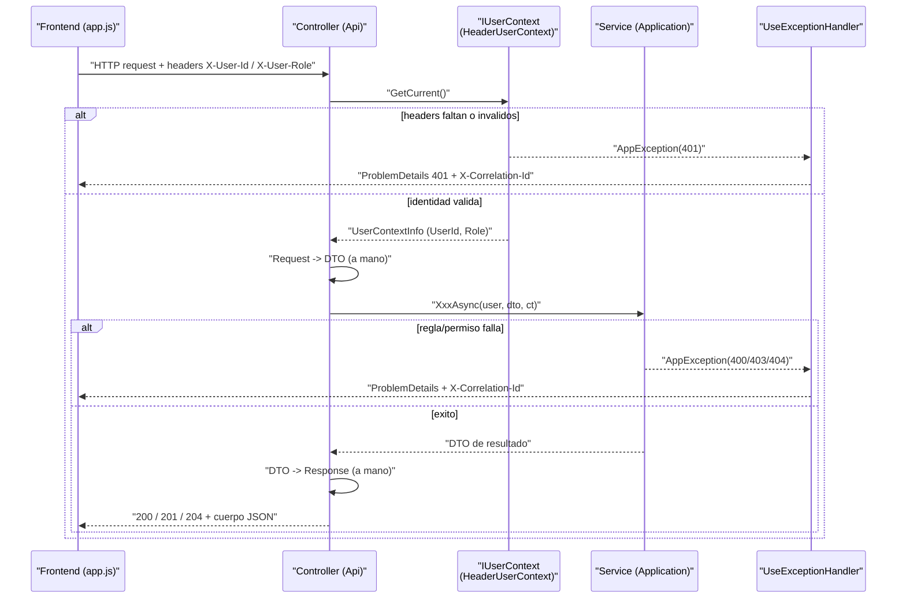

## En breve

La capa **Api** es la puerta de entrada HTTP del sistema: recibe las peticiones del frontend, las traduce a objetos de transporte (DTO), llama al servicio de negocio correspondiente en la capa [Application](modulo-application.html), y devuelve la respuesta (o un error normalizado). No tiene logica de negocio propia: es una capa fina de "traduccion y delegacion". Vive en `backend/src/IntegradorMarcas.Api/` y es la unica capa que "sabe" de HTTP, controllers y rutas.

> 📌 En la practica: un **controller** es la clase que mapea una URL (`POST /api/justificaciones`) a un metodo de C#. Aca solo se arma/desarma el "sobre" HTTP; el trabajo real lo hace el servicio que el controller invoca.

## Que hace (y que NO hace) la capa Api

Cada controller hace siempre los mismos cuatro pasos, sin excepcion en los controllers "normales":

1. **Resolver la identidad**: llama a `_userContext.GetCurrent()` para saber quien es el usuario (lee los headers `X-User-Id` / `X-User-Role`). Ver [Seguridad](seguridad.html).
2. **Traducir Request -> DTO**: convierte el objeto que llego en el cuerpo JSON (un `*Request`) al DTO que entiende la capa Application. Se hace **a mano**, con object initializers; no hay AutoMapper ni mapeo automatico.
3. **Delegar en el servicio**: `await _service.XxxAsync(user, dto, cancellationToken)`. Toda la logica de negocio, validacion y autorizacion vive ahi, no aca.
4. **Traducir DTO -> Response**: convierte el resultado del servicio a un objeto `*Response` (de nuevo a mano) y lo envuelve en `Ok(...)`, `CreatedAtAction(...)` o `NoContent()`.

> 💡 Un **DTO** (Data Transfer Object) es un objeto plano que solo lleva datos de una capa a otra, sin comportamiento. Aca hay tres "formas" del mismo dato segun la capa: **Contracts** (lo que viaja por la red), **DTOs** (transporte interno entre capas) y **Entities** del [Dominio](modulo-dominio.html). El controller es el que cruza de Contracts a DTOs y viceversa.

Lo que la capa Api **NO** hace: validar reglas de negocio, decidir si un rol tiene permiso, o tocar la base de datos. Eso queda en Application (logica/autorizacion) e [Infraestructura](modulo-infraestructura.html) (acceso a datos). Esta separacion es la regla de la [Clean Architecture](arquitectura.html): las dependencias apuntan hacia adentro.

Patron tipico (extraido de `JustificacionesController.Create`):

```cs
[HttpPost]
public async Task<ActionResult<CreateJustificacionResponse>> Create(
    [FromBody] CreateJustificacionRequest request,
    CancellationToken cancellationToken)
{
    var user = _userContext.GetCurrent();              // 1. identidad
    var dto = new CreateJustificacionDto { ... };       // 2. Request -> DTO (a mano)
    var id = await _service.CreateAsync(user, dto, cancellationToken); // 3. delega
    return CreatedAtAction(nameof(ListMine), new { id }, new CreateJustificacionResponse { ... }); // 4. DTO -> Response
}
```

Fuente: [JustificacionesController.cs:23-51](../backend/src/IntegradorMarcas.Api/Controllers/JustificacionesController.cs).

## Los 7 controllers

Todos los controllers de negocio comparten la misma forma: `[ApiController]`, `sealed`, reciben por constructor un servicio de Application y el `IUserContext`. La unica clase que **no** es `sealed` es `SessionController` (excepcion deliberada). Las rutas se declaran con `[Route(...)]`; algunas usan el token `[controller]` (que se reemplaza por el nombre de la clase sin el sufijo "Controller").

| Controller | Ruta base | Rol que sirve | Responsabilidad | Depende de |
| --- | --- | --- | --- | --- |
| `JustificacionesController` | `api/[controller]` -> `api/justificaciones` | `ROL_FUNC` | Crear boleta, listar las propias (`/mias`), ver lineas, consultar el aprobador actual (`/aprobador-actual`), historico | `IJustificacionService` |
| `JefaturaController` | `api/jefatura/justificaciones` | `ROL_JEFE` | Listar pendientes, ver detalle completo, resolver (aprobar/rechazar) | `IJustificacionService` |
| `RrhhController` | `api/rrhh/justificaciones` | `ROL_RRHH` | Consulta global de justificaciones con filtros | `IJustificacionService` |
| `AdminAprobacionesController` | `api/admin/aprobaciones` | `ROL_ADMIN` | CRUD de jerarquias y delegaciones de aprobacion | `IAdminAprobacionesService` |
| `AdminOrganizacionController` | `api/admin/organizacion` | `ROL_ADMIN` | Gestionar dependencias y asignacion/estado de usuarios | `IAdminOrganizacionService` |
| `AdminMonitoringController` | `api/admin/monitoring` | `ROL_ADMIN` | Listar registros de errores y eventos de auditoria (monitoreo) | `ISqlConnectionFactory` (SQL inline) |
| `SessionController` | `api/[controller]` -> `api/session` | Todos | Validar sesion (`/status`), perfil (`/profile`), logout | `ISqlConnectionFactory` (SQL inline) |

Fuentes: [JustificacionesController.cs](../backend/src/IntegradorMarcas.Api/Controllers/JustificacionesController.cs), [JefaturaController.cs](../backend/src/IntegradorMarcas.Api/Controllers/JefaturaController.cs), [RrhhController.cs](../backend/src/IntegradorMarcas.Api/Controllers/RrhhController.cs), [AdminAprobacionesController.cs](../backend/src/IntegradorMarcas.Api/Controllers/AdminAprobacionesController.cs), [AdminOrganizacionController.cs](../backend/src/IntegradorMarcas.Api/Controllers/AdminOrganizacionController.cs), [AdminMonitoringController.cs](../backend/src/IntegradorMarcas.Api/Controllers/AdminMonitoringController.cs), [SessionController.cs](../backend/src/IntegradorMarcas.Api/Controllers/SessionController.cs).

> 💡 Para el catalogo completo de endpoints (verbos, rutas, query params y cuerpos), ver la pagina [Endpoints de la API](api.html).

### Detalle por controller

- **`JustificacionesController`** (funcionario): `POST` crea una boleta y responde `201 Created` con `EstadoID = PendienteJefatura`; `GET /mias` lista las propias con filtros opcionales (`estadoId`, `desde`, `hasta`); `GET /aprobador-actual` calcula quien debe aprobar; `GET /{id}/lineas` trae el detalle; `GET /historico` aplica scoping por rol dentro del servicio. Ver [JustificacionesController.cs:23-167](../backend/src/IntegradorMarcas.Api/Controllers/JustificacionesController.cs).
- **`JefaturaController`** (jefatura): `GET /pendientes` lista lo que la jefatura puede aprobar; `GET /{id}` arma una respuesta compuesta (encabezado + solicitante + aprobador + detalles); `PATCH /{id}/resolver` aplica la accion y devuelve `204 No Content`. La validacion de la accion y las transiciones de estado se hacen en el servicio, no aca. Ver [JefaturaController.cs:27-133](../backend/src/IntegradorMarcas.Api/Controllers/JefaturaController.cs).
- **`AdminAprobacionesController`**: CRUD de jerarquias (`/jerarquias`) y delegaciones (`/delegaciones`). Captura `HttpContext.TraceIdentifier` como `correlationId` y se lo pasa al servicio para auditoria de acciones admin. Ver [AdminAprobacionesController.cs:53-258](../backend/src/IntegradorMarcas.Api/Controllers/AdminAprobacionesController.cs).
- **`AdminOrganizacionController`**: usa dos helpers `static` privados (`MapDependenciaResponse`, `MapUsuarioResponse`) para el mapeo DTO -> Response, en vez de repetir el object initializer en cada accion. Ver [AdminOrganizacionController.cs:101-130](../backend/src/IntegradorMarcas.Api/Controllers/AdminOrganizacionController.cs).

## Contracts: la "forma del cable" (wire)

La carpeta `Contracts/` define la forma exacta del JSON que entra y sale por HTTP. Se divide en dos:

- **`Requests/`**: lo que el cliente manda en el cuerpo (`[FromBody]`). Ej. `CreateJustificacionRequest`, `ResolverJustificacionRequest`, `CreateJerarquiaRequest`.
- **`Responses/`**: lo que la API devuelve. Ej. `CreateJustificacionResponse`, `JustificacionResumenResponse`, `AdminDelegacionResponse`.

Son clases `sealed` con propiedades auto-implementadas y sin logica. Ejemplo minimo:

```cs
public sealed class CreateJustificacionResponse
{
    public int JustificacionID { get; set; }
    public int EstadoID { get; set; }
    public string EstadoDescripcion { get; set; } = string.Empty;
}
```

Fuente: [CreateJustificacionResponse.cs:3-8](../backend/src/IntegradorMarcas.Api/Contracts/Responses/CreateJustificacionResponse.cs).

### La convencion `ID` vs `Id` (deliberada, no es un descuido)

Hay una diferencia de naming **intencional** entre capas que conviene tener clara para no confundirse:

| Capa | Sufijo | Ejemplo |
| --- | --- | --- |
| **Api / Contracts** (wire) | `ID` (mayusculas) | `JustificacionID`, `AprobadorID`, `TipoJustificacionID` |
| **Application / DTOs** | `Id` (PascalCase) | `JustificacionId`, `AprobadorId` |
| **Domain / Entities** | `Id` (PascalCase) | `JustificacionId` |

El controller es el unico lugar donde se cruza esa frontera, mapeando `ID` <-> `Id` a mano. Se ve claro en `Create`: el Request trae `d.TipoJustificacionID` y el DTO lo recibe como `TipoJustificacionId` ([JustificacionesController.cs:32-37](../backend/src/IntegradorMarcas.Api/Controllers/JustificacionesController.cs)), y al responder ocurre lo inverso (`JustificacionID = x.JustificacionId`, [JustificacionesController.cs:70](../backend/src/IntegradorMarcas.Api/Controllers/JustificacionesController.cs)). Fuentes del contraste: [JustificacionDetalleRequest.cs:5](../backend/src/IntegradorMarcas.Api/Contracts/Requests/JustificacionDetalleRequest.cs) (`TipoJustificacionID`) vs el DTO en Application.

> ⚠️ Si ves `JustificacionID` (con D mayuscula) estas mirando un Contract de la capa Api. Si ves `JustificacionId`, estas en Application o Domain. No es inconsistencia: es la regla del proyecto y debe respetarse al agregar campos.

## Program.cs: el pipeline y el manejo de errores

[Program.cs](../backend/src/IntegradorMarcas.Api/Program.cs) es el punto de arranque: registra servicios (inyeccion de dependencias), arma el pipeline HTTP y publica el proceso. Lo importante para entender el comportamiento de la API:

### Registro de servicios (DI)

Cada interfaz de Application se asocia a su implementacion con `AddScoped` (una instancia por request): `IJustificacionService -> JustificacionService`, `IUserContext -> HeaderUserContext`, `ISqlConnectionFactory -> SqlConnectionFactory`, repositorios, etc. Ver [Program.cs:62-72](../backend/src/IntegradorMarcas.Api/Program.cs).

> 💡 **Inyeccion de dependencias (DI)**: en vez de que un controller cree el servicio que necesita, el framework se lo "inyecta" por el constructor segun este registro. Asi se desacoplan las capas y se pueden cambiar implementaciones (o usar mocks en tests) sin tocar el controller.

### Validacion de la cadena de conexion al arrancar

Si falta la connection string `IntegraCnp`, en entornos **no Development** el arranque **aborta** (fail-fast con `InvalidOperationException`); en Development solo **advierte** y sigue, para permitir trabajo de frontend/health sin BD. Ver [Program.cs:15-31](../backend/src/IntegradorMarcas.Api/Program.cs). La cadena nunca se versiona; se inyecta por variable de entorno (ver [Modelo de datos](modelo-datos.html) y [Seguridad](seguridad.html)).

### Manejo global de excepciones -> ProblemDetails

El bloque `app.UseExceptionHandler(...)` ([Program.cs:80-139](../backend/src/IntegradorMarcas.Api/Program.cs)) es el corazon de como la API reporta errores. Atrapa cualquier excepcion no manejada y la traduce a un codigo HTTP segun su tipo:

| Excepcion | Codigo HTTP | Origen |
| --- | --- | --- |
| `AppException` | el `StatusCode` que trae la propia excepcion (400/401/403/404...) | Application/Api |
| `KeyNotFoundException` | `404 Not Found` | Application/Infra |
| `OperationCanceledException` | `499` (cliente cancelo) | cancelacion del request |
| cualquier otra | `500 Internal Server Error` | inesperado |

Fuente del `switch`: [Program.cs:89-95](../backend/src/IntegradorMarcas.Api/Program.cs).

> 💡 **`ProblemDetails`** es el formato estandar (RFC 7807) para devolver errores HTTP en JSON: un objeto con `title`, `status`, etc. La respuesta se arma con `Results.Problem(...)` ([Program.cs:133-137](../backend/src/IntegradorMarcas.Api/Program.cs)).

Cada error genera un **`correlationId`** (un `Guid`) que se devuelve de dos formas para poder cruzar la respuesta del cliente con la bitacora tecnica:

- En el cuerpo, dentro de `extensions.correlationId`.
- En el header de respuesta `X-Correlation-Id` ([Program.cs:131](../backend/src/IntegradorMarcas.Api/Program.cs)).

Ademas, antes de responder, el handler intenta persistir el error en la BD via `IErrorLogRepository.LogAsync` (incluye `StackTrace` solo si `statusCode >= 500`). Es **fire-and-forget seguro**: si el logging falla, se traga la excepcion (`catch { }`) para no romper la respuesta al cliente. Ver [Program.cs:97-127](../backend/src/IntegradorMarcas.Api/Program.cs).

### ModelState invalido tambien va por AppException

Cuando el JSON entrante no pasa la validacion de modelo, en vez de la respuesta 400 por defecto de ASP.NET, se concatenan los mensajes y se lanza `AppException(..., 400)`, que cae en el mismo handler. Asi todos los errores salen con el mismo formato. Ver [Program.cs:34-46](../backend/src/IntegradorMarcas.Api/Program.cs).

### CORS abierto, /health y catch-all de 404

- **CORS**: la politica `LocalFrontend` permite **cualquier** origen, header y metodo (`SetIsOriginAllowed(_ => true)`). El propio comentario en codigo advierte que debe restringirse en despliegues expuestos. Ver [Program.cs:50-60](../backend/src/IntegradorMarcas.Api/Program.cs) y la advertencia en [Seguridad](seguridad.html).

> 💡 **CORS** (Cross-Origin Resource Sharing) controla que sitios web (origenes) pueden llamar a esta API desde el navegador. Aca esta abierto del todo porque es un entorno local/demo.

- **`GET /health`**: probe minimo que devuelve `{ status: "ok", utc: <fecha UTC> }` para verificar que el proceso esta vivo. Ver [Program.cs:161-165](../backend/src/IntegradorMarcas.Api/Program.cs).
- **Catch-all de 404**: un middleware intercepta respuestas 404 sin cuerpo y lanza `AppException("Endpoint no encontrado", 404)` para que tambien salgan en formato `ProblemDetails`. Ver [Program.cs:150-157](../backend/src/IntegradorMarcas.Api/Program.cs).

## Excepciones a las convenciones

Dos controllers rompen el patron "fino" descrito arriba y conviene saberlo:

- **`SessionController`**: es el unico controller **no `sealed`**, no usa `IUserContext` (parsea los headers `X-User-Id`/`X-User-Role` a mano dentro de cada accion) y recibe `ISqlConnectionFactory` directo para correr SQL inline (`SELECT NombreCompleto FROM RecursosHumanos.Usuario ...` en `/profile`). Devuelve objetos anonimos en vez de Contracts tipados. Ver [SessionController.cs:14-136](../backend/src/IntegradorMarcas.Api/Controllers/SessionController.cs).
- **`AdminMonitoringController`**: si usa `IUserContext` y valida el rol con un **guard clause** (`if (!RolesSistema.EsAdmin(...)) throw new AppException(..., 403)`), pero corre una consulta SQL grande **inline** (un `UNION ALL` sobre `Auditoria.ErrorApi` + `Auditoria.EventoAuditoria`) en vez de delegar en un repositorio. Tambien define su Response (`AdminMonitoringRecordResponse`) como clase anidada. Ver [AdminMonitoringController.cs:23-157](../backend/src/IntegradorMarcas.Api/Controllers/AdminMonitoringController.cs).

> 💡 Un **guard clause** es una validacion al inicio de un metodo que corta la ejecucion temprano si no se cumple una condicion (aca: si no es admin, lanza 403 y no sigue). Es el mecanismo de autorizacion del proyecto, ver [Seguridad](seguridad.html).

> ⚠️ Estos dos casos son la razon por la que la regla "todo el SQL vive en `Infrastructure/Queries`" tiene dos excepciones documentadas. Si extendes monitoreo o sesion, sabe que el SQL esta en el propio controller.

## Como fluye una peticion



El diagrama muestra el punto clave: los errores **no** se manejan con `try/catch` en cada controller. El controller deja "burbujear" la excepcion y el handler global de `Program.cs` la convierte en una respuesta `ProblemDetails` consistente con su `correlationId`.

## Referencias en el codigo

- [JustificacionesController.cs](../backend/src/IntegradorMarcas.Api/Controllers/JustificacionesController.cs) — endpoints del funcionario; patron Request->DTO->Response.
- [JefaturaController.cs](../backend/src/IntegradorMarcas.Api/Controllers/JefaturaController.cs) — pendientes, detalle compuesto y resolver.
- [RrhhController.cs](../backend/src/IntegradorMarcas.Api/Controllers/RrhhController.cs) — consulta global RRHH.
- [AdminAprobacionesController.cs](../backend/src/IntegradorMarcas.Api/Controllers/AdminAprobacionesController.cs) — CRUD jerarquias/delegaciones con correlationId.
- [AdminOrganizacionController.cs](../backend/src/IntegradorMarcas.Api/Controllers/AdminOrganizacionController.cs) — dependencias y usuarios; helpers de mapeo.
- [AdminMonitoringController.cs](../backend/src/IntegradorMarcas.Api/Controllers/AdminMonitoringController.cs) — excepcion: SQL inline + guard clause de rol.
- [SessionController.cs](../backend/src/IntegradorMarcas.Api/Controllers/SessionController.cs) — excepcion: no sealed, parsea headers a mano, SQL inline.
- [Program.cs](../backend/src/IntegradorMarcas.Api/Program.cs) — DI, pipeline, UseExceptionHandler/ProblemDetails, CORS, /health.
- [HeaderUserContext.cs](../backend/src/IntegradorMarcas.Api/Security/HeaderUserContext.cs) — resolucion de identidad por headers (401 si faltan).
- [CreateJustificacionRequest.cs](../backend/src/IntegradorMarcas.Api/Contracts/Requests/CreateJustificacionRequest.cs) · [CreateJustificacionResponse.cs](../backend/src/IntegradorMarcas.Api/Contracts/Responses/CreateJustificacionResponse.cs) · [JustificacionDetalleRequest.cs](../backend/src/IntegradorMarcas.Api/Contracts/Requests/JustificacionDetalleRequest.cs) — ejemplos de Contracts (sufijo `ID`).

Paginas relacionadas: [Arquitectura](arquitectura.html) · [Capa Application](modulo-application.html) · [Infraestructura](modulo-infraestructura.html) · [Dominio](modulo-dominio.html) · [Seguridad](seguridad.html) · [Endpoints de la API](api.html) · [Flujos](flujos.html) · [Glosario](glosario.html).
