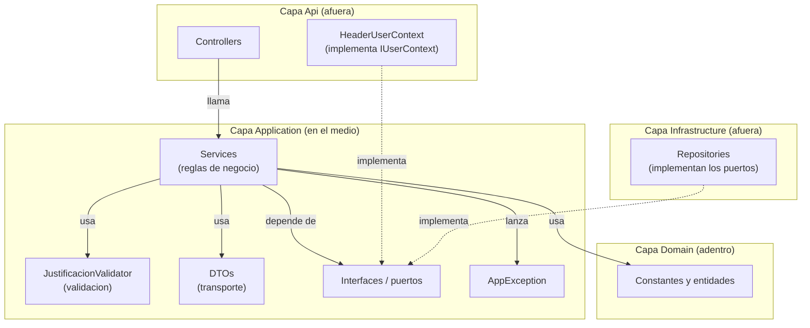
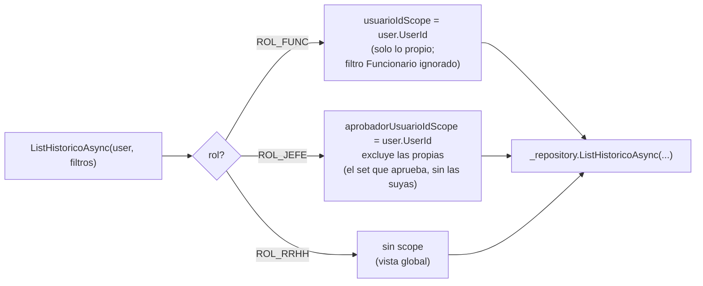

## En breve

La capa **Application** es el cerebro del backend: ahi viven las **reglas de negocio** (quien puede hacer que, que datos son validos, en que estado se puede aprobar una boleta). Lo importante es lo que NO sabe: no sabe de HTTP (no conoce `HttpContext` ni status codes salvo el numero que mete en una excepcion), ni de SQL (nunca arma una consulta ni abre una conexion). Para hablar con el mundo exterior define **puertos** (interfaces) que otras capas implementan. Esto es el corazon de la **Clean Architecture** del proyecto (ver [Arquitectura](arquitectura.html)): la dependencia apunta hacia adentro, asi que Application solo conoce a [Domain](modulo-dominio.html) y a si misma.

> 📌 En la practica: si manana cambias SQL Server por PostgreSQL, o la API REST por una consola, esta capa NO se toca. Las reglas viven aca, aisladas de la tecnologia.

## Por que existe una capa "en el medio"

En un sistema tipico la tentacion es poner toda la logica en el controlador (el codigo que recibe el request HTTP). El problema: ahi se mezcla "que devuelve cada endpoint" con "quien puede aprobar una boleta y bajo que condiciones". Cuando crece, nadie sabe donde esta una regla.

La capa Application separa esas dos cosas. El controlador en [modulo-api](modulo-api.html) se vuelve delgado (traduce request -> DTO, llama al servicio, traduce DTO -> response). Toda la decision de negocio queda en un **service** de Application. Y como el service no toca la base de datos directamente, sino a traves de interfaces, se puede **probar con tests** sin necesitar SQL Server real.



## La logica vive en Services

Hay **tres servicios**, uno por area funcional. Cada uno es una clase `sealed` (no se puede heredar de ella, convencion del proyecto) que recibe sus dependencias por el constructor (eso es **inyeccion de dependencias**: en vez de crear sus colaboradores, se los pasan ya armados, lo que facilita reemplazarlos por dobles de prueba en los tests).

| Servicio | Interface (puerto) | Responsabilidad | Roles que atiende |
| --- | --- | --- | --- |
| `JustificacionService` | `IJustificacionService` | Ciclo de vida de las boletas: crear, listar, ver detalle, resolver (aprobar/rechazar) | ROL_FUNC, ROL_JEFE, ROL_RRHH |
| `AdminAprobacionesService` | `IAdminAprobacionesService` | ABM de jerarquias de aprobacion y delegaciones | ROL_ADMIN |
| `AdminOrganizacionService` | `IAdminOrganizacionService` | ABM de dependencias organizacionales y asignacion/estado de usuarios | ROL_ADMIN |

### JustificacionService — el flujo central de boletas

Es el servicio mas usado. Su interface declara los metodos que el controlador puede invocar ([IJustificacionService.cs:5-16](../backend/src/IntegradorMarcas.Application/Interfaces/IJustificacionService.cs)). En el constructor recibe dos puertos: el repositorio de datos y el de eventos de auditoria ([JustificacionService.cs:11-18](../backend/src/IntegradorMarcas.Application/Services/JustificacionService.cs)).

| Metodo | Que hace | Quien puede |
| --- | --- | --- |
| `CreateAsync` | Crea una boleta nueva con sus lineas de detalle | funcionario o jefatura ([JustificacionService.cs:22-25](../backend/src/IntegradorMarcas.Application/Services/JustificacionService.cs)) |
| `GetCurrentApproverAsync` | Devuelve quien es el aprobador vigente del solicitante | funcionario, jefatura o RRHH ([:57-65](../backend/src/IntegradorMarcas.Application/Services/JustificacionService.cs)) |
| `ListMineAsync` | Lista las boletas propias del usuario | funcionario, jefatura o RRHH ([:67-76](../backend/src/IntegradorMarcas.Application/Services/JustificacionService.cs)) |
| `ListMineLineasAsync` | Detalle (lineas) de una boleta propia | funcionario, jefatura o RRHH ([:89-103](../backend/src/IntegradorMarcas.Application/Services/JustificacionService.cs)) |
| `ListPendientesJefaturaAsync` | Cola de boletas pendientes de aprobar | solo jefatura ([:78-87](../backend/src/IntegradorMarcas.Application/Services/JustificacionService.cs)) |
| `ListRrhhAsync` | Vista global de todas las boletas | solo RRHH ([:105-117](../backend/src/IntegradorMarcas.Application/Services/JustificacionService.cs)) |
| `ListHistoricoAsync` | Historico con **scoping** segun rol (ver mas abajo) | funcionario, jefatura o RRHH ([:119-151](../backend/src/IntegradorMarcas.Application/Services/JustificacionService.cs)) |
| `GetDetalleJefaturaAsync` | Detalle de una boleta para aprobarla | solo jefatura, y solo si esta en su alcance ([:153-178](../backend/src/IntegradorMarcas.Application/Services/JustificacionService.cs)) |
| `ResolverAsync` | Aprueba o rechaza una boleta | solo jefatura ([:180-227](../backend/src/IntegradorMarcas.Application/Services/JustificacionService.cs)) |

`CreateAsync` es un buen ejemplo de todo lo que hace un service: chequea rol, valida el request, verifica contra el catalogo que los `TipoJustificacionId` existan, delega la insercion al repositorio y registra un evento de auditoria ([JustificacionService.cs:20-55](../backend/src/IntegradorMarcas.Application/Services/JustificacionService.cs)). Notar que el service **nunca** escribe SQL: pide `_repository.CreateAsync(...)` y confia en que [Infrastructure](modulo-infraestructura.html) lo implemente.

### AdminAprobacionesService — jerarquias y delegaciones

Gestiona quien aprueba a quien. Recibe **tres** puertos: el repositorio, el de eventos de auditoria y ademas el de auditoria detallada de acciones admin ([AdminAprobacionesService.cs:15-23](../backend/src/IntegradorMarcas.Application/Services/AdminAprobacionesService.cs)). Cada operacion de escritura sigue un patron consistente:

1. `EnsureAdmin(user)` — guard de rol.
2. Validacion del request (`ValidateCreateJerarquia`, etc.).
3. `EnsureReferences...Async` — verifica que las FK referenciadas existan en BD (que el aprobador exista, que no haya auto-delegacion, etc.) ([AdminAprobacionesService.cs:285-319](../backend/src/IntegradorMarcas.Application/Services/AdminAprobacionesService.cs)).
4. Operacion en el repositorio.
5. Doble auditoria: un evento resumen (`LogSummaryEventAsync`) y un registro detallado con snapshots JSON antes/despues (`LogDetailedAuditAsync`, [:326-354](../backend/src/IntegradorMarcas.Application/Services/AdminAprobacionesService.cs)).

> 💡 Para `Update` y `ChangeState`, el service primero lee el estado **previo** del registro (para el snapshot "antes"), aplica el cambio y vuelve a leer el "despues". Ese before/after se serializa a JSON y va a la pista de auditoria admin.

### AdminOrganizacionService — dependencias y usuarios

Maneja el organigrama y la asignacion de usuarios (rol, unidad, jefatura, estado activo). Mismo patron de tres puertos y misma secuencia guard -> validar -> verificar referencias -> operar -> auditar ([AdminOrganizacionService.cs:15-23](../backend/src/IntegradorMarcas.Application/Services/AdminOrganizacionService.cs)). Aca aparecen reglas de integridad estructural mas finas:

- Una dependencia no puede ser su propia padre ([:237-240](../backend/src/IntegradorMarcas.Application/Services/AdminOrganizacionService.cs)) y no se permite crear ciclos jerarquicos (`WouldCreateDependenciaCycleAsync`, [:46-49](../backend/src/IntegradorMarcas.Application/Services/AdminOrganizacionService.cs)).
- Un usuario no puede ser su propia jefatura ni formar un ciclo directo de jefatura ([:114-130](../backend/src/IntegradorMarcas.Application/Services/AdminOrganizacionService.cs)).

## Guard clauses: la autorizacion vive aqui

Una **guard clause** es una verificacion al inicio de un metodo que corta la ejecucion temprano si no se cumple una condicion (el patron "valido primero, sigo despues"). En este proyecto, **la autorizacion ES la guard clause**: no hay atributos `[Authorize]` ni middleware de auth. Cada metodo de service empieza preguntando por el rol y lanza `AppException(403)` si no aplica.

```cs
public async Task<IReadOnlyList<JustificacionResumenDto>> ListPendientesJefaturaAsync(...)
{
    if (!RolesSistema.EsJefatura(user.Role))
    {
        throw new AppException("Solo jefatura puede ver pendientes.", 403);
    }
    // ... a partir de aqui ya se que el usuario es jefatura
}
```

El guard usa los helpers de `RolesSistema` ([RolesSistema.cs:10-32](../backend/src/IntegradorMarcas.Domain/Constants/RolesSistema.cs)), que normalizan el string del rol con `Trim().ToUpperInvariant()` y aceptan sinonimos (`ROL_JEFE`, `JEFATURA` o `2` cuentan todos como jefatura). En los servicios admin el guard esta extraido a un metodo privado `EnsureAdmin` para no repetirlo ([AdminAprobacionesService.cs:356-362](../backend/src/IntegradorMarcas.Application/Services/AdminAprobacionesService.cs), [AdminOrganizacionService.cs:212-218](../backend/src/IntegradorMarcas.Application/Services/AdminOrganizacionService.cs)).

> ⚠️ Como toda la autorizacion vive dentro de los services, cualquier endpoint nuevo que **no** pase por un service de Application queda sin proteccion. Esto es relevante para `SessionController` y `AdminMonitoringController`, que corren SQL inline sin pasar por esta capa (ver [Seguridad](seguridad.html)).

### Mas alla del rol: alcance de aprobacion

Para resolver o ver el detalle de una boleta, no basta con ser jefatura: la boleta tiene que estar dentro del **alcance de aprobacion vigente** del usuario. `GetDetalleJefaturaAsync` y `ResolverAsync` consultan al repositorio una validacion de scope antes de actuar ([JustificacionService.cs:160-169](../backend/src/IntegradorMarcas.Application/Services/JustificacionService.cs) y [:188-203](../backend/src/IntegradorMarcas.Application/Services/JustificacionService.cs)). El repositorio resuelve esto contra la TVF `dbo.fn_AprobadoresVigentesPorSolicitante` (ver [Modelo de datos](modelo-datos.html)) y devuelve un DTO con banderas:

```cs
public sealed class AprobacionScopeValidationDto
{
    public bool Exists { get; set; }            // la boleta existe?
    public int EstadoId { get; set; }           // en que estado esta
    public bool IsInApprovalScope { get; set; } // este jefe puede aprobarla?
    public string? ScopeSource { get; set; }    // jerarquia o delegacion?
    public int? DeleganteUsuarioId { get; set; }
}
```

`ResolverAsync` ademas chequea que la boleta siga en `PendienteJefatura` antes de cambiarla; si ya fue resuelta lanza un `409` (regla de negocio RN-04) ([JustificacionService.cs:200-203](../backend/src/IntegradorMarcas.Application/Services/JustificacionService.cs)). Estas constantes de estado (`PendienteJefatura=1`, `Aprobado=2`, `Rechazado=3`) viven en [Domain](modulo-dominio.html) ([EstadoIds.cs:5-7](../backend/src/IntegradorMarcas.Domain/Constants/EstadoIds.cs)).

## Scoping de ListHistorico por rol

`ListHistoricoAsync` es el caso mas interesante de logica de negocio: el **mismo endpoint** devuelve datos distintos segun el rol, recortando ("scoping") lo que cada quien puede ver ([JustificacionService.cs:119-151](../backend/src/IntegradorMarcas.Application/Services/JustificacionService.cs)).



La logica concreta:

- **Funcionario**: se fuerza `usuarioIdScope = user.UserId` y se anula el filtro `Funcionario` que venga del request (no puede buscar boletas de otros) ([JustificacionService.cs:133, 138](../backend/src/IntegradorMarcas.Application/Services/JustificacionService.cs)).
- **Jefatura**: se setea `aprobadorUsuarioIdScope = user.UserId` y `excluirPropiosEnScopeAprobador = true`, para ver el historico que le toca aprobar pero **excluyendo sus propias** boletas ([:134-135](../backend/src/IntegradorMarcas.Application/Services/JustificacionService.cs)).
- **RRHH**: ambos scopes quedan en `null`, es decir vista global sin recorte.

El service arma un `FiltroRrhhJustificacionesDto` "scoped" y se lo pasa al repositorio, que traduce esos parametros a la consulta. El service decide **que** ver; el repositorio sabe **como** consultarlo.

## Validacion: JustificacionValidator

La validacion de entrada esta centralizada en una clase estatica, `JustificacionValidator` ([JustificacionValidator.cs](../backend/src/IntegradorMarcas.Application/Validation/JustificacionValidator.cs)). Cada metodo valida una cosa y, si falla, lanza `AppException(..., 400)`. Asi el service queda limpio: solo invoca el validador.

| Metodo | Valida | Regla |
| --- | --- | --- |
| `ValidateCreate` | El alta de boleta | `MotivoGeneral` requerido y <=500; al menos 1 linea (RN-01); cada linea con tipo y fecha; observacion <=250 ([:14-43](../backend/src/IntegradorMarcas.Application/Validation/JustificacionValidator.cs)) |
| `ValidateAccion` | La accion de resolucion | Debe ser `APROBAR` o `RECHAZAR` (normaliza a mayusculas) ([:45-54](../backend/src/IntegradorMarcas.Application/Validation/JustificacionValidator.cs)) |
| `NormalizeComentarioResolucion` | El comentario | Trim; vacio -> `null`; <=500 caracteres ([:56-75](../backend/src/IntegradorMarcas.Application/Validation/JustificacionValidator.cs)) |
| `ValidateRangoFechas` | Filtros de fecha | `Desde` no puede ser mayor que `Hasta` ([:77-83](../backend/src/IntegradorMarcas.Application/Validation/JustificacionValidator.cs)) |
| `ValidateCompania` | Filtro de compania | Solo `CNP` o `FANAL` ([:85-96](../backend/src/IntegradorMarcas.Application/Validation/JustificacionValidator.cs)) |
| `ValidateTextoBusqueda` | Busqueda por funcionario | <=150 caracteres ([:98-104](../backend/src/IntegradorMarcas.Application/Validation/JustificacionValidator.cs)) |

> 📌 Notar que `ValidateAccion` no solo valida: **devuelve** el valor normalizado. El service lo usa para decidir el estado destino (`APROBAR` -> `Aprobado`, sino `Rechazado`), evitando comparar strings sucios mas adelante.

Los servicios admin no usan este validador: traen su propia validacion inline en metodos privados estaticos (`ValidateCreateJerarquia`, `ValidateCreateDelegacion`, `ValidateDependencia`, `ValidateEstadoRegistro`, etc.), porque las reglas son especificas de cada entidad ([AdminAprobacionesService.cs:364-490](../backend/src/IntegradorMarcas.Application/Services/AdminAprobacionesService.cs), [AdminOrganizacionService.cs:220-246](../backend/src/IntegradorMarcas.Application/Services/AdminOrganizacionService.cs)).

## DTOs: el transporte entre capas

Un **DTO** (Data Transfer Object) es una clase boba, sin logica, que solo carga datos de un lado a otro. Sirve para que cada capa hable un idioma estable sin acoplarse a las demas. En este proyecto los DTOs son el lenguaje **entre** la capa Api y la Infrastructure, pasando por Application.

> 📌 Hay tres niveles de objetos: **Api/Contracts** (forma del JSON que viaja por la red, con sufijo `ID`), **Application/DTOs** (lo que se mueve entre capas, con sufijo `Id`) y **Domain/Entities** (las entidades de negocio). Los controladores traducen Contract <-> DTO a mano; ver [modulo-api](modulo-api.html) y [modulo-dominio](modulo-dominio.html).

Categorias de DTOs que viven aca:

- **Entrada (requests de negocio)**: `CreateJustificacionDto` + `JustificacionDetalleDto`, `ResolverJustificacionDto`, `CreateJerarquiaDto`, `UpdateDelegacionDto`, `UpdateDependenciaDto`, etc. Son simples bolsas de propiedades ([CreateJustificacionDto.cs](../backend/src/IntegradorMarcas.Application/DTOs/CreateJustificacionDto.cs), [JustificacionDetalleDto.cs](../backend/src/IntegradorMarcas.Application/DTOs/JustificacionDetalleDto.cs)).
- **Filtros**: `FiltroJustificacionesDto`, `FiltroRrhhJustificacionesDto`.
- **Salida (resumenes y detalles)**: `JustificacionResumenDto`, `RrhhJustificacionResumenDto`, `JustificacionCompletaDto`, `JustificacionDetalleLineaDto`, `CurrentApproverDto`, los `Admin*Dto`.
- **Validacion interna**: `AprobacionScopeValidationDto` y `ResolverValidationDto` — los devuelve el repositorio para que el service tome decisiones de scope/estado ([AprobacionScopeValidationDto.cs](../backend/src/IntegradorMarcas.Application/DTOs/AprobacionScopeValidationDto.cs)).
- **Auditoria**: `AuditEventEntry` (evento resumen, [AuditEventEntry.cs](../backend/src/IntegradorMarcas.Application/DTOs/AuditEventEntry.cs)) y `AdminActionAuditEntry` (accion admin con snapshots JSON, [AdminActionAuditEntry.cs](../backend/src/IntegradorMarcas.Application/DTOs/AdminActionAuditEntry.cs)).

## Interfaces (puertos) y quien las implementa

Aqui esta la clave de la Clean Architecture: Application **define** las interfaces que necesita, pero **no las implementa**. Las implementaciones viven en capas de afuera. Asi Application no depende de nadie concreto; depende de abstracciones que otros cumplen (principio de inversion de dependencias).

```mermaid
graph TD
    subgraph "Application define los puertos"
        IJS["IJustificacionService"]
        IAAS["IAdminAprobacionesService"]
        IAOS["IAdminOrganizacionService"]
        IUC["IUserContext"]
        IJR["IJustificacionRepository"]
        IAAR["IAdminAprobacionesRepository"]
        IAOR["IAdminOrganizacionRepository"]
        IAER["IAuditEventRepository"]
        IELR["IErrorLogRepository"]
        IAAUD["IAdminActionAuditRepository"]
    end

    JS["JustificacionService"] -.implementa.-> IJS
    AAS["AdminAprobacionesService"] -.implementa.-> IAAS
    AOS["AdminOrganizacionService"] -.implementa.-> IAOS

    HUC["HeaderUserContext<br/>(capa Api)"] -.implementa.-> IUC

    JR["JustificacionRepository"] -.implementa.-> IJR
    AAR["AdminAprobacionesRepository"] -.implementa.-> IAAR
    AOR["AdminOrganizacionRepository"] -.implementa.-> IAOR
    AER["AuditEventRepository"] -.implementa.-> IAER
    ELR["ErrorLogRepository"] -.implementa.-> IELR
    AAUDR["AdminActionAuditRepository"] -.implementa.-> IAAUD

    classDef infra fill:#e8f0fe;
    class JR,AAR,AOR,AER,ELR,AAUDR infra;
    classDef api fill:#fef3e8;
    class HUC api;
    classDef app fill:#e8fee8;
    class JS,AAS,AOS app;
```



| Puerto (interface) | Lo implementa | Para que sirve |
| --- | --- | --- |
| `IJustificacionService` | `JustificacionService` (Application) | API de negocio de boletas que consume el controlador |
| `IAdminAprobacionesService` | `AdminAprobacionesService` (Application) | API de negocio de jerarquias/delegaciones |
| `IAdminOrganizacionService` | `AdminOrganizacionService` (Application) | API de negocio de organizacion/usuarios |
| `IUserContext` | `HeaderUserContext` (capa Api) | Da el usuario/rol actual; lee los headers `X-User-Id` / `X-User-Role` |
| `IJustificacionRepository` | `JustificacionRepository` (Infrastructure) | Persistencia de boletas y validaciones de scope |
| `IAdminAprobacionesRepository` | `AdminAprobacionesRepository` (Infrastructure) | Persistencia de jerarquias/delegaciones |
| `IAdminOrganizacionRepository` | `AdminOrganizacionRepository` (Infrastructure) | Persistencia de dependencias/usuarios |
| `IAuditEventRepository` | `AuditEventRepository` (Infrastructure) | Inserta eventos en `Auditoria.EventoAuditoria` |
| `IErrorLogRepository` | `ErrorLogRepository` (Infrastructure) | Inserta errores en `Auditoria.ErrorApi` |
| `IAdminActionAuditRepository` | `AdminActionAuditRepository` (Infrastructure) | Inserta acciones admin con before/after en `Auditoria.AdminAccionAuditoria` |

Notas sobre los puertos:

- **`IUserContext` lo implementa la capa Api, no Infrastructure**. Es la unica fuente de identidad que conoce Application: recibe un `UserContextInfo` (solo `UserId` y `Role`, [UserContextInfo.cs](../backend/src/IntegradorMarcas.Application/Interfaces/UserContextInfo.cs)) y a partir de ahi aplica los guards. Application no sabe que ese rol viene de un header HTTP; eso es problema de la capa Api (ver [Seguridad](seguridad.html)).
- Las interfaces de **service** tienen como primer parametro un `UserContextInfo`, mientras que las de **repository** reciben ya el `usuarioId` desgranado. Comparar [IJustificacionService.cs:7](../backend/src/IntegradorMarcas.Application/Interfaces/IJustificacionService.cs) con [IJustificacionRepository.cs:8](../backend/src/IntegradorMarcas.Application/Interfaces/IJustificacionRepository.cs): el service decide la autorizacion, el repo solo persiste.
- Todos los metodos son `async Task` y reciben un `CancellationToken` que se hila controller -> service -> repository -> Dapper, para poder cancelar operaciones largas.
- `IErrorLogRepository` es el unico puerto cuyo metodo (`LogAsync`) **no** lleva `CancellationToken`: el logging de errores es best-effort y no debe cancelarse a media respuesta ([IErrorLogRepository.cs:5](../backend/src/IntegradorMarcas.Application/Interfaces/IErrorLogRepository.cs)).

## AppException: la unica excepcion de control de flujo

Cuando una regla de negocio no se cumple, el service no devuelve codigos de error ni `null`: lanza `AppException`, que es una excepcion `sealed` con un `StatusCode` HTTP adentro ([AppException.cs](../backend/src/IntegradorMarcas.Application/Common/AppException.cs)).

```cs
public sealed class AppException : Exception
{
    public AppException(string message, int statusCode) : base(message)
        => StatusCode = statusCode;

    public int StatusCode { get; }
}
```

> 📌 Esto es un patron deliberado: Application "habla" en numeros HTTP (400, 403, 404, 409, 500) pero **no genera la respuesta HTTP**. Solo lanza la excepcion con el numero. La capa Api la atrapa en un manejador global (`UseExceptionHandler` en `Program.cs`) y la convierte en `ProblemDetails` con ese status. Asi Application no depende de ASP.NET.

Los status codes que vas a ver salir de los services:

| Status | Significado en este sistema | Ejemplo |
| --- | --- | --- |
| 400 | Datos invalidos / regla de validacion | `ValidateCreate` falla; auto-delegacion ([AdminAprobacionesService.cs:300-303](../backend/src/IntegradorMarcas.Application/Services/AdminAprobacionesService.cs)) |
| 403 | Rol incorrecto o boleta fuera de alcance | guards `EsJefatura`, scope de aprobacion ([JustificacionService.cs:166-169](../backend/src/IntegradorMarcas.Application/Services/JustificacionService.cs)) |
| 404 | El registro no existe | jerarquia/dependencia/usuario inexistente |
| 409 | Conflicto de estado | boleta ya resuelta, RN-04 ([JustificacionService.cs:200-203](../backend/src/IntegradorMarcas.Application/Services/JustificacionService.cs)) |
| 500 | No se pudo recuperar tras escribir | `"No se pudo recuperar..."` ([AdminAprobacionesService.cs:213-214](../backend/src/IntegradorMarcas.Application/Services/AdminAprobacionesService.cs)) |

El manejo de `AppException` y como se traduce a `ProblemDetails` con `correlationId` se detalla en [modulo-api](modulo-api.html). El recorrido completo de un request por todas las capas esta en [Flujos](flujos.html).

## Referencias en el codigo

- Servicios:
  - [JustificacionService.cs](../backend/src/IntegradorMarcas.Application/Services/JustificacionService.cs) — boletas: crear, listar, scoping de historico, resolver
  - [AdminAprobacionesService.cs](../backend/src/IntegradorMarcas.Application/Services/AdminAprobacionesService.cs) — jerarquias y delegaciones
  - [AdminOrganizacionService.cs](../backend/src/IntegradorMarcas.Application/Services/AdminOrganizacionService.cs) — dependencias y asignacion de usuarios
- Validacion: [JustificacionValidator.cs](../backend/src/IntegradorMarcas.Application/Validation/JustificacionValidator.cs)
- Excepcion de control de flujo: [AppException.cs](../backend/src/IntegradorMarcas.Application/Common/AppException.cs)
- Puertos de service: [IJustificacionService.cs](../backend/src/IntegradorMarcas.Application/Interfaces/IJustificacionService.cs) · [IAdminAprobacionesService.cs](../backend/src/IntegradorMarcas.Application/Interfaces/IAdminAprobacionesService.cs) · [IAdminOrganizacionService.cs](../backend/src/IntegradorMarcas.Application/Interfaces/IAdminOrganizacionService.cs)
- Puertos de repositorio: [IJustificacionRepository.cs](../backend/src/IntegradorMarcas.Application/Interfaces/IJustificacionRepository.cs) · [IAdminAprobacionesRepository.cs](../backend/src/IntegradorMarcas.Application/Interfaces/IAdminAprobacionesRepository.cs) · [IAdminOrganizacionRepository.cs](../backend/src/IntegradorMarcas.Application/Interfaces/IAdminOrganizacionRepository.cs)
- Puertos de auditoria/identidad: [IAuditEventRepository.cs](../backend/src/IntegradorMarcas.Application/Interfaces/IAuditEventRepository.cs) · [IErrorLogRepository.cs](../backend/src/IntegradorMarcas.Application/Interfaces/IErrorLogRepository.cs) · [IAdminActionAuditRepository.cs](../backend/src/IntegradorMarcas.Application/Interfaces/IAdminActionAuditRepository.cs) · [IUserContext.cs](../backend/src/IntegradorMarcas.Application/Interfaces/IUserContext.cs) · [UserContextInfo.cs](../backend/src/IntegradorMarcas.Application/Interfaces/UserContextInfo.cs)
- DTOs citados: [CreateJustificacionDto.cs](../backend/src/IntegradorMarcas.Application/DTOs/CreateJustificacionDto.cs) · [JustificacionDetalleDto.cs](../backend/src/IntegradorMarcas.Application/DTOs/JustificacionDetalleDto.cs) · [AprobacionScopeValidationDto.cs](../backend/src/IntegradorMarcas.Application/DTOs/AprobacionScopeValidationDto.cs) · [ResolverValidationDto.cs](../backend/src/IntegradorMarcas.Application/DTOs/ResolverValidationDto.cs) · [AuditEventEntry.cs](../backend/src/IntegradorMarcas.Application/DTOs/AuditEventEntry.cs) · [AdminActionAuditEntry.cs](../backend/src/IntegradorMarcas.Application/DTOs/AdminActionAuditEntry.cs)
- Constantes de Domain usadas por los guards y estados: [RolesSistema.cs](../backend/src/IntegradorMarcas.Domain/Constants/RolesSistema.cs) · [EstadoIds.cs](../backend/src/IntegradorMarcas.Domain/Constants/EstadoIds.cs)
