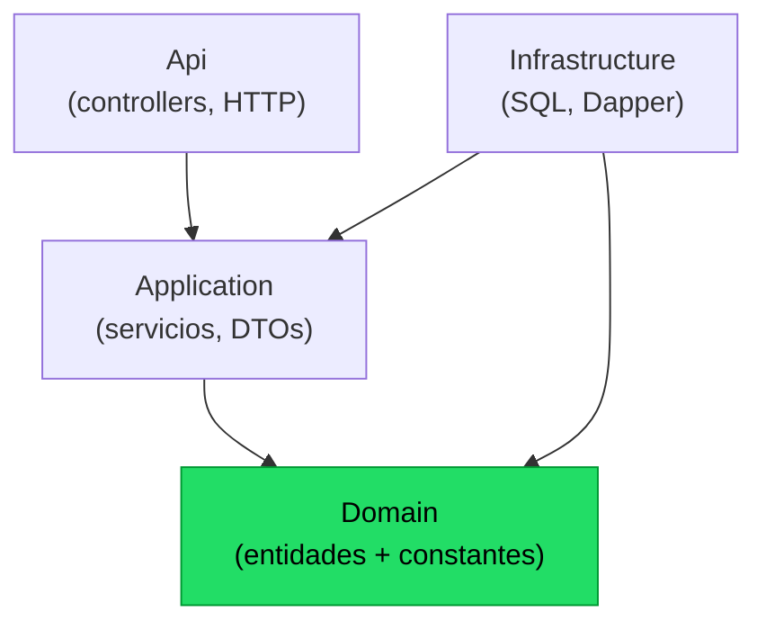
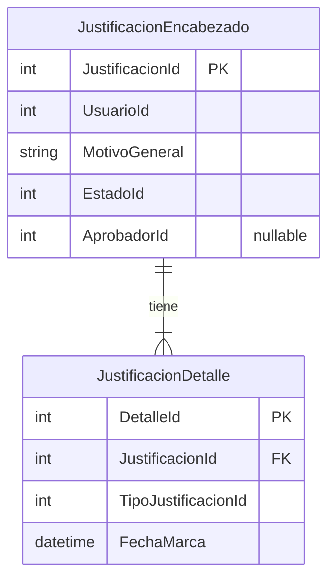
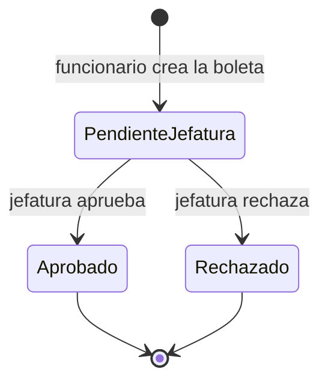

## En breve

La capa **Domain** es el nucleo del backend: define QUE es una justificacion de marca y cuales son las reglas mas basicas del negocio (estados, roles), sin saber NADA de bases de datos, HTTP ni de las otras capas. Es el corazon de la [arquitectura](arquitectura.html) Clean Architecture (el estilo de capas donde las dependencias apuntan siempre hacia adentro, al dominio). Por eso es codigo minimo, estable y facil de probar.

> 📌 En la practica: si manana cambian de SQL Server a otra base, o de API REST a otra cosa, esta capa **no se toca**. Solo describe el negocio.

## Que es la capa Domain

En Clean Architecture el codigo se organiza en circulos concentricos, y la regla de oro es: **las capas de afuera dependen de las de adentro, nunca al reves**. Domain es el circulo mas interno. Lo confirma su archivo de proyecto, que no declara NINGUNA referencia a otros proyectos ni paquetes NuGet: solo el SDK base de .NET 8 (`net8.0`), ver [IntegradorMarcas.Domain.csproj](../backend/src/IntegradorMarcas.Domain/IntegradorMarcas.Domain.csproj).



> Las flechas son "depende de". Todas terminan en Domain; de Domain no sale ninguna flecha. Eso es la **regla de dependencia hacia adentro**.

Domain contiene solo dos cosas, ambas sin logica de infraestructura:

| Carpeta | Que hay | Archivos |
| --- | --- | --- |
| `Entities/` | Las clases que representan los datos del negocio | `JustificacionEncabezado`, `JustificacionDetalle` |
| `Constants/` | Valores fijos del negocio (estados, roles) | `EstadoIds`, `RolesSistema` |

> 💡 Tip: cuando quieras entender "de que esta hecha" una boleta de justificacion sin perderte en SQL ni en JSON, este es el primer lugar para mirar.

## Entidades: el modelo encabezado-detalle

Una boleta de justificacion es un caso clasico de **encabezado-detalle** (en ingles *master-detail*): un encabezado con los datos generales y varias lineas hijas con el detalle. Pensalo como una factura: un encabezado (cliente, fecha, total) y muchas lineas (cada producto). Aca el encabezado es la solicitud de justificacion y cada linea es una marca de asistencia concreta que se justifica.

### JustificacionEncabezado

Representa la solicitud completa: quien la hizo, por que, en que estado esta y quien la aprobo. Ver [JustificacionEncabezado.cs:3-14](../backend/src/IntegradorMarcas.Domain/Entities/JustificacionEncabezado.cs).

```cs
public sealed class JustificacionEncabezado
{
    public int JustificacionId { get; set; }
    public int UsuarioId { get; set; }
    public string MotivoGeneral { get; set; } = string.Empty;
    public int EstadoId { get; set; }
    public DateTime FechaCreacion { get; set; }
    public int? AprobadorId { get; set; }
    public DateTime? FechaAprobacion { get; set; }
    public string UsrRegistro { get; set; } = string.Empty;
    public DateTime FecRegistro { get; set; }
}
```

| Campo | Que significa |
| --- | --- |
| `JustificacionId` | Identificador unico de la boleta (la PK). Es el nexo con las lineas de detalle. |
| `UsuarioId` | El funcionario que crea/solicita la justificacion. |
| `MotivoGeneral` | Texto libre con el motivo global de la solicitud. |
| `EstadoId` | En que punto del flujo esta: 1 pendiente, 2 aprobada, 3 rechazada (ver [EstadoIds](#constantes-de-negocio)). |
| `FechaCreacion` | Cuando se creo la boleta. |
| `AprobadorId` | Quien la aprobo/rechazo. Es `int?` (nullable) porque **mientras esta pendiente no hay aprobador todavia**. |
| `FechaAprobacion` | Cuando se resolvio. Tambien nullable por la misma razon. |
| `UsrRegistro` / `FecRegistro` | Datos de auditoria de registro (usuario y fecha del alta tecnica). |

> ⚠️ Notar el uso de `int?` y `DateTime?` (tipos nullable) en `AprobadorId` y `FechaAprobacion`: el lenguaje mismo expresa la regla de negocio de que esos datos no existen hasta que una jefatura resuelve la boleta.

### JustificacionDetalle

Cada linea representa **una marca de asistencia puntual** que se quiere justificar, con su tipo y su fecha. Ver [JustificacionDetalle.cs:3-12](../backend/src/IntegradorMarcas.Domain/Entities/JustificacionDetalle.cs).

```cs
public sealed class JustificacionDetalle
{
    public int DetalleId { get; set; }
    public int JustificacionId { get; set; }
    public int TipoJustificacionId { get; set; }
    public DateTime FechaMarca { get; set; }
    public string? ObservacionDetalle { get; set; }
    public string UsrRegistro { get; set; } = string.Empty;
    public DateTime FecRegistro { get; set; }
}
```

| Campo | Que significa |
| --- | --- |
| `DetalleId` | PK de la linea. |
| `JustificacionId` | La FK que apunta al encabezado dueno de esta linea (el "pegamento" encabezado-detalle). |
| `TipoJustificacionId` | Categoria de la justificacion (catalogo: omision de marca, permiso, etc.). |
| `FechaMarca` | La fecha/hora de la marca de asistencia que se justifica. |
| `ObservacionDetalle` | Comentario opcional de esa linea (`string?`, puede ser null). |
| `UsrRegistro` / `FecRegistro` | Auditoria de registro de la linea. |

### Relacion 1 a muchos

Un encabezado tiene una o mas lineas de detalle, unidas por `JustificacionId`:



> 📌 Este mismo modelo es el que se persiste en SQL Server. Como se mapea cada campo a tablas y columnas se documenta en [Modelo de datos](modelo-datos.html), y como viaja hacia/desde el cliente, en [Capa Application](modulo-application.html) (DTOs) y la [API](api.html).

## Constantes de negocio

Domain tambien guarda los **valores magicos del negocio** como constantes con nombre, para que el resto del codigo no escriba `1`, `2`, `3` o `"ROL_FUNC"` sueltos (que serian indescifrables y faciles de teclear mal).

### EstadoIds: el ciclo de vida de una boleta

Define los tres estados posibles de una justificacion. Ver [EstadoIds.cs:3-8](../backend/src/IntegradorMarcas.Domain/Constants/EstadoIds.cs).

```cs
public static class EstadoIds
{
    public const int PendienteJefatura = 1;
    public const int Aprobado = 2;
    public const int Rechazado = 3;
}
```

| Constante | Valor | Significado |
| --- | --- | --- |
| `PendienteJefatura` | 1 | Recien creada, esperando que la jefatura resuelva. |
| `Aprobado` | 2 | La jefatura la aprobo. |
| `Rechazado` | 3 | La jefatura la rechazo. |

El flujo de transiciones es lineal y sin retorno:



Estas constantes no decoran: las aplican las capas de afuera para imponer la regla. Por ejemplo, al crear una boleta queda en `PendienteJefatura` (ver [JustificacionRepository.cs:56](../backend/src/IntegradorMarcas.Infrastructure/Repositories/JustificacionRepository.cs)), y al resolver, el servicio valida que el estado actual sea exactamente `PendienteJefatura` antes de pasar a `Aprobado` o `Rechazado` (ver [JustificacionService.cs:200-206](../backend/src/IntegradorMarcas.Application/Services/JustificacionService.cs)). El detalle del flujo completo esta en [Flujos](flujos.html).

### RolesSistema: roles y helpers de comparacion

Define los cuatro roles del sistema con sus **valores EXACTOS** y, ademas, helpers `Es*` que comparan de forma tolerante. Ver [RolesSistema.cs:3-33](../backend/src/IntegradorMarcas.Domain/Constants/RolesSistema.cs).

```cs
public static class RolesSistema
{
    public const string RolFunc  = "ROL_FUNC";
    public const string RolJefe  = "ROL_JEFE";
    public const string RolRrhh  = "ROL_RRHH";
    public const string RolAdmin = "ROL_ADMIN";

    public static bool EsFuncionario(string? rol)
    {
        var normalized = (rol ?? string.Empty).Trim().ToUpperInvariant();
        return normalized is RolFunc or "FUNCIONARIO" or "1";
    }
    // EsJefatura, EsRrhh, EsAdmin: misma forma
}
```

| Constante | Valor exacto | Helper | Sinonimos que tambien acepta |
| --- | --- | --- | --- |
| `RolFunc` | `ROL_FUNC` | `EsFuncionario` | `FUNCIONARIO`, `1` |
| `RolJefe` | `ROL_JEFE` | `EsJefatura` | `JEFATURA`, `2` |
| `RolRrhh` | `ROL_RRHH` | `EsRrhh` | `RRHH`, `3` |
| `RolAdmin` | `ROL_ADMIN` | `EsAdmin` | `ADMIN`, `4` |

Los helpers **normalizan** la entrada antes de comparar: `Trim()` quita espacios y `ToUpperInvariant()` la pasa a mayusculas (ver lineas 12-13 de [RolesSistema.cs](../backend/src/IntegradorMarcas.Domain/Constants/RolesSistema.cs)). Asi `" rol_func "`, `ROL_FUNC` o `1` se reconocen todos como funcionario. Tambien aceptan `null` sin reventar (`rol ?? string.Empty`).

> 📌 Estos helpers son la base de la **autorizacion** del sistema. Como no hay JWT ni `[Authorize]`, cada servicio de [Application](modulo-application.html) usa `RolesSistema.Es*(...)` como guard clause (una verificacion al inicio del metodo que corta la ejecucion si el rol no aplica). Mas en [Seguridad](seguridad.html).

## Por que el dominio no depende de nada

Que esta capa no referencie a ninguna otra (confirmado en el [.csproj](../backend/src/IntegradorMarcas.Domain/IntegradorMarcas.Domain.csproj) sin `ProjectReference` ni `PackageReference`) tiene ventajas concretas:

- **Testeable sin infraestructura**: para probar `RolesSistema.EsJefatura(...)` o las transiciones de estado no hace falta levantar una base de datos ni un servidor HTTP. Es logica pura.
- **Estable**: es el codigo que menos cambia. Las reglas del negocio ("una boleta nace pendiente") son mas duraderas que la tecnologia (SQL Server, Dapper, ASP.NET).
- **Reusable**: cualquier capa de afuera puede usar estas entidades y constantes sin arrastrar dependencias.
- **Direccion de dependencia clara**: nadie "adentro" conoce a los de "afuera", lo que evita ciclos y acoplamientos accidentales.

## Nota: Class1.cs sobrante

En la raiz del proyecto Domain queda un [Class1.cs](../backend/src/IntegradorMarcas.Domain/Class1.cs) vacio (`public class Class1 {}`), residuo del scaffolding inicial de `dotnet new classlib`. No se usa en ninguna parte y se puede borrar; se documenta aca solo para que no confunda al explorar la carpeta.

> ⚠️ El mismo leftover de scaffolding existe en Application e Infrastructure (`Class1.cs`) y en los tests (`UnitTest1.cs`). Son inofensivos pero conviene limpiarlos.

## Referencias en el codigo

- [JustificacionEncabezado.cs](../backend/src/IntegradorMarcas.Domain/Entities/JustificacionEncabezado.cs) — entidad encabezado de la boleta.
- [JustificacionDetalle.cs](../backend/src/IntegradorMarcas.Domain/Entities/JustificacionDetalle.cs) — entidad linea de detalle.
- [EstadoIds.cs](../backend/src/IntegradorMarcas.Domain/Constants/EstadoIds.cs) — constantes de estado (1/2/3).
- [RolesSistema.cs](../backend/src/IntegradorMarcas.Domain/Constants/RolesSistema.cs) — roles y helpers `Es*`.
- [IntegradorMarcas.Domain.csproj](../backend/src/IntegradorMarcas.Domain/IntegradorMarcas.Domain.csproj) — sin referencias externas (prueba de la regla de dependencia).
- [Class1.cs](../backend/src/IntegradorMarcas.Domain/Class1.cs) — scaffolding sobrante.
- Uso de las constantes fuera de Domain: [JustificacionService.cs:200-220](../backend/src/IntegradorMarcas.Application/Services/JustificacionService.cs) · [JustificacionRepository.cs:56](../backend/src/IntegradorMarcas.Infrastructure/Repositories/JustificacionRepository.cs).

Paginas relacionadas: [Arquitectura](arquitectura.html) · [Capa Application](modulo-application.html) · [Modelo de datos](modelo-datos.html) · [Flujos](flujos.html) · [Seguridad](seguridad.html) · [Glosario](glosario.html).
