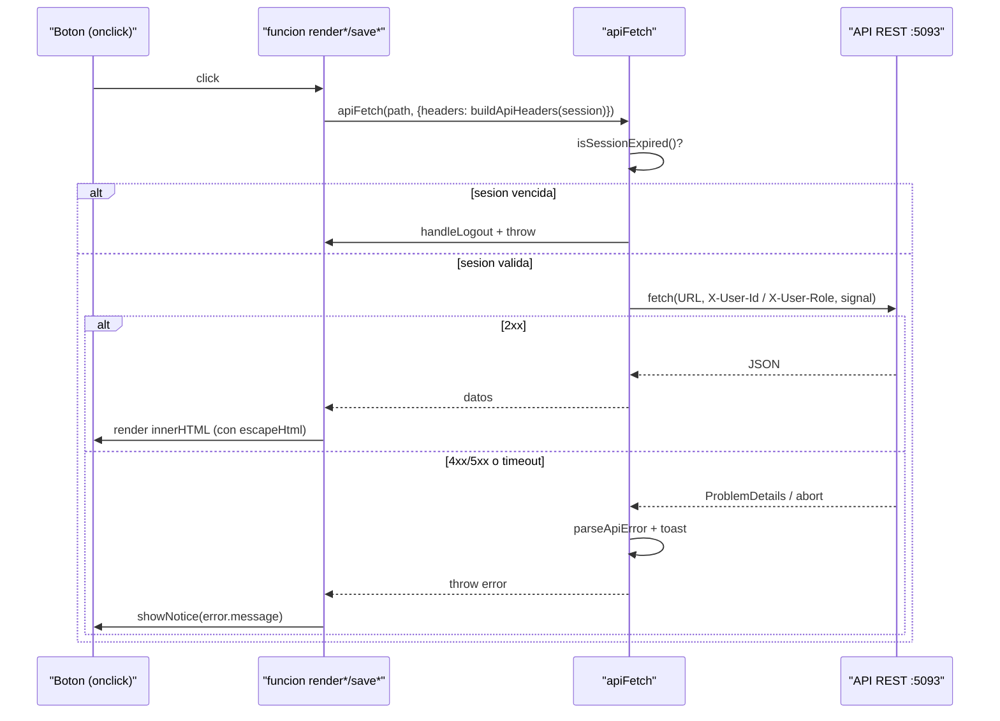
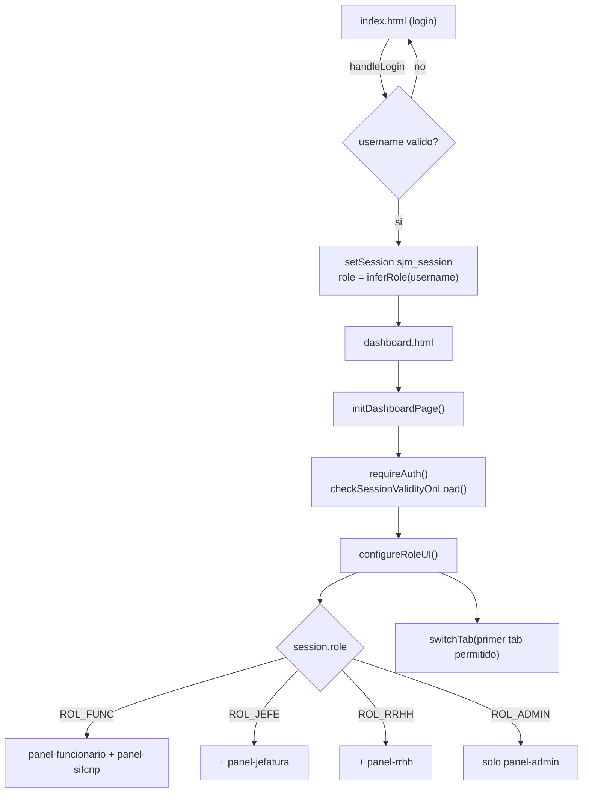

## En breve

El frontend de SIFCNP es un **cliente estatico** (no necesita servidor de aplicacion propio, solo que alguien sirva los archivos): tres archivos en la raiz del repo, `index.html`, `dashboard.html`, `app.js` y `style.css`. No usa ningun framework (React, Angular, Vue), ni empaquetador (bundler), ni paso de compilacion (build). Es **vanilla JS**: JavaScript puro de navegador, un solo script global que dibuja la interfaz, valida formularios y conversa con la [API REST](modulo-api.html). Existe para que un funcionario, su jefatura, RRHH o un administrador trabajen las boletas de justificacion de marca desde el navegador.

> 📌 En la practica: como no hay build, lo que ves en los `.html`/`.js` es exactamente lo que corre. Editas el archivo, recargas el navegador, listo. Eso lo hace facil de leer pero tambien fragil: cualquier error de JS se ve directo en la consola del navegador.

## Anatomia: dos paginas, un cerebro

El frontend son **dos pantallas** que comparten el mismo cerebro (`app.js`) y la misma hoja de estilos (`style.css`):

| Archivo | Rol | Que carga |
| --- | --- | --- |
| [index.html](../index.html) | Pantalla de **login** | `style.css` + `app.js` |
| [dashboard.html](../dashboard.html) | **Aplicacion** completa por roles | `style.css` + `app.js` |
| [app.js](../app.js) | Logica unica (~2227 lineas) | — |
| [style.css](../style.css) | Estilos globales + variables CSS | — |

Ambas paginas terminan con `<script src="app.js"></script>` ([index.html:246](../index.html), [dashboard.html:781](../dashboard.html)). El mismo script corre en las dos; al final decide **donde esta** mirando el DOM:

```js
// app.js:2214-2227
document.addEventListener('DOMContentLoaded', () => {
  syncApiBaseUrlOverride();
  if (document.getElementById('username')) {   // hay campo "Usuario" -> es el login
    initLoginPage();
  }
  if (document.querySelector('.topbar')) {      // hay barra superior -> es el dashboard
    initDashboardPage();
    initIdleMonitor();
    startSessionExpiryTimer();
  }
});
```

> 💡 Este patron "un script para todo" evita imports/modulos, pero significa que **todas** las ~50 funciones viven en el ambito global (`window`) y se cablean con `onclick="..."` directo en el HTML (mira los `onclick="handleLogin()"`, `onclick="switchTab(...)"`, etc.). No hay separacion de modulos: es un trade-off deliberado de simplicidad sobre encapsulamiento.

### `style.css` y las variables CSS

`style.css` define la paleta y radios via **custom properties** (variables CSS, los `--blue-900`, `--radius-lg`, etc. que ves por todos lados). Cada `.html` ademas mete su propio `<style>` inline para layout especifico de esa pagina (el login centra y pinta un fondo geometrico en [index.html:8-175](../index.html); el dashboard define la `topbar`, `nav-tab`, paneles y la animacion `shake` en [dashboard.html:8-230](../dashboard.html)).

## Como habla con la API: `apiFetch` + `buildApiHeaders`

Toda comunicacion con el backend pasa por **un solo embudo**: la funcion `apiFetch`. No hay `fetch()` sueltos en otros lados; si necesitas pegarle a la API, pasas por aqui. Eso centraliza timeout, manejo de errores y expiracion de sesion.

> 📌 Para que sirve un embudo unico: si manana cambia la forma de autenticar o de reportar errores, se toca **un solo lugar**. Tambien garantiza que toda llamada respeta el timeout y revisa la sesion antes de salir.

### `buildApiHeaders`: la identidad por headers

SIFCNP **no usa JWT ni cookies**. La identidad viaja en dos headers HTTP que el backend confia ciegamente (mira [Seguridad](seguridad.html) para entender por que esto es inseguro por diseno del MVP). `buildApiHeaders` los arma:

```js
// app.js:318-334
function buildApiHeaders(session, withJsonBody = false) {
  const identity = resolveUserIdentity(session);
  if (!identity?.userId || !identity?.role) {
    throw new Error('No fue posible resolver identidad para llamar la API.');
  }
  const headers = {
    'X-User-Id': String(identity.userId),
    'X-User-Role': identity.role
  };
  if (withJsonBody) headers['Content-Type'] = 'application/json';
  return headers;
}
```

`resolveUserIdentity` ([app.js:300-316](../app.js)) traduce el `username` de la sesion a un `userId` numerico via `MOCK_USER_DIRECTORY`; si el usuario no esta en el directorio, cae a `userId: 10` (un default magico que puede colisionar — ver [Seguridad](seguridad.html)).

### `apiFetch`: timeout, abort y errores

```js
// app.js:361-411 (resumido)
async function apiFetch(path, options = {}, session = getSession()) {
  if (isSessionExpired()) {                         // 1. sesion vencida -> logout
    handleLogout('Sesión expirada por inactividad...');
    throw new Error('Session expired');
  }
  const controller = new AbortController();         // 2. timeout duro
  const timer = setTimeout(() => controller.abort(), API_CONFIG.timeoutMs); // 12s
  try {
    const response = await fetch(buildApiUrl(path), { ...options, signal: controller.signal });
    if (!response.ok) throw await parseApiError(response);   // 3. HTTP >=400
    if (response.status === 204) return null;
    return contentType.includes('application/json') ? response.json() : null;
  } catch (error) {
    // AbortError -> 408; TypeError (red/CORS) -> status 0; 5xx/0/408 -> toast automatico
  } finally {
    clearTimeout(timer);
  }
}
```

Detalles clave:

- **`AbortController` + timeout** ([app.js:368-369](../app.js)): es el mecanismo del navegador para **cancelar** una peticion en curso. Si la API tarda mas de `API_CONFIG.timeoutMs` (12000 ms, definido en [app.js:131-134](../app.js)), se aborta y se convierte en un error con `status 408`.
- **Traduccion de fallos de red**: un `TypeError` de `fetch` (backend caido, CORS — ver glosario para [CORS](glosario.html)) se convierte en un error legible con `status: 0` y mensaje *"No fue posible conectar con la API. Verifique backend, URL y CORS."* ([app.js:394-398](../app.js)).
- **Toast automatico** ([app.js:400-406](../app.js)): errores `>= 500`, de red (`0`) o timeout (`408`) disparan una notificacion flotante con el `correlationId` que devuelve el backend (util para soporte tecnico).
- **`parseApiError`** ([app.js:336-358](../app.js)) lee el `ProblemDetails` que devuelve la API y extrae `detail`/`title`/`message`, el `status` y el `correlationId` (del cuerpo o del header `X-Correlation-Id`).

> 💡 La URL base de la API es configurable sin tocar codigo: `getApiBaseUrl` ([app.js:288-294](../app.js)) la resuelve en orden de prioridad query-string `?api=...` > `window.SJM_API_BASE_URL` > `sessionStorage` > default `http://localhost:5093`. Asi podes apuntar la UI a otra API con `dashboard.html?api=http://localhost:5093`.

### Diagrama: secuencia de una llamada tipica



## Sesion en `sessionStorage` (prefijo `sjm_`)

El estado de sesion vive en `sessionStorage` (almacenamiento del navegador que se borra al cerrar la pestana). Todas las claves llevan el prefijo `sjm_` para no chocar con otras apps. Estan centralizadas en `STORAGE_KEYS` ([app.js:83-88](../app.js)):

| Clave | Constante | Para que |
| --- | --- | --- |
| `sjm_session` | `STORAGE_KEYS.session` | objeto de sesion JSON (`isAuth`, `username`, `role`, `company`, `displayName`...) |
| `sjm_activeTab` | `STORAGE_KEYS.activeTab` | pestana/panel activo, para recordarlo al recargar |
| `sjm_api_base_url` | `STORAGE_KEYS.apiBaseUrl` | override de la URL de la API (lo fija `?api=...`) |
| `sjm_lastActivity` | `STORAGE_KEYS.lastActivity` | timestamp ISO de la ultima actividad (para inactividad) |

`getSession`/`setSession` ([app.js:177-193](../app.js)) leen y escriben el objeto serializado como JSON; `setSession` ademas inicializa `sjm_lastActivity` cuando la sesion esta autenticada.

> 💡 `hydrateSessionDisplayName` ([app.js:201-216](../app.js)) pide `GET /api/session/profile` para mostrar el **nombre completo real** del usuario en la barra superior; si falla, el topbar deja el `username` como respaldo silencioso.

### Login mock: `handleLogin` y `MOCK_USER_DIRECTORY`

El login es **simulado** (mock): no hay autenticacion real. `handleLogin` ([app.js:521-550](../app.js)) ni siquiera envia el password al servidor — solo valida largos minimos localmente y arma la sesion:

```js
// app.js:531-549 (resumido)
if (username.length < 3 || password.length < 4) { /* error visual + shake */ return; }
const session = {
  isAuth: true,
  username,
  role: inferRole(username),       // el ROL se deduce del texto del username
  company: inferCompany(username), // CNP o FANAL segun prefijo
  apiBaseUrl: getApiBaseUrl()
};
setSession(session);
window.location.href = 'dashboard.html';
```

El rol sale de `inferRole` ([app.js:160-169](../app.js)): primero busca el username exacto en `MOCK_USER_DIRECTORY` ([app.js:141-150](../app.js)); si no esta, infiere por substring (`admin` -> `ROL_ADMIN`, `rrhh` -> `ROL_RRHH`, `jefe` -> `ROL_JEFE`, resto -> `ROL_FUNC`). El directorio mapea los usernames de demo a `userId`/`role`:

| Username | userId | role |
| --- | --- | --- |
| `funcionario.ana` | 4 | `ROL_FUNC` |
| `funcionario.luis` | 5 | `ROL_FUNC` |
| `jefe.maria` / `jefe.ricardo` | 3 | `ROL_JEFE` |
| `rrhh.carlos` / `rrhh.sandra` | 6 | `ROL_RRHH` |
| `admin.demo` / `admin.sofia` | 1 | `ROL_ADMIN` |

> ⚠️ Esto es inseguro a proposito (MVP/demo). Cualquier password de 4+ caracteres entra, y el rol se deriva del **texto** del username. Notese que `jefe.maria` y `jefe.ricardo` comparten `userId: 3`, igual `rrhh.carlos`/`rrhh.sandra` (6) y `admin.demo`/`admin.sofia` (1). Estos usernames de ejemplo aparecen impresos en la pantalla de login ([index.html:229-234](../index.html)). Detalle completo en [Seguridad](seguridad.html).

## Render por rol: `configureRoleUI` y `switchTab`

Una sola pagina (`dashboard.html`) contiene **los cinco paneles** a la vez; lo que cambia por rol es **cuales pestanas se muestran** y cual queda activa. `configureRoleUI` ([app.js:776-804](../app.js)) hace ese trabajo al cargar:

```js
// app.js:786-797 (resumido)
const allowedByRole = {
  ROL_FUNC:  ['panel-funcionario', 'panel-sifcnp'],
  ROL_JEFE:  ['panel-funcionario', 'panel-jefatura', 'panel-sifcnp'],
  ROL_RRHH:  ['panel-funcionario', 'panel-rrhh', 'panel-sifcnp'],
  ROL_ADMIN: ['panel-admin']
};
const allowedTabs = allowedByRole[session.role] || ['panel-sifcnp'];
document.querySelectorAll('.nav-tab').forEach(tab => {
  tab.classList.toggle('hidden', !allowedTabs.includes(tab.getAttribute('data-tab')));
});
```

`switchTab` ([app.js:860-871](../app.js)) oculta todos los `.tab-panel`, muestra el elegido, marca su `.nav-tab` como `active` y persiste la eleccion en `sjm_activeTab`.

> ⚠️ Esto es solo cosmetica de UI: ocultar pestanas **no es seguridad**. La autorizacion real vive en el backend (cada servicio valida el rol). Si un funcionario invocara a mano un endpoint de jefatura, el backend lo rechaza con 403 — ver [API](api.html) y [Seguridad](seguridad.html).

### Los cinco paneles

| Panel | id | Roles que lo ven | Que hace | Funciones JS clave |
| --- | --- | --- | --- | --- |
| Funcionario | `panel-funcionario` | FUNC, JEFE, RRHH | crear boleta + ver mi historial | `registerJustification`, `renderFuncionarioHistory`, `addDetailLine` |
| Jefatura | `panel-jefatura` | JEFE | aprobar/rechazar pendientes (paginado, ordenable) | `renderJefaturaRequests`, `approveRequest`, `toggleDetail` |
| RRHH | `panel-rrhh` | RRHH | consulta global con filtros | `renderRRHHTable`, `applyRRHHFilter` |
| SIFCNP | `panel-sifcnp` | FUNC, JEFE, RRHH | consulta historica | `renderSifcnpHistorico`, `sifcnpSearch` |
| Admin | `panel-admin` | ADMIN | dependencias, usuarios, jerarquias, delegaciones, registros | `loadAdmin*`, `switchAdminTab` |

Notas de comportamiento:
- El panel **Funcionario** permite crear boleta solo a `ROL_FUNC` y `ROL_JEFE` ([app.js:925](../app.js)); la grilla de historial (`/api/justificaciones/mias`) se sirve a FUNC/JEFE/RRHH con paginado "cargar 10 mas" ([app.js:967-1116](../app.js)).
- El panel **Jefatura** trae pendientes (`/api/jefatura/justificaciones/pendientes`), pagina de a 15 ([app.js:109](../app.js)), permite ordenar por columna ([app.js:1202-1238](../app.js)) y exportar a CSV ([app.js:1542-1567](../app.js)). Aprobar/rechazar pega `PATCH .../resolver` ([app.js:1333-1367](../app.js)).
- El panel **SIFCNP** ajusta su scope con `configureSifcnpScopeUI` ([app.js:846-858](../app.js)): a un funcionario le oculta el filtro por funcionario y le muestra la nota "Mostrando solo sus registros historicos".
- El panel **Admin** tiene sub-pestanas internas (`switchAdminTab`, [app.js:1638-1647](../app.js)) y usa "drawers" (cajones laterales) para editar/crear, ademas de un visor de errores+eventos en "Registros" ([app.js:2024-2090](../app.js)). Toda accion admin exige `requireAdminSession` ([app.js:1600-1606](../app.js)).

### Diagrama: del login al render por rol



## Aviso de sesion por inactividad

Si el usuario deja de interactuar, la sesion se cierra sola. La configuracion esta en `SESSION_CONFIG` ([app.js:90-94](../app.js)): timeout total **5 minutos**, con un **aviso 30 segundos antes** y un chequeo cada segundo en esos ultimos 30s.

Como funciona:
- `initIdleMonitor` ([app.js:599-605](../app.js)) escucha `mousemove`, `keypress`, `click`, `touchstart`, `scroll` y en cada uno llama `resetIdleTimer`, que actualiza `sjm_lastActivity` y reprograma el temporizador.
- `startSessionExpiryTimer` ([app.js:646-684](../app.js)) calcula cuanto falta y agenda el aviso justo cuando quedan 30s.
- Al entrar en la ventana final, `showSessionWarningModal` ([app.js:719-730](../app.js)) abre el modal `#session-warning-modal` ([dashboard.html:750-779](../dashboard.html)) con cuenta regresiva (`startFinalCountdown`, [app.js:690-714](../app.js)).
- El usuario elige **"Permanecer Conectado"** (`handleStayLoggedIn` -> reinicia el temporizador) o **"Cerrar Sesion"** (`handleLogoutNow`). Si no responde, `handleLogout` ([app.js:567-591](../app.js)) limpia las claves `sjm_*` y redirige a `index.html`.
- Ademas, **cada** llamada a `apiFetch` revisa `isSessionExpired()` antes de salir ([app.js:363-366](../app.js)): si vencio, hace logout en el acto.

> 📌 En la practica: aunque tengas una pestana abierta sin tocar nada, a los 5 minutos te saca; a los 4:30 te avisa. Cualquier movimiento del mouse reinicia el reloj.

## Seguridad de salida: `escapeHtml`

El frontend dibuja casi todo armando strings de HTML e inyectandolos con `innerHTML` (mira los `tbody.innerHTML = ...` en cada render). Eso es comodo pero peligroso: si un dato de la API trae `<script>`, podria ejecutarse (un ataque de **XSS** — inyeccion de codigo via contenido del usuario). Para evitarlo, **todo valor interpolado pasa por `escapeHtml`** ([app.js:2180-2187](../app.js)):

```js
// app.js:2180-2187
function escapeHtml(value) {
  return String(value)
    .replace(/&/g, '&amp;')
    .replace(/</g, '&lt;')
    .replace(/>/g, '&gt;')
    .replace(/"/g, '&quot;')
    .replace(/'/g, '&#39;');
}
```

Convierte los caracteres peligrosos en sus entidades HTML, asi el navegador los muestra como **texto** y no como marcado. Lo veras envolviendo nombres, motivos, observaciones, etc. en todas las tablas (`${escapeHtml(b.funcionarioNombre)}`, etc.).

> ⚠️ Excepcion conocida: `normalizeMojibakeTemporaryForHistoryDetail` ([app.js:446-464](../app.js)) es un parche que corrige texto mal codificado (UTF-8 leido como Latin-1, los `á` -> `á`) **solo** en el detalle de historial del funcionario, no en Jefatura/RRHH/SIFCNP. Es un sintoma de un bug de encoding del backend aun sin resolver.

## Utilidades de presentacion

Funciones de apoyo que normalizan datos para mostrar:

- `formatDate` / `formatDateTime` ([app.js:2154-2174](../app.js)): fechas a `dd/mm/yyyy` (con hora cuando aplica); devuelven `—` si el valor es invalido o vacio.
- `presentBoletaId` ([app.js:420-424](../app.js)): convierte el id numerico en `JM-0042`.
- `renderStatusBadge` ([app.js:2142-2146](../app.js)): pinta el estado como badge (Aprobado/Rechazado/Pendiente).
- `mapEstadoDescripcion` ([app.js:413-418](../app.js)) y `normalizeApiResumen` ([app.js:426-443](../app.js)): adaptan la forma cruda que devuelve la API (con sufijo `ID`) a un objeto interno comodo. Notese que los campos del wire usan `justificacionID`/`estadoID` (ver convenciones de [Contracts en la API](modulo-api.html)).
- `toast` / `showNotice` ([app.js:22-80](../app.js), [app.js:2148-2152](../app.js)): sistema de notificaciones flotantes no invasivas; `showNotice` simplemente redirige a `toast`.

## Referencias en el codigo

- [index.html](../index.html) — pantalla de login, formulario y usuarios demo (lineas 211-235).
- [dashboard.html](../dashboard.html) — topbar, nav-tabs, los 5 paneles (304-746) y el modal de inactividad (750-779).
- [app.js](../app.js) — logica unica del frontend (~2227 lineas). Puntos clave: `apiFetch` (361-411), `buildApiHeaders` (318-334), `STORAGE_KEYS` (83-88), `handleLogin` (521-550), `MOCK_USER_DIRECTORY` (141-150), `configureRoleUI` (776-804), `switchTab` (860-871), inactividad (599-768), `escapeHtml` (2180-2187), bootstrap `DOMContentLoaded` (2214-2227).
- [style.css](../style.css) — variables CSS y estilos globales compartidos por ambas paginas.

Paginas relacionadas: [Seguridad](seguridad.html) · [API REST (.NET)](modulo-api.html) · [Endpoints de la API](api.html) · [Flujos de negocio](flujos.html) · [Glosario](glosario.html).
