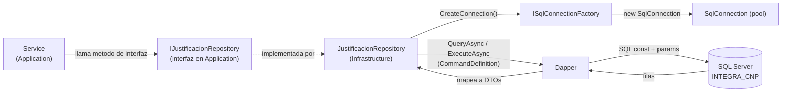

## En breve

La capa **Infrastructure** es la unica que sabe hablar con la base de datos. Es el "garage" del backend: aqui viven los repositorios que abren una conexion a SQL Server, lanzan el SQL y devuelven objetos C# limpios a la capa de [Application](modulo-application.html). Si manana cambiara el motor de datos, este es (idealmente) el unico modulo que habria que reescribir; el resto del backend solo conoce *interfaces*, no implementaciones.

Sigue la regla de [Clean Architecture](glosario.html): Infrastructure **implementa** las interfaces que [Application](modulo-application.html) **define** (`IJustificacionRepository`, `IErrorLogRepository`, etc.). Asi la logica de negocio nunca depende directamente de SQL Server.

> 📌 Para que sirve: aislar TODO el acceso a datos en un solo lugar. Un service de Application pide "dame las justificaciones de este usuario" llamando a un metodo de interfaz, sin enterarse de connection strings, Dapper ni SQL.

## ADO.NET y Dapper: acceso a datos sin ORM pesado

Este proyecto **no usa EF Core** ni ningun ORM (Object-Relational Mapper) que genere SQL por vos. Usa dos piezas mas livianas:

- **ADO.NET** (`Microsoft.Data.SqlClient`): la API de mas bajo nivel de .NET para hablar con SQL Server. Provee la `SqlConnection`, transacciones, etc. Es potente pero verboso: por si solo te obliga a leer columna por columna de un `DataReader`.
- **Dapper**: una micro-libreria que se monta encima de ADO.NET. Su unico trabajo es **mapear filas a objetos**: vos le pasas un string de SQL y una clase destino, y Dapper devuelve `IEnumerable<TuClase>` ya poblada. Tambien arma los parametros desde un objeto anonimo. No genera SQL ni esconde la base de datos; vos escribis el SQL a mano.

> 💡 La filosofia del proyecto es "SQL explicito, control total": el SQL se escribe a mano (y se versiona como constantes), y Dapper solo ahorra el tedio de mapear filas. Es el punto medio entre ADO.NET crudo y un ORM completo.

```cs
// Patron tipico (JustificacionRepository.cs): SQL constante + objeto anonimo de params + clase destino
var data = await connection.QueryAsync<JustificacionResumenDto>(new CommandDefinition(
    JustificacionesSql.ListMine,                       // SQL como const string
    new { UsuarioID = usuarioId, filtros.EstadoId },   // params anonimos nombrados
    cancellationToken: cancellationToken));            // siempre se hila el CancellationToken
```

## La fabrica de conexiones: ISqlConnectionFactory

Ningun repositorio crea su propia `SqlConnection` con la connection string a mano. Todos reciben una **fabrica** y le piden conexiones. Esa es la abstraccion `ISqlConnectionFactory`, definida como una interfaz minima:

```cs
// ISqlConnectionFactory.cs (8 lineas)
public interface ISqlConnectionFactory
{
    IDbConnection CreateConnection();
}
```

La implementacion concreta lee la connection string llamada **`IntegraCnp`** desde la configuracion y devuelve una `SqlConnection` nueva en cada llamada:

```cs
// SqlConnectionFactory.cs
public SqlConnectionFactory(IConfiguration configuration)
{
    _connectionString = configuration.GetConnectionString("IntegraCnp")
        ?? throw new InvalidOperationException("Connection string 'IntegraCnp' no configurada.");
}

public IDbConnection CreateConnection() => new SqlConnection(_connectionString);
```

Puntos clave:

| Detalle | Comportamiento | Anclaje |
| --- | --- | --- |
| Clave de la connection string | `IntegraCnp` (no `INTEGRA_CNP`) | [SqlConnectionFactory.cs:13](../backend/src/IntegradorMarcas.Infrastructure/Data/SqlConnectionFactory.cs) |
| Si falta la cadena | Lanza `InvalidOperationException` | [SqlConnectionFactory.cs:14](../backend/src/IntegradorMarcas.Infrastructure/Data/SqlConnectionFactory.cs) |
| Una conexion por operacion | `CreateConnection()` siempre crea una `SqlConnection` nueva | [SqlConnectionFactory.cs:19](../backend/src/IntegradorMarcas.Infrastructure/Data/SqlConnectionFactory.cs) |
| Registro DI | `AddScoped<ISqlConnectionFactory, SqlConnectionFactory>()` | [Program.cs:62](../backend/src/IntegradorMarcas.Api/Program.cs) |

> 📌 La connection string NO se versiona en el repo: se inyecta por la variable de entorno de usuario `ConnectionStrings__IntegraCnp` (el `__` equivale a `:` en config de .NET). Ver [Seguridad](seguridad.html).

> 💡 Una conexion nueva por operacion suena costoso, pero `Microsoft.Data.SqlClient` mantiene un **pool de conexiones** por debajo: "crear" una conexion suele reusar una del pool. El patron habitual en los repos es `await using var connection = (SqlConnection)_connectionFactory.CreateConnection();`, que la libera (la devuelve al pool) al salir del metodo.

## Patron de repositorio: un repo `sealed` por agregado

La regla del proyecto es **un repositorio por agregado de negocio**. Cada uno es una clase `sealed` (no se hereda), recibe `ISqlConnectionFactory` por constructor e implementa su interfaz de [Application](modulo-application.html). Hay 6 repositorios:

| Repositorio | Interfaz | Responsabilidad | Anclaje |
| --- | --- | --- | --- |
| `JustificacionRepository` | `IJustificacionRepository` | El nucleo del negocio: crear boletas, listar las propias / pendientes de jefatura / global RRHH / historico, detalle de jefatura, validaciones de scope, resolver (aprobar/rechazar) | [JustificacionRepository.cs](../backend/src/IntegradorMarcas.Infrastructure/Repositories/JustificacionRepository.cs) |
| `AdminAprobacionesRepository` | `IAdminAprobacionesRepository` | CRUD de jerarquias de aprobacion y delegaciones; chequeos de existencia (usuario, estructura, jerarquia) | [AdminAprobacionesRepository.cs](../backend/src/IntegradorMarcas.Infrastructure/Repositories/AdminAprobacionesRepository.cs) |
| `AdminOrganizacionRepository` | `IAdminOrganizacionRepository` | Dependencias (estructura organizacional), asignaciones de usuarios (rol/unidad/jefatura), deteccion de ciclos | [AdminOrganizacionRepository.cs](../backend/src/IntegradorMarcas.Infrastructure/Repositories/AdminOrganizacionRepository.cs) |
| `AuditEventRepository` | `IAuditEventRepository` | Registrar eventos de auditoria en `Auditoria.EventoAuditoria` | [AuditEventRepository.cs](../backend/src/IntegradorMarcas.Infrastructure/Repositories/AuditEventRepository.cs) |
| `AdminActionAuditRepository` | `IAdminActionAuditRepository` | Registrar acciones de admin con snapshots before/after (JSON) en `Auditoria.AdminAccionAuditoria` | [AdminActionAuditRepository.cs](../backend/src/IntegradorMarcas.Infrastructure/Repositories/AdminActionAuditRepository.cs) |
| `ErrorLogRepository` | `IErrorLogRepository` | Registrar errores de la API en `Auditoria.ErrorApi` (best-effort) | [ErrorLogRepository.cs](../backend/src/IntegradorMarcas.Infrastructure/Repositories/ErrorLogRepository.cs) |

Todos se registran como `Scoped` en el contenedor de inyeccion de dependencias en [Program.cs:62-72](../backend/src/IntegradorMarcas.Api/Program.cs) (una instancia por request HTTP).

> ⚠️ No todo el acceso a datos vive en estos repos. Dos controllers de la [API](modulo-api.html) (`SessionController` y `AdminMonitoringController`) toman `ISqlConnectionFactory` directamente y corren SQL inline, saltandose el patron de repositorio. Es una desviacion deliberada documentada en `CLAUDE.md`.

### Diagrama: como fluye una consulta



La capa de [Application](modulo-application.html) depende de la **interfaz** (flecha solida al centro); la implementacion concreta (linea punteada) la provee Infrastructure en tiempo de ejecucion via inyeccion de dependencias. Asi se respeta la regla de dependencia hacia adentro de [Clean Architecture](arquitectura.html).

## Como se usa Dapper en la practica

### Lecturas: `QueryAsync` / `QuerySingleAsync`

Para leer filas, los repos usan `QueryAsync<T>` (varias filas) o `QuerySingleAsync<T>` / `QuerySingleOrDefaultAsync<T>` (una sola). Siempre con un `CommandDefinition` que empaqueta SQL + params + `CancellationToken`:

```cs
// JustificacionRepository.GetExistingTipoJustificacionIdsAsync
var data = await connection.QueryAsync<int>(new CommandDefinition(
    JustificacionesSql.GetExistingTipoJustificacionIds,
    new { Ids = distinctIds },             // Dapper expande un array a una lista IN (...)
    cancellationToken: cancellationToken));
```

Convenciones observables en todos los repos:

- **Params anonimos nombrados**: un objeto anonimo `new { ... }` cuyos nombres de propiedad coinciden con los `@Param` del SQL. Notar el uso deliberado del sufijo `ID` (`UsuarioID`, `JustificacionID`) para casar con los `@UsuarioID` del SQL — el repo mapea a mano `Id` (DTO) <-> `ID` (param). Ver [JustificacionRepository.cs:122-138](../backend/src/IntegradorMarcas.Infrastructure/Repositories/JustificacionRepository.cs).
- **`CancellationToken` hilado** controller -> service -> repository -> Dapper, para poder abortar consultas si el cliente corta.
- **Colecciones devueltas como `IReadOnlyList`/`IReadOnlyCollection`** (`.ToList()` / `.ToArray()` antes de retornar).
- **Clases `*Row` privadas** cuando la fila no calza directo en el DTO publico: el repo mapea la `Row` al DTO a mano. Ejemplos: `JustificacionDetalleJefaturaRow` y `CurrentApproverRow` en [JustificacionRepository.cs:336-377](../backend/src/IntegradorMarcas.Infrastructure/Repositories/JustificacionRepository.cs).

### Inserts con SCOPE_IDENTITY

Cuando un insert necesita devolver el Id autogenerado, el SQL termina en `SELECT CAST(SCOPE_IDENTITY() AS INT)` y el repo usa `ExecuteScalarAsync<int>` para leer ese valor:

```sql
-- JustificacionesSql.InsertEncabezado
INSERT INTO Operacion.Justificacion (UsuarioId, MotivoGeneral, EstadoJustificacionId, CreadoPor)
VALUES (@UsuarioID, @MotivoGeneral, @EstadoID, @UsrRegistro);
SELECT CAST(SCOPE_IDENTITY() AS INT)
```

```cs
// JustificacionRepository.CreateAsync
var justificacionId = await connection.ExecuteScalarAsync<int>(new CommandDefinition(
    JustificacionesSql.InsertEncabezado, new { ... }, transaction, ...));
```

`SCOPE_IDENTITY()` devuelve el ultimo Id IDENTITY generado en el mismo scope, evitando colisiones con triggers. Ver [JustificacionRepository.cs:50-60](../backend/src/IntegradorMarcas.Infrastructure/Repositories/JustificacionRepository.cs).

### Escrituras simples: `ExecuteAsync`

Updates, toggles de estado y deletes logicos usan `ExecuteAsync`, que devuelve el numero de filas afectadas. Los chequeos de existencia (`Exists*`) usan `ExecuteScalarAsync<bool>`. Ejemplos en [AdminOrganizacionRepository.cs](../backend/src/IntegradorMarcas.Infrastructure/Repositories/AdminOrganizacionRepository.cs).

### Multi-insert con transaccion explicita

Crear una justificacion es atomico: un encabezado + N detalles. O entran todos o ninguno. Por eso `CreateAsync` abre la conexion con `OpenAsync`, inicia una transaccion con `BeginTransactionAsync`, hace los inserts pasando esa `transaction` a cada `CommandDefinition`, y hace `Commit`; si algo falla, `Rollback` y re-lanza:

```cs
// JustificacionRepository.CreateAsync (resumen)
await connection.OpenAsync(cancellationToken);
await using var transaction = await connection.BeginTransactionAsync(cancellationToken);
try
{
    var justificacionId = await connection.ExecuteScalarAsync<int>(/* InsertEncabezado */, transaction, ...);
    foreach (var detalle in request.Detalles)
        await connection.ExecuteAsync(/* InsertDetalle */, transaction, ...);
    await transaction.CommitAsync(cancellationToken);
    return justificacionId;
}
catch { await transaction.RollbackAsync(cancellationToken); throw; }
```

> 📌 Una **transaccion** garantiza atomicidad: el encabezado y sus lineas se confirman juntos. Si insertara el encabezado pero fallara una linea, sin transaccion quedaria una boleta "huerfana" a medio crear.

`OpenAsync` explicito aparece solo donde hace falta (transacciones / multi-statement): `CreateAsync` y `ErrorLogRepository.LogAsync`. En las lecturas simples, Dapper abre y cierra la conexion por vos. Ver [JustificacionRepository.cs:42-86](../backend/src/IntegradorMarcas.Infrastructure/Repositories/JustificacionRepository.cs) y [ErrorLogRepository.cs:21-22](../backend/src/IntegradorMarcas.Infrastructure/Repositories/ErrorLogRepository.cs).

## Todo el SQL vive como constantes en `Queries/*Sql.cs`

Una regla fuerte del proyecto: **ningun repositorio tiene SQL incrustado en sus metodos**. Cada sentencia es una `public const string` en una clase estatica dentro de la carpeta `Queries/`. El repo solo referencia el nombre (`JustificacionesSql.ListMine`). Esto mantiene el SQL agrupado, revisable y reutilizable.

| Archivo de SQL | Lineas aprox. | Lo usa | Anclaje |
| --- | --- | --- | --- |
| `JustificacionesSql` | ~377 | `JustificacionRepository` | [JustificacionesSql.cs](../backend/src/IntegradorMarcas.Infrastructure/Queries/JustificacionesSql.cs) |
| `AdminAprobacionesSql` | ~175 | `AdminAprobacionesRepository` | [AdminAprobacionesSql.cs](../backend/src/IntegradorMarcas.Infrastructure/Queries/AdminAprobacionesSql.cs) |
| `AdminOrganizacionSql` | ~169 | `AdminOrganizacionRepository` | [AdminOrganizacionSql.cs](../backend/src/IntegradorMarcas.Infrastructure/Queries/AdminOrganizacionSql.cs) |
| `AuditoriaSql` | ~28 | `AuditEventRepository` | [AuditoriaSql.cs](../backend/src/IntegradorMarcas.Infrastructure/Queries/AuditoriaSql.cs) |
| `AdminActionAuditSql` | ~36 | `AdminActionAuditRepository` | [AdminActionAuditSql.cs](../backend/src/IntegradorMarcas.Infrastructure/Queries/AdminActionAuditSql.cs) |

Notas de estilo en estos archivos:

- El SQL nuevo usa **raw string literals** (`"""..."""`); el viejo usa **verbatim strings** (`@"..."`). Comparar `InsertEncabezado` (verbatim, [JustificacionesSql.cs:5](../backend/src/IntegradorMarcas.Infrastructure/Queries/JustificacionesSql.cs)) con el SQL inline de `ErrorLogRepository` (raw, [ErrorLogRepository.cs:24-31](../backend/src/IntegradorMarcas.Infrastructure/Repositories/ErrorLogRepository.cs)).
- Los nombres de tablas/columnas siguen las [convenciones de BD](modelo-datos.html): PascalCase, esquema explicito (`Operacion.Justificacion`, `Configuracion.EstadoJustificacion`, `Auditoria.EventoAuditoria`).
- El unico repo con SQL **inline** (no en una clase `Queries/`) es `ErrorLogRepository`, por una razon historica de contrato (ver abajo).

## Logging best-effort: auditoria que nunca rompe la respuesta

Tres repositorios alimentan el esquema `Auditoria` de la BD. La filosofia es **fire-and-forget**: registrar es importante, pero un fallo de auditoria nunca debe romper la operacion real del usuario.

### `ErrorLogRepository` — el caso mas defensivo

Registra cada error de la API en `Auditoria.ErrorApi`. Su metodo `LogAsync` envuelve TODO en un `try/catch` que **se traga cualquier excepcion**: si la BD no esta disponible, simplemente no registra y no propaga el fallo (la operacion original ya fallo de todas formas).

```cs
// ErrorLogRepository.LogAsync (resumen)
try { /* abrir conexion + INSERT en Auditoria.ErrorApi */ }
catch
{
    // El log de errores nunca debe propagar excepciones hacia el usuario.
}
```

> ⚠️ Detalle de contrato: el INSERT de `ErrorApi` usa nombres de columna **en ingles** (`CorrelationID`, `HttpMethod`, `StatusCode`, `StackTrace`...) — una desviacion deliberada de las convenciones en espanol, para casar con el contrato C#. NO corregir. Ver [ErrorLogRepository.cs:24-31](../backend/src/IntegradorMarcas.Infrastructure/Repositories/ErrorLogRepository.cs) y [Modelo de datos](modelo-datos.html).

### `AuditEventRepository` — eventos de negocio

Inserta eventos en `Auditoria.EventoAuditoria` (quien hizo que, resultado, referencia funcional, resumen del payload) via `AuditoriaSql.InsertEvento`. Ver [AuditEventRepository.cs:19-37](../backend/src/IntegradorMarcas.Infrastructure/Repositories/AuditEventRepository.cs).

### `AdminActionAuditRepository` — acciones de admin con before/after

Inserta en `Auditoria.AdminAccionAuditoria` con snapshots JSON de los valores anteriores y nuevos (`ValoresAnteriores` / `ValoresNuevos`), util para reconstruir que cambio un admin. Ver [AdminActionAuditRepository.cs:19-41](../backend/src/IntegradorMarcas.Infrastructure/Repositories/AdminActionAuditRepository.cs).

> 💡 La diferencia con `ErrorLogRepository`: estos dos no se "tragan" la excepcion ellos mismos. El que decide ignorar fallos de auditoria es quien los invoca desde [Application](modulo-application.html) (patron fire-and-forget aguas arriba).

## Resumen

- Infrastructure es la frontera con SQL Server: implementa las interfaces de [Application](modulo-application.html), nadie mas toca la base de datos (salvo dos controllers que se saltan el patron).
- `ISqlConnectionFactory` centraliza la creacion de conexiones contra la connection string `IntegraCnp`.
- 6 repositorios `sealed`, uno por agregado, mapean filas a DTOs con Dapper.
- El SQL es todo `const string` en `Queries/*Sql.cs`; los repos solo lo referencian.
- Inserts con `SCOPE_IDENTITY`, multi-insert con transaccion explicita, auditoria best-effort.

Para el detalle de las tablas y esquemas que tocan estas consultas, ver [Modelo de datos](modelo-datos.html). Para quien consume estos repositorios, ver [Capa Application](modulo-application.html).

## Referencias en el codigo

- [ISqlConnectionFactory.cs](../backend/src/IntegradorMarcas.Infrastructure/Data/ISqlConnectionFactory.cs) — interfaz de la fabrica de conexiones.
- [SqlConnectionFactory.cs](../backend/src/IntegradorMarcas.Infrastructure/Data/SqlConnectionFactory.cs) — implementacion; lee connection string `IntegraCnp`.
- [JustificacionRepository.cs](../backend/src/IntegradorMarcas.Infrastructure/Repositories/JustificacionRepository.cs) — repo central; transaccion en `CreateAsync`, clases `*Row` privadas.
- [AdminAprobacionesRepository.cs](../backend/src/IntegradorMarcas.Infrastructure/Repositories/AdminAprobacionesRepository.cs) — jerarquias y delegaciones.
- [AdminOrganizacionRepository.cs](../backend/src/IntegradorMarcas.Infrastructure/Repositories/AdminOrganizacionRepository.cs) — dependencias, usuarios, deteccion de ciclos.
- [AuditEventRepository.cs](../backend/src/IntegradorMarcas.Infrastructure/Repositories/AuditEventRepository.cs) — eventos de auditoria.
- [AdminActionAuditRepository.cs](../backend/src/IntegradorMarcas.Infrastructure/Repositories/AdminActionAuditRepository.cs) — acciones de admin con snapshots JSON.
- [ErrorLogRepository.cs](../backend/src/IntegradorMarcas.Infrastructure/Repositories/ErrorLogRepository.cs) — log de errores best-effort; SQL inline, columnas en ingles.
- [JustificacionesSql.cs](../backend/src/IntegradorMarcas.Infrastructure/Queries/JustificacionesSql.cs) · [AdminAprobacionesSql.cs](../backend/src/IntegradorMarcas.Infrastructure/Queries/AdminAprobacionesSql.cs) · [AdminOrganizacionSql.cs](../backend/src/IntegradorMarcas.Infrastructure/Queries/AdminOrganizacionSql.cs) · [AuditoriaSql.cs](../backend/src/IntegradorMarcas.Infrastructure/Queries/AuditoriaSql.cs) · [AdminActionAuditSql.cs](../backend/src/IntegradorMarcas.Infrastructure/Queries/AdminActionAuditSql.cs) — SQL como constantes.
- [Program.cs:62-72](../backend/src/IntegradorMarcas.Api/Program.cs) — registro DI de fabrica y repositorios (Scoped).
