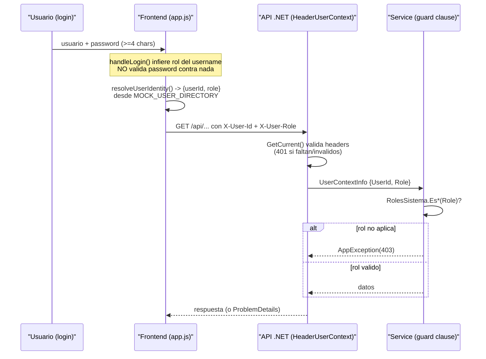

## En breve

SIFCNP identifica a cada usuario con dos **headers HTTP** (datos extra que el navegador adjunta a cada peticion, fuera del cuerpo del mensaje): `X-User-Id` y `X-User-Role`. No hay JWT ni cookies de sesion: el backend simplemente *confia* en lo que dicen esos headers. La autorizacion (quien puede hacer que) no usa atributos ni middleware estandar, sino **guard clauses** (lineas de validacion al inicio de cada metodo que cortan la ejecucion si no se cumple una condicion) dentro de la capa Application. Es un diseno deliberado de MVP/demo: practico para desarrollo, pero inseguro para produccion expuesta.

> ⚠️ Este esquema es trivial de falsificar (ver [Gotchas de seguridad](#gotchas-de-seguridad-lo-que-hay-que-saber)). Sirve para demo y desarrollo local; antes de exponer la app hay que reemplazar la identidad por una real (Microsoft 365 esta previsto).

## Como se identifica al usuario

Todo endpoint de negocio espera dos headers en cada request:

```http
GET /api/justificaciones/mias HTTP/1.1
X-User-Id: 6
X-User-Role: ROL_RRHH
```

- `X-User-Id`: el identificador entero del usuario (debe parsear a `int` y ser `> 0`).
- `X-User-Role`: el rol con el que actua (uno de los valores de la tabla de roles, mas abajo).

Los nombres de header son configurables (claves `Security:HeaderUserId` y `Security:HeaderRole`), con defaults `X-User-Id` / `X-User-Role` ([HeaderUserContext.cs:33-34](../backend/src/IntegradorMarcas.Api/Security/HeaderUserContext.cs)).

> 📌 En la practica: cualquiera que pueda fijar estos dos headers *es* ese usuario con ese rol. No hay contrasena, token ni firma que el backend verifique. Por eso la regla del proyecto es "el backend confia en los headers".

### Quien define el contrato `IUserContext`

La identidad se modela con la interfaz [IUserContext.cs](../backend/src/IntegradorMarcas.Application/Interfaces/IUserContext.cs), que vive en la capa **Application** (ver [modulo-application](modulo-application.html)) y expone un unico metodo `GetCurrent()` que devuelve un [UserContextInfo.cs](../backend/src/IntegradorMarcas.Application/Interfaces/UserContextInfo.cs) con dos propiedades:

```cs
public sealed class UserContextInfo
{
    public int UserId { get; set; }
    public string Role { get; set; } = string.Empty;
}
```

La **implementacion** vive afuera, en la capa Api: [HeaderUserContext.cs](../backend/src/IntegradorMarcas.Api/Security/HeaderUserContext.cs). Este patron (interfaz adentro, implementacion afuera) es lo que llamamos **Clean Architecture** (organizar el codigo en capas donde lo central no conoce los detalles tecnicos; ver [arquitectura](arquitectura.html)). Se registra en el contenedor de dependencias en [Program.cs:71](../backend/src/IntegradorMarcas.Api/Program.cs):

```cs
builder.Services.AddScoped<IUserContext, HeaderUserContext>();
```

## `HeaderUserContext.GetCurrent()` y los 401 que lanza

`GetCurrent()` ([HeaderUserContext.cs:27-56](../backend/src/IntegradorMarcas.Api/Security/HeaderUserContext.cs)) lee los headers del request actual y valida la identidad. Lanza `AppException(401)` (no autenticado) en cualquiera de estos casos:

| Condicion | Resultado |
| --- | --- |
| No existe contexto HTTP (`HttpContext` es null) | `AppException("No hay contexto HTTP disponible.", 401)` |
| Falta `X-User-Id`, o no parsea a entero, o es `<= 0` | `AppException("Header requerido inválido: X-User-Id", 401)` |
| Falta `X-User-Role` o esta vacio/en blanco | `AppException("Header requerido inválido: X-User-Role", 401)` |

Solo si pasa las tres validaciones devuelve un `UserContextInfo` poblado. Resultado practico: **todos los endpoints de negocio responden 401 si faltan los headers**, incluso desde Swagger o desde los archivos `.http`.

> 💡 Tip: `X-User-Id` se valida que sea entero positivo, pero `X-User-Role` solo se valida que no este vacio. Un rol con texto basura (p. ej. `X-User-Role: cualquiercosa`) pasa el 401 aqui, y recien falla mas adelante con 403 cuando una guard clause no lo reconoce (ver siguiente seccion).

## Roles del sistema

Los cuatro roles son constantes en [RolesSistema.cs](../backend/src/IntegradorMarcas.Domain/Constants/RolesSistema.cs), en la capa **Domain** (ver [modulo-dominio](modulo-dominio.html)). Cada rol tiene un helper booleano que normaliza la entrada con `Trim().ToUpperInvariant()` y acepta sinonimos:

| Constante | Valor exacto | Helper | Sinonimos aceptados |
| --- | --- | --- | --- |
| `RolFunc` | `ROL_FUNC` | `EsFuncionario(rol)` | `FUNCIONARIO`, `1` |
| `RolJefe` | `ROL_JEFE` | `EsJefatura(rol)` | `JEFATURA`, `2` |
| `RolRrhh` | `ROL_RRHH` | `EsRrhh(rol)` | `RRHH`, `3` |
| `RolAdmin` | `ROL_ADMIN` | `EsAdmin(rol)` | `ADMIN`, `4` |

```cs
public static bool EsRrhh(string? rol)
{
    var normalized = (rol ?? string.Empty).Trim().ToUpperInvariant();
    return normalized is RolRrhh or "RRHH" or "3";
}
```

> 📌 Para que sirven los sinonimos: el helper es tolerante a varias formas de escribir el mismo rol (`ROL_RRHH`, `rrhh`, ` RRHH `, `3`). Asi distintos clientes pueden mandar el rol de la forma que les quede mas comoda y el backend lo entiende igual. El valor *canonico* que usa el frontend siempre es la forma `ROL_*`.

## Autorizacion: guard clauses, no `[Authorize]`

SIFCNP **no** usa el sistema de autorizacion estandar de ASP.NET: no hay atributos `[Authorize]`, ni politicas, ni middleware de auth. En su lugar, cada metodo de servicio en la capa Application empieza con una o varias **guard clauses** que chequean el rol con los helpers `RolesSistema.Es*` y lanzan `AppException(403)` (prohibido) si el rol no aplica.

Ejemplos reales en [JustificacionService.cs](../backend/src/IntegradorMarcas.Application/Services/JustificacionService.cs):

```cs
// Crear boleta: solo funcionario o jefatura
if (!RolesSistema.EsFuncionario(user.Role) && !RolesSistema.EsJefatura(user.Role))
{
    throw new AppException("Solo funcionario o jefatura pueden crear boletas.", 403);
}
```

```cs
// Pendientes de aprobacion: solo jefatura
if (!RolesSistema.EsJefatura(user.Role))
{
    throw new AppException("Solo jefatura puede ver pendientes.", 403);
}
```

```cs
// Boletas globales: solo RRHH
if (!RolesSistema.EsRrhh(user.Role))
{
    throw new AppException("Solo RRHH puede consultar boletas globales.", 403);
}
```

> 📌 Por que asi: poner la regla de autorizacion *dentro* del servicio de negocio (capa Application) la mantiene cerca de la logica que protege, independiente del transporte HTTP. La desventaja es que no hay un punto unico que la garantice: si un metodo nuevo olvida su guard clause, queda sin proteger. Hay que recordarlo en cada metodo. Mas detalle de la capa en [modulo-application](modulo-application.html).

### Reglas de negocio adicionales que tambien son 403/409

Las guard clauses no se limitan al rol. En el flujo de aprobacion ([JustificacionService.cs:153-211](../backend/src/IntegradorMarcas.Application/Services/JustificacionService.cs)) hay validaciones de **alcance** y de **estado**:

| Situacion | Status | Mensaje (resumen) |
| --- | --- | --- |
| La boleta no esta en el alcance de aprobacion vigente del usuario | 403 | "no pertenece al alcance de aprobacion vigente" |
| Resolver una boleta sin ser jefatura | 403 | "RN-03: solo jefatura puede resolver boletas" |
| La boleta no existe | 404 | "No existe la boleta indicada." |
| La boleta ya fue resuelta | 409 | "RN-04: la boleta ya fue resuelta y no puede modificarse" |

### `ListHistorico`: scoping por rol

Un caso especial es `ListHistoricoAsync` ([JustificacionService.cs:119-151](../backend/src/IntegradorMarcas.Application/Services/JustificacionService.cs)): los tres roles (funcionario, jefatura, RRHH) pueden llamarlo, pero **cada uno ve un universo distinto de boletas**. El servicio no solo deja pasar o no, sino que *acota* (scoping) la consulta segun el rol:

```cs
var usuarioIdScope = esFuncionario ? user.UserId : (int?)null;
var aprobadorUsuarioIdScope = esJefatura ? user.UserId : (int?)null;
var excluirPropiosEnScopeAprobador = esJefatura;
```

| Rol | Que ve | Como se fuerza |
| --- | --- | --- |
| Funcionario | Solo sus propias boletas | `usuarioIdScope = user.UserId`; ademas se ignora el filtro `Funcionario` que venga del cliente |
| Jefatura | Boletas donde es aprobador, excluyendo las propias | `aprobadorUsuarioIdScope = user.UserId` + `excluirPropiosEnScopeAprobador = true` |
| RRHH | Todo (global) | ambos scopes en `null` |

> 💡 Esto es importante: aunque un funcionario mande filtros que pidan boletas de otra persona, el servicio sobreescribe el scope con su propio `UserId` antes de llamar al repositorio. La seguridad no depende de que el cliente "se porte bien".

## El flujo de identidad completo



El lado del navegador esta en [app.js](../app.js) (ver [modulo-frontend](modulo-frontend.html)):

- `buildApiHeaders(session)` ([app.js:318-334](../app.js)) construye `X-User-Id` y `X-User-Role` a partir de la sesion. **Todas** las llamadas a la API pasan por aqui; no hay headers de identidad fuera de esta funcion.
- `resolveUserIdentity(session)` ([app.js:300-316](../app.js)) busca el username en el directorio mock; si no lo encuentra, cae a un `userId: 10` por defecto y deriva el rol del texto del username con `inferRole`.

## `AppException`: la unica excepcion de control de flujo

Todas las respuestas de error "esperadas" (401/403/404/409/400) salen de [AppException.cs](../backend/src/IntegradorMarcas.Application/Common/AppException.cs), una excepcion sellada que lleva un `StatusCode`:

```cs
public sealed class AppException : Exception
{
    public AppException(string message, int statusCode) : base(message) { StatusCode = statusCode; }
    public int StatusCode { get; }
}
```

El manejador global en [Program.cs:80-139](../backend/src/IntegradorMarcas.Api/Program.cs) (`UseExceptionHandler`) la mapea a HTTP:

| Excepcion | Status HTTP resultante |
| --- | --- |
| `AppException` | su propio `StatusCode` (401/403/404/400/409...) |
| `KeyNotFoundException` | 404 |
| `OperationCanceledException` | 499 (cliente cancelo) |
| cualquier otra | 500 |

La respuesta es un `ProblemDetails` con un `correlationId` (en el cuerpo y en el header `X-Correlation-Id`) para cruzar el error con la bitacora tecnica. Mas detalle del manejo de errores y la API en [modulo-api](modulo-api.html) y [api](api.html).

## CORS abierto en desarrollo

**CORS** (Cross-Origin Resource Sharing) es el mecanismo del navegador que decide si una pagina servida desde un origen (p. ej. `http://localhost:8000`) puede llamar a una API en otro origen (p. ej. `http://localhost:5093`). Por defecto el navegador lo bloquea; el servidor debe permitirlo explicitamente.

La politica `LocalFrontend` en [Program.cs:50-60](../backend/src/IntegradorMarcas.Api/Program.cs) abre **todo**:

```cs
policy
    .SetIsOriginAllowed(_ => true)   // cualquier origen
    .AllowAnyHeader()
    .AllowAnyMethod();
```

> ⚠️ `SetIsOriginAllowed(_ => true)` acepta peticiones desde *cualquier* sitio web. El propio comentario del codigo dice "restringir en despliegues expuestos". Para produccion hay que enumerar los origenes permitidos (`WithOrigins(...)`) en vez de aceptar todos.

## Identidad Microsoft 365 prevista

La aplicacion **no gestiona contrasenas**: no hay tabla de credenciales, ni hashing, ni verificacion de password en el backend. El diseno previsto delega la autenticacion real a Microsoft 365 (la organizacion ya autentica al usuario por fuera), y la app solo recibiria la identidad ya resuelta para traducirla a `X-User-Id` / `X-User-Role`. Hoy esa pieza todavia no esta conectada: el login es un mock local (siguiente seccion). TODO: confirmar el mecanismo exacto de integracion M365 (OIDC, header de reverse proxy, etc.) cuando se implemente.

## Gotchas de seguridad (lo que hay que saber)

> ⚠️ Estos puntos son del diseno MVP/demo actual. Son inseguros a proposito para facilitar la demo; documentados para no olvidarlos antes de exponer la app.

- **Login mock, cualquier password sirve.** `handleLogin()` ([app.js:521-550](../app.js)) solo valida que el username tenga `>= 3` caracteres y el password `>= 4`. El password **nunca se envia** a ningun lado ni se compara contra nada. Cualquier contrasena de 4+ caracteres entra.
- **El rol se deriva del texto del username.** `inferRole()` ([app.js:160-169](../app.js)): si el username contiene `admin` -> `ROL_ADMIN`, `rrhh` -> `ROL_RRHH`, `jefe` -> `ROL_JEFE`, y si no, `ROL_FUNC`. Escribir `admin.loquesea` te hace admin.
- **Headers triviales de falsificar.** Como el backend confia en `X-User-Id` / `X-User-Role` sin verificar nada, cualquier cliente (curl, Postman, Swagger) puede ponerse el rol que quiera. No hay defensa en el backend contra esto por diseno.
- **`MOCK_USER_DIRECTORY` quemado en el frontend.** ([app.js:141-150](../app.js)) mapea usernames de ejemplo a `{userId, role}`. Varios usernames comparten el mismo `userId` (`jefe.maria` y `jefe.ricardo` -> 3; `rrhh.carlos` y `rrhh.sandra` -> 6; `admin.sofia` y `admin.demo` -> 1). Los usernames de ejemplo tambien aparecen impresos en `index.html`.
- **Usuario desconocido cae a `userId: 10`.** ([app.js:312-315](../app.js)) Cualquier username fuera del directorio mock usa el id por defecto 10, que puede colisionar con un usuario real de la BD.
- **`Security:UseMockIdentity` no se consume.** La flag existe en config (true en Development) pero `HeaderUserContext` siempre lee los headers reales; la flag no cambia nada en codigo.

## Referencias en el codigo

- [HeaderUserContext.cs:27-56](../backend/src/IntegradorMarcas.Api/Security/HeaderUserContext.cs) — lee headers, valida identidad, lanza los 401.
- [IUserContext.cs](../backend/src/IntegradorMarcas.Application/Interfaces/IUserContext.cs) — contrato de identidad (Application).
- [UserContextInfo.cs](../backend/src/IntegradorMarcas.Application/Interfaces/UserContextInfo.cs) — `UserId` + `Role`.
- [RolesSistema.cs](../backend/src/IntegradorMarcas.Domain/Constants/RolesSistema.cs) — constantes de rol y helpers `Es*` con sinonimos.
- [AppException.cs](../backend/src/IntegradorMarcas.Application/Common/AppException.cs) — excepcion con `StatusCode`.
- [JustificacionService.cs:22-211](../backend/src/IntegradorMarcas.Application/Services/JustificacionService.cs) — guard clauses por rol y scoping de `ListHistorico`.
- [Program.cs:50-71, 80-139](../backend/src/IntegradorMarcas.Api/Program.cs) — registro de `HeaderUserContext`, politica CORS abierta, mapeo de excepciones a HTTP.
- [app.js:141-169, 300-334, 521-550](../app.js) — `MOCK_USER_DIRECTORY`, `inferRole`, `resolveUserIdentity`, `buildApiHeaders`, `handleLogin`.
