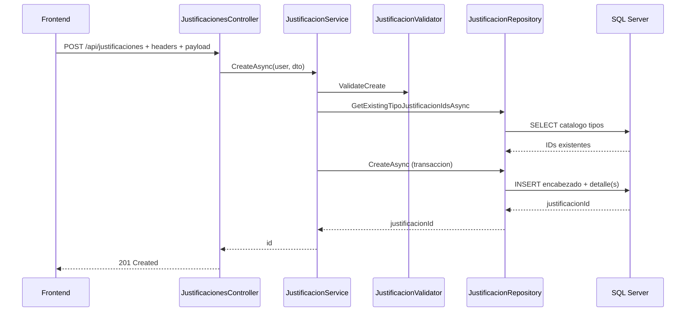
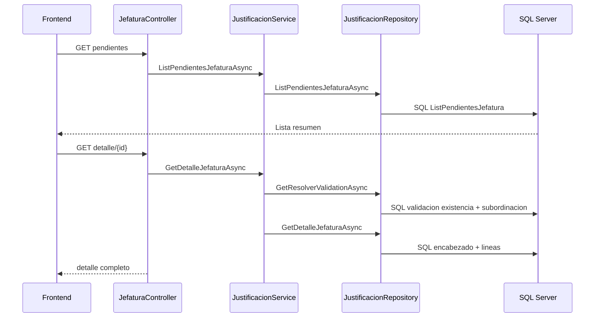
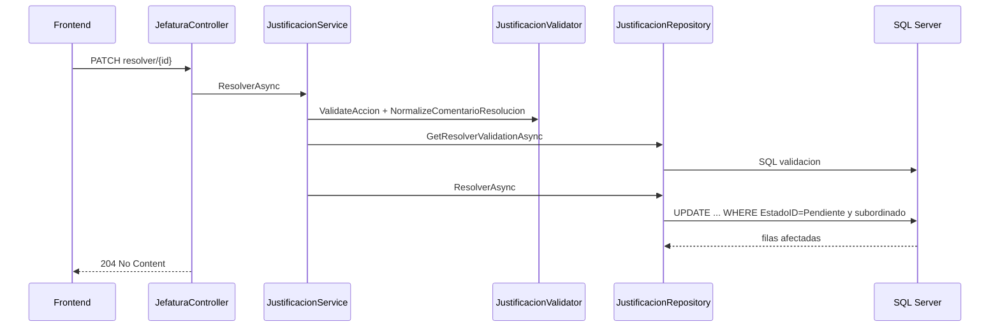
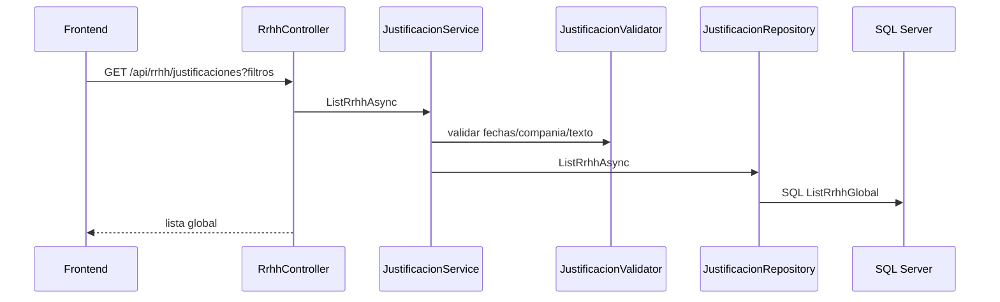

# Flujos de Datos End-to-End

## 1. Proposito
Trazar los flujos reales de datos desde UI hasta SQL Server y de vuelta, por rol funcional, con validaciones y errores por etapa.

## 2. Alcance
- Flujos implementados: crear boleta, listar mias, pendientes jefatura, detalle jefatura, resolver, consulta RRHH.
- Incluye mapeo endpoint -> service -> repository -> SQL -> tablas.

## 3. Fuente de verdad
- app.js
- Controllers en backend/src/IntegradorMarcas.Api/Controllers
- JustificacionService y JustificacionValidator
- JustificacionRepository y JustificacionesSql

## 4. Mapa tecnico global
| Flujo | Endpoint | Service | Repository | SQL principal | Tablas |
|---|---|---|---|---|---|
| Crear boleta | POST /api/justificaciones | CreateAsync | CreateAsync | InsertEncabezado + InsertDetalle | Justificaciones_Encabezado, Justificaciones_Detalle |
| Mis boletas | GET /api/justificaciones/mias | ListMineAsync | ListMineAsync | ListMine | Justificaciones_Encabezado, Justificaciones_Detalle, Estados |
| Pendientes jefatura | GET /api/jefatura/justificaciones/pendientes | ListPendientesJefaturaAsync | ListPendientesJefaturaAsync | ListPendientesJefatura | Justificaciones_Encabezado, Usuarios, Justificaciones_Detalle, Estados |
| Detalle jefatura | GET /api/jefatura/justificaciones/{id} | GetDetalleJefaturaAsync | GetResolverValidationAsync + GetDetalleJefaturaAsync | GetResolverValidation + GetDetalleJefaturaEncabezado + GetDetalleJefaturaLineas | Justificaciones_Encabezado, Usuarios, Justificaciones_Detalle, Cat_TiposJustificacion, Estados |
| Resolver boleta | PATCH /api/jefatura/justificaciones/{id}/resolver | ResolverAsync | GetResolverValidationAsync + ResolverAsync | GetResolverValidation + ResolverPendiente | Justificaciones_Encabezado, Usuarios |
| Consulta RRHH | GET /api/rrhh/justificaciones | ListRrhhAsync | ListRrhhAsync | ListRrhhGlobal | Justificaciones_Encabezado, Justificaciones_Detalle, Usuarios, Estados, Cat_TiposJustificacion |

## 5. Secuencias por rol

### 5.1 Funcionario: crear boleta

Errores clave:
- 400: motivo/lineas/tipo/fecha invalidos.
- 401: headers faltantes o invalidos.
- 403: rol distinto de Funcionario.

### 5.2 Jefatura: ver pendientes y detalle

Errores clave:
- 403: rol no jefatura o no subordinado directo.
- 404: boleta no existe.

### 5.3 Jefatura: resolver boleta

Errores clave:
- 409 RN-04: boleta ya resuelta.
- 409 concurrencia: filas afectadas = 0 en UPDATE condicional.

### 5.4 RRHH: consulta global

Errores clave:
- 400 compania invalida o fechas inconsistentes.
- 403 si no es rol RRHH.

## 6. Puntos de validacion por etapa
- Frontend: valida requeridos basicos de formulario (motivo y lineas).
- API Security: valida headers y formato de identidad.
- Service/Validator: valida negocio y autorizacion por rol.
- SQL: aplica filtros y condicion de estado pendiente para concurrencia optimista.

## 7. Manejo de errores y trazabilidad
- AppException mapea a status definido.
- Middleware global retorna ProblemDetails.
- Handler principal agrega X-Correlation-Id y persiste en dbo.ApiErrorLog.
- Errores de red/timeout en frontend generan toast explicativo.

## 8. Checklist de validacion
- Cada flujo documentado llega a SQL real en JustificacionesSql.
- Reglas de autorizacion coinciden con JustificacionService.
- Errores coinciden con AppException + middleware.
- Endpoint/rol coincide con controladores y frontend.

## 9. Historial de cambios
- 2026-04-23: Documento creado con trazabilidad completa UI -> API -> SQL.
