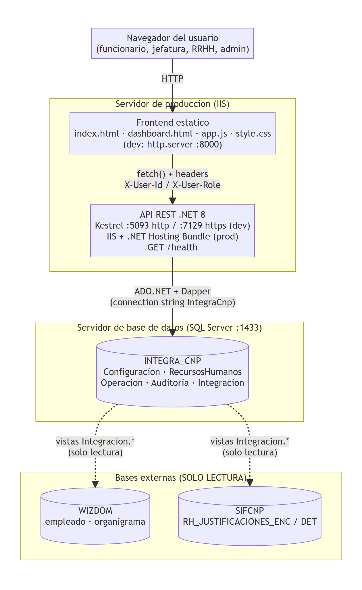
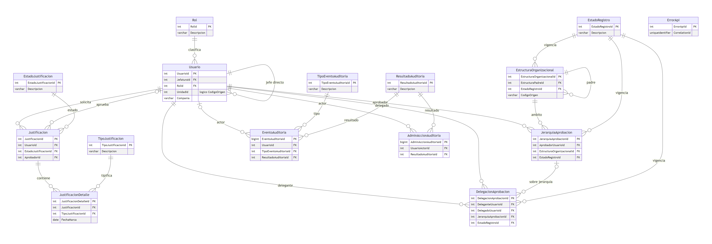
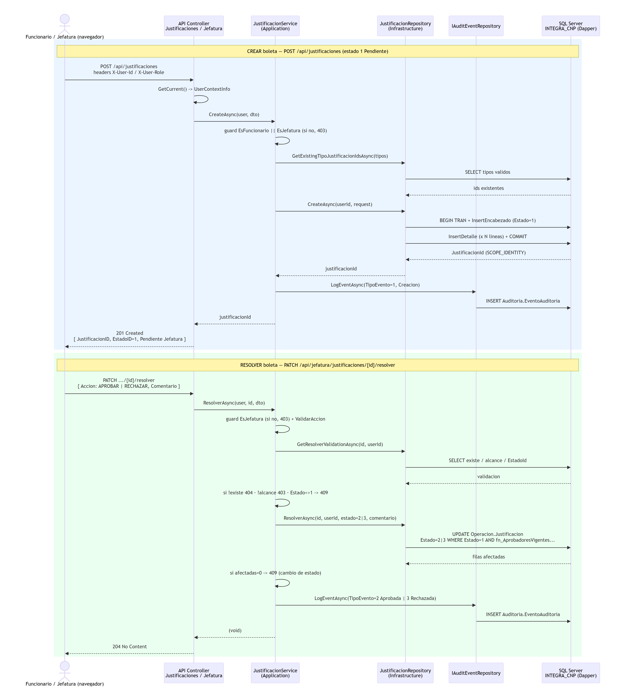

# Manual Técnico — SIFCNP (INTEGRA_CNP)

## Sistema de Justificación de Marcas

| Dato | Valor |
| --- | --- |
| **Producto** | SIFCNP — Sistema de Justificación de Marcas (repositorio/BD: INTEGRA_CNP) |
| **Versión del manual** | 1.0.0 |
| **Fecha** | 27 de junio de 2026 |
| **Estado del documento** | Aprobado para la versión 1.0.0 |
| **Público objetivo** | Personas desarrolladoras y de mantenimiento del sistema |
| **Organización emisora** | Unidad de Tecnologías de Información (UTI) — Consejo Nacional de Producción (CNP) |
| **Idioma** | Español (Costa Rica). Identificadores de código en su idioma original. |

> **Propósito.** Este manual describe la arquitectura, los componentes, el modelo de datos, la referencia de API (OpenAPI), los flujos internos, la instalación, la configuración, el despliegue, el mantenimiento y la gestión de cambios de SIFCNP. Cubre el ciclo de vida completo del software, sin omitir componentes. Está alineado con **ISO/IEC/IEEE 15289:2019** (contenido de los ítems de información), **ISO/IEC/IEEE 12207:2017** (procesos del ciclo de vida), **ISO/IEC/IEEE 42010:2022** (descripción de arquitectura) y la **OpenAPI Specification 3.x** (referencia de API).

---

## Tabla de contenidos

1. [Identificación y alcance](#1-identificación-y-alcance)
2. [Referencias y notación](#2-referencias-y-notación)
3. [Visión general del sistema](#3-visión-general-del-sistema)
4. [Descripción de arquitectura (42010)](#4-descripción-de-arquitectura-42010)
5. [Componentes y estructura del repositorio](#5-componentes-y-estructura-del-repositorio)
6. [Modelo de datos](#6-modelo-de-datos)
7. [Referencia de API (OpenAPI)](#7-referencia-de-api-openapi)
8. [Flujos internos](#8-flujos-internos)
9. [Ciclo de vida del software (12207)](#9-ciclo-de-vida-del-software-12207)
10. [Instalación y configuración](#10-instalación-y-configuración)
11. [Despliegue](#11-despliegue)
12. [Pruebas y verificación](#12-pruebas-y-verificación)
13. [Mantenimiento y gestión de cambios](#13-mantenimiento-y-gestión-de-cambios)
14. [Solución de problemas (técnico)](#14-solución-de-problemas-técnico)
15. [Glosario](#15-glosario)
16. [Trazabilidad con las normas](#16-trazabilidad-con-las-normas)
17. [Fuentes](#17-fuentes)

---

## 1. Identificación y alcance

- **Sistema:** SIFCNP — Sistema de Justificación de Marcas. La marca visible en la interfaz es **SIFCNP**; el repositorio y la base de datos se llaman **INTEGRA_CNP**.
- **Alcance funcional:** gestión de boletas de justificación de marca para CNP y FANAL: creación (funcionario), resolución (jefatura), consulta global (RRHH) y administración de organización, jerarquías, delegaciones y auditoría (administrador).
- **Alcance técnico de este documento:** todas las piezas del sistema — frontend estático, API REST .NET 8 y base de datos SQL Server `INTEGRA_CNP`, más sus integraciones de solo lectura (WIZDOM, SIFCNP).
- **Fuera de alcance:** las bases externas WIZDOM/SIFCNP son **solo lectura**; SIFCNP no escribe en ellas.

---

## 2. Referencias y notación

**Referencias internas del repositorio:**

- `CLAUDE.md` — guía de arquitectura y convenciones del proyecto.
- `docs/db/` — scripts de base de datos y convenciones (`Convenciones_Nomeclatura_BD.md`, `Observaciones_Consolidacion_SQL.md`).
- `docs/seguridad/gestion_credenciales_conexion_bd.md` — gestión de la cadena de conexión.
- `docs/specs/` — especificaciones (incluida la de despliegue IIS).
- `docs/PROMPT-GENERACION-MANUALES.md` — criterios de elaboración de estos manuales.

**Notación:**

- Rutas de archivo y código en `monoespaciado`. Referencias `archivo:línea` cuando aplica.
- Los **Contracts** (forma del wire HTTP) usan sufijo `ID` (`JustificacionID`); los **DTOs/Entities** usan `Id` (`JustificacionId`); los parámetros SQL usan `@PascalCase`.

---

## 3. Visión general del sistema

SIFCNP tiene **tres piezas**:

1. **Frontend estático** — HTML/CSS/JavaScript vanilla en la raíz del repositorio. Dos páginas: `index.html` (ingreso) y `dashboard.html` (aplicación por roles), con un único script global `app.js` (~2227 líneas) y `style.css`. Sin framework, sin bundler, sin paso de compilación. Es un cliente delgado sobre la API REST.
2. **API REST .NET 8** — en `backend/`, con **Clean Architecture** (Domain, Application, Infrastructure, Api).
3. **Base de datos SQL Server** — `INTEGRA_CNP`, con cinco esquemas funcionales (`Configuracion`, `RecursosHumanos`, `Operacion`, `Auditoria`, `Integracion`).

### 3.1 Stack y dependencias

| Capa | Tecnología | Paquetes clave |
| --- | --- | --- |
| Frontend | HTML5 + CSS3 + JavaScript (ES) vanilla | Ninguno (sin dependencias) |
| API | .NET 8 (`net8.0`), ASP.NET Core | `Swashbuckle.AspNetCore` 10.1.7, `Microsoft.AspNetCore.OpenApi` 8.0.25 |
| Acceso a datos | ADO.NET + Dapper | `Dapper` 2.1.72, `Microsoft.Data.SqlClient` 7.0.0 |
| Pruebas | xUnit | `xunit` 2.5.3, `coverlet.collector` 6.0.0 |
| Base de datos | SQL Server 2019+ (validado 15.0.2135.5) | — |

> Nota de "skew" de paquetes: `Microsoft.Extensions.Configuration.Abstractions` 10.0.7 en Infrastructure mientras el target es `net8.0` (roll-forward). Los tests fijan `Microsoft.Extensions.Configuration` 8.0.0.

---

## 4. Descripción de arquitectura (42010)

Esta sección sigue el modelo conceptual de **ISO/IEC/IEEE 42010:2022**: partes interesadas (stakeholders), intereses (concerns), puntos de vista (viewpoints) con sus vistas (views), decisiones de arquitectura y su justificación, y reglas de correspondencia.

### 4.1 Entidad de interés y partes interesadas

- **Entidad de interés:** el sistema SIFCNP (frontend + API + base de datos).
- **Stakeholders y sus concerns:**

| Stakeholder | Intereses (concerns) |
| --- | --- |
| Desarrolladores / mantenimiento | Mantenibilidad, claridad de capas, pruebas, evolución |
| Unidad de TI / operaciones | Despliegue en IIS, configuración, respaldo, disponibilidad |
| Seguridad institucional | Identidad, autorización, trazabilidad/auditoría, protección de credenciales |
| RRHH, jefaturas, funcionarios | Correctitud del flujo de aprobación, integridad de datos |
| Integración (SIFCNP/WIZDOM) | Lectura consistente de datos externos sin escritura |

### 4.2 Vistas

**(a) Vista lógica — Clean Architecture (regla de dependencia hacia adentro):**

```text
Domain          (entidades, constantes; SIN referencias)
  ^
Application      (DTOs, Interfaces, Services, Validation, Common) -> Domain
  ^
Infrastructure   (Data, Queries, Repositories)                    -> Domain + Application
  ^
Api              (Controllers, Contracts, Security)               -> Application + Infrastructure
```

Las interfaces (`IJustificacionRepository`, `IUserContext`, `IErrorLogRepository`, `IAuditEventRepository`, servicios) se definen en `Application/Interfaces` y se implementan hacia afuera (Infrastructure o Api).

**(b) Vista de despliegue:**

```text
[Navegador del usuario]
  │  HTTP
  ▼
[Frontend estático]  dev: python http.server :8000   ·  prod: IIS
  │  fetch() con headers X-User-Id / X-User-Role
  ▼
[API REST .NET 8]    dev: Kestrel :5093 (http) / :7129 (https)  ·  prod: IIS (Hosting Bundle)
  │  ADO.NET + Dapper
  ▼
[SQL Server: INTEGRA_CNP]
  │  vistas de Integracion (solo lectura)
```

[WIZDOM]  ·  [SIFCNP]   (bases externas, solo lectura)

```



*Figura 1. Diagrama de despliegue.*

**(c) Vista de datos:** ver [sección 6](#6-modelo-de-datos).

**(d) Vista de comportamiento:** ver [sección 8](#8-flujos-internos).

**(e) Vista de seguridad / identidad:** la identidad se resuelve por `IUserContext` → `HeaderUserContext`, que lee los headers `X-User-Id` / `X-User-Role`. La autorización se aplica como **guard clauses** en los servicios de Application (`RolesSistema.Es*`). El modelo de identidad previsto es **Microsoft 365 / Entra** (ver decisión ADR-1).

### 4.3 Decisiones de arquitectura y justificación

| ID | Decisión | Justificación (rationale) |
|---|---|---|
| **ADR-1** | Identidad por headers `X-User-Id` / `X-User-Role` (`HeaderUserContext`), confiados por la API. **Dirección futura: Microsoft 365 / Entra** (cuentas `@cnp.go.cr`); se eliminará la gestión de credenciales en la app. | MVP rápido sin JWT/cookies. El modelo definitivo delega la identidad a la cuenta institucional. |
| **ADR-2** | Sin EF Core: ADO.NET crudo + Dapper. Todo el SQL como `const string` en `Infrastructure/Queries/*Sql.cs`. | Control fino del SQL, rendimiento, transparencia de las consultas. |
| **ADR-3** | Autorización por guard clauses en Application (no `[Authorize]` ni middleware de auth). `ListHistorico` aplica scoping por rol. | Simplicidad y control explícito del alcance por rol. |
| **ADR-4** | La función de aprobadores vive en `dbo.fn_AprobadoresVigentesPorSolicitante` (no en `Operacion`). | El backend la invoca como `dbo.fn_...`; se mantiene la compatibilidad. |
| **ADR-5** | Modelo de objetos en tres niveles: Contracts (`ID`) ↔ DTOs (`Id`) ↔ Entities; mapeo manual sin AutoMapper. | Separación de la forma del wire respecto del transporte interno y el dominio. |
| **ADR-6** | `AppException` (con `StatusCode`) como única excepción de control de flujo; respuesta `ProblemDetails` con `correlationId` y header `X-Correlation-Id`. | Manejo de errores uniforme y trazable. |
| **ADR-7** | Cadena de conexión inyectada por variable de entorno `ConnectionStrings__IntegraCnp`; **fail-fast** en no-Development. | No versionar credenciales; abortar el arranque si falta en producción. |

### 4.4 Correspondencias y reglas de consistencia

- **Regla de nombres:** `Contract.XID` ⟷ `DTO.XId` ⟷ `Entity.XId` ⟷ columna/param SQL `@XID`. Los controllers traducen a mano `ID` ⟷ `Id`.
- **Regla de capas:** ninguna capa interior referencia a una exterior (Domain no referencia nada; Api referencia Application + Infrastructure).
- **Regla de SQL:** todo el SQL reside en `Queries/*Sql.cs` salvo dos excepciones documentadas (`AdminMonitoringController`, `SessionController`), que llevan SQL inline.

---

<a id="5-componentes-y-estructura-del-repositorio"></a>
## 5. Componentes y estructura del repositorio

```

/ (raíz)
├── index.html, dashboard.html, app.js, style.css   (frontend estático)
├── backend/
│   ├── IntegradorMarcas.slnx                        (solución, formato slnx)
│   ├── src/
│   │   ├── IntegradorMarcas.Domain/                 Constants (RolesSistema, EstadoIds), Entities
│   │   ├── IntegradorMarcas.Application/            Common (AppException), DTOs, Interfaces, Services, Validation
│   │   ├── IntegradorMarcas.Infrastructure/         Data (ISqlConnectionFactory), Queries (*Sql.cs), Repositories
│   │   └── IntegradorMarcas.Api/                    Program.cs, Controllers (7), Contracts, Security (HeaderUserContext)
│   └── tests/IntegradorMarcas.Tests/                xUnit
├── docs/                                            db/, seguridad/, specs/, manuales
└── .vscode/tasks.json                               tareas de build/run/test/serve

```

**Controllers (7):** `JustificacionesController`, `JefaturaController`, `RrhhController`, `AdminAprobacionesController`, `AdminOrganizacionController`, `AdminMonitoringController`, `SessionController`, más el endpoint mínimo `GET /health` en `Program.cs`.

**Repositorios (sealed, uno por agregado):** `JustificacionRepository`, `AdminAprobacionesRepository`, `AdminOrganizacionRepository`, `AuditEventRepository`, `AdminActionAuditRepository`, `ErrorLogRepository`.

> Restos de scaffolding (no afectan el funcionamiento): `Class1.cs` en Application/Domain/Infrastructure y `UnitTest1.cs` en Tests.

---

## 6. Modelo de datos

Base `INTEGRA_CNP`, SQL Server. Cinco esquemas funcionales. Convenciones en `docs/db/Convenciones_Nomeclatura_BD.md` (PascalCase, español, PK = `[Tabla]Id`, FK = mismo nombre de la PK referenciada). Toda la estructura está en `docs/db/02_EstructuraCompleta.sql`.

### 6.1 Esquema `Configuracion` (catálogos)

| Tabla | PK | Contenido |
|---|---|---|
| `Rol` | `RolId` (1..4) | Funcionario, Jefatura, RRHH, Administrador |
| `EstadoJustificacion` | `EstadoJustificacionId` | Pendiente Jefatura (1), Aprobada (2), Rechazada (3) |
| `TipoJustificacion` | `TipoJustificacionId` (IDENTITY) | 5 tipos (Marca Tardía, Omisión Entrada/Salida, Marca antes de salida, Ausencia) |
| `EstadoRegistro` | `EstadoRegistroId` | Activo (1), Inactivo (2) |
| `TipoEventoAuditoria` | `TipoEventoAuditoriaId` | 11 tipos de evento (1..11) |
| `ResultadoAuditoria` | `ResultadoAuditoriaId` | Exito (1), Fallo (2), Denegado (3) |

### 6.2 Esquema `RecursosHumanos`

- **`Usuario`** — PK `UsuarioId` (IDENTITY). Columnas: `Cedula`, `NombreCompleto`, `CorreoElectronico`, `JefaturaId` (auto-FK al jefe directo), `UnidadId` (INT), `RolId` (FK), `Compania` (CHECK `IN ('CNP','FANAL')`), `EsActivo` + auditoría.
- **`EstructuraOrganizacional`** — PK `EstructuraOrganizacionalId` (IDENTITY). Columnas: `Nombre`, `CodigoOrigen` (VARCHAR), `EstructuraPadreId` (auto-FK), `EstadoRegistroId`, `VigenciaDesde/Hasta`.

> **Relación lógica (no por FK):** `Usuario.UnidadId` (INT) ⟷ `EstructuraOrganizacional.CodigoOrigen` (VARCHAR), unidos por CAST. Es el punto más débil del diseño (ver `Observaciones_Consolidacion_SQL.md`).

### 6.3 Esquema `Operacion`

- **`Justificacion`** (encabezado) — PK `JustificacionId`. Columnas: `UsuarioId` (solicitante), `MotivoGeneral`, `ComentarioResolucion`, `RolResolucion`, `EstadoJustificacionId`, `FechaCreacion`, `AprobadorId`, `FechaAprobacion` + auditoría.
- **`JustificacionDetalle`** (líneas) — PK `JustificacionDetalleId`. Columnas: `JustificacionId`, `TipoJustificacionId`, `FechaMarca` (DATE), `ObservacionDetalle`.
- **`JerarquiaAprobacion`** — PK `JerarquiaAprobacionId`. Columnas: `AprobadorUsuarioId`, `EstructuraOrganizacionalId`, `NivelAprobacion`, `TipoRelacion` (CHECK `IN ('Vertical','Horizontal')`), `EstadoRegistroId`, `VigenciaDesde/Hasta`.
- **`DelegacionAprobacion`** — PK `DelegacionAprobacionId`. Columnas: `DeleganteUsuarioId`, `DelegadoUsuarioId`, `JerarquiaAprobacionId` (NULL = todas), `Motivo`, `EstadoRegistroId`, `VigenciaDesde/Hasta`.

### 6.4 Esquema `Auditoria`

- **`EventoAuditoria`** — PK BIGINT. Bitácora funcional con snapshots `NombreUsuario`/`RolCodigo`, `TipoEventoAuditoriaId`, `ResultadoAuditoriaId`, `ReferenciaFuncional`, `PayloadResumen`.
- **`ErrorApi`** — PK. **Columnas en inglés a propósito** (contrato C# de `IErrorLogRepository`): `CorrelationId`, `FechaUtc`, `HttpMethod`, `Endpoint`, `StatusCode`, `TipoError`, `Mensaje`, `StackTrace` (solo si `StatusCode >= 500`), `UsuarioID`, `RolUsuario`, `Entorno`, `Ip`, `UserAgent`. **No corregir** la nomenclatura.
- **`AdminAccionAuditoria`** — PK BIGINT. Acciones admin con `ValoresAnteriores`/`ValoresNuevos` (JSON antes/después), `CorrelationId`, `UsuarioActorId`, `Accion`, `EntidadObjetivo`.

### 6.5 Función `dbo.fn_AprobadoresVigentesPorSolicitante`

- Vive en **`dbo`** (la invoca el backend). Recibe `@SolicitanteUsuarioId INT`, `@FechaRef DATETIME2`.
- Devuelve tabla con `AprobadorUsuarioId`, `Origen` (`'Jerarquia'` o `'Delegacion'`), `DeleganteUsuarioId` (NULL para jerarquía).
- Combina (`UNION ALL`) aprobadores por jerarquía y por delegación vigentes (`EstadoRegistroId=1` y vigencia contra `@FechaRef`). **`Origen='Delegacion'` tiene prioridad** sobre jerarquía.

### 6.6 Vistas e integración

- **`Integracion.v_EmpleadoWizdom`**, **`v_OrganigramaWizdom`** (sobre `WIZDOM`, solo si la BD existe).
- **`Integracion.v_JustificacionEncabezadoSifcnp`**, **`v_JustificacionDetalleSifcnp`** (sobre `SIFCNP`, solo lectura). El backend no las consume.
- **`dbo.V_JUSTIFICACIONES_DETALLE`** — vista legada en `MAYUSCULAS_SNAKE` **a propósito** (compatibilidad SIFCNP). No aplicar PascalCase.
- **`dbo.Estructuras_Organizacionales`** — shim de compatibilidad usado por una sola consulta (`GetDetalleJefaturaEncabezado`).



*Figura 2. Diagrama entidad-relación de los esquemas.*

---

## 7. Referencia de API (OpenAPI)

La API expone **27 operaciones**. Toda operación de negocio requiere los headers `X-User-Id` y `X-User-Role`; si faltan o son inválidos, responde **401**. La autorización por rol se aplica en los servicios de Application y devuelve **403** cuando no aplica.

El documento que sigue está en **OpenAPI 3.0.3** (elegido por legibilidad de `nullable`; es trivialmente migrable a 3.1). Cubre rutas, parámetros, cuerpos, respuestas y esquemas principales.

```yaml
openapi: 3.0.3
info:
  title: SIFCNP - API de Justificación de Marcas (INTEGRA_CNP)
  version: 1.0.0
  description: >
    API REST para la gestión de boletas de justificación de marca.
    Identidad por headers (modelo previsto: Microsoft 365 / Entra).
servers:
  - url: http://localhost:5093
    description: Desarrollo (Kestrel, perfil http)
  - url: https://localhost:7129
    description: Desarrollo (Kestrel, perfil https)
  # - url: https://<servidor-iis>   # TODO: dirección de producción (IIS)
tags:
  - name: Health
  - name: Session
  - name: Justificaciones
  - name: Jefatura
  - name: RRHH
  - name: Admin - Aprobaciones
  - name: Admin - Organización
  - name: Admin - Monitoreo
security:
  - UserId: []
    UserRole: []
components:
  securitySchemes:
    UserId:
      type: apiKey
      in: header
      name: X-User-Id
    UserRole:
      type: apiKey
      in: header
      name: X-User-Role
  schemas:
    ProblemDetails:
      type: object
      properties:
        type: { type: string }
        title: { type: string }
        status: { type: integer }
        detail: { type: string }
        correlationId: { type: string, format: uuid }
    JustificacionDetalleRequest:
      type: object
      required: [TipoJustificacionID, FechaMarca]
      properties:
        TipoJustificacionID: { type: integer }
        FechaMarca: { type: string, format: date-time }
        ObservacionDetalle: { type: string, nullable: true, maxLength: 250 }
    CreateJustificacionRequest:
      type: object
      required: [MotivoGeneral, Detalles]
      properties:
        MotivoGeneral: { type: string, maxLength: 500 }
        Detalles:
          type: array
          items: { $ref: '#/components/schemas/JustificacionDetalleRequest' }
    CreateJustificacionResponse:
      type: object
      properties:
        JustificacionID: { type: integer }
        EstadoID: { type: integer, example: 1 }
        EstadoDescripcion: { type: string, example: "Pendiente Jefatura" }
    JustificacionResumenResponse:
      type: object
      properties:
        JustificacionID: { type: integer }
        MotivoGeneral: { type: string }
        ObservacionDetalle: { type: string, nullable: true }
        ComentarioResolucion: { type: string, nullable: true }
        EstadoID: { type: integer }
        EstadoDescripcion: { type: string }
        FechaCreacion: { type: string, format: date-time }
        CantidadDetalles: { type: integer }
        AprobadorID: { type: integer, nullable: true }
        FechaAprobacion: { type: string, format: date-time, nullable: true }
    JustificacionDetalleLineaResponse:
      type: object
      properties:
        DetalleID: { type: integer }
        TipoJustificacionID: { type: integer }
        TipoJustificacionDescripcion: { type: string }
        FechaMarca: { type: string, format: date-time }
        ObservacionDetalle: { type: string, nullable: true }
    UsuarioResumenResponse:
      type: object
      properties:
        UsuarioID: { type: integer }
        NombreCompleto: { type: string }
        Cedula: { type: string }
        Correo: { type: string }
        Compania: { type: string }
        UnidadID: { type: integer }
        JefaturaID: { type: integer, nullable: true }
        UnidadNombre: { type: string }
    CurrentApproverResponse:
      type: object
      properties:
        SolicitanteUsuarioID: { type: integer }
        Aprobador:
          allOf: [ { $ref: '#/components/schemas/UsuarioResumenResponse' } ]
          nullable: true
        Origen: { type: string, nullable: true, enum: [Jerarquia, Delegacion, null] }
        DeleganteUsuarioID: { type: integer, nullable: true }
        DeleganteNombre: { type: string, nullable: true }
    RrhhJustificacionResumenResponse:
      type: object
      properties:
        JustificacionID: { type: integer }
        MotivoGeneral: { type: string }
        ComentarioResolucion: { type: string, nullable: true }
        EstadoID: { type: integer }
        EstadoDescripcion: { type: string }
        FechaCreacion: { type: string, format: date-time }
        CantidadDetalles: { type: integer }
        AprobadorID: { type: integer, nullable: true }
        FechaAprobacion: { type: string, format: date-time, nullable: true }
        FuncionarioID: { type: integer }
        FuncionarioNombre: { type: string }
        FuncionarioCedula: { type: string }
        Compania: { type: string }
        JefaturaID: { type: integer, nullable: true }
        JefaturaNombre: { type: string, nullable: true }
        TipoPrincipal: { type: string, nullable: true }
    JustificacionDetalleCompletaResponse:
      type: object
      properties:
        Encabezado: { $ref: '#/components/schemas/JustificacionResumenResponse' }
        Solicitante: { $ref: '#/components/schemas/UsuarioResumenResponse' }
        Aprobador:
          allOf: [ { $ref: '#/components/schemas/UsuarioResumenResponse' } ]
          nullable: true
        Detalles:
          type: array
          items: { $ref: '#/components/schemas/JustificacionDetalleLineaResponse' }
    ResolverJustificacionRequest:
      type: object
      required: [Accion]
      properties:
        Accion: { type: string, enum: [APROBAR, RECHAZAR] }
        Comentario: { type: string, nullable: true, maxLength: 500 }
    AdminJerarquiaResponse:
      type: object
      properties:
        JerarquiaAprobacionID: { type: integer }
        AprobadorUsuarioID: { type: integer }
        EstructuraOrganizacionalID: { type: integer }
        NivelAprobacion: { type: integer }
        TipoRelacion: { type: string, enum: [Vertical, Horizontal] }
        EstadoRegistroID: { type: integer }
        VigenciaDesde: { type: string, format: date-time }
        VigenciaHasta: { type: string, format: date-time, nullable: true }
    CreateJerarquiaRequest:
      type: object
      required: [AprobadorUsuarioID, EstructuraOrganizacionalID, NivelAprobacion, TipoRelacion, VigenciaDesde]
      properties:
        AprobadorUsuarioID: { type: integer }
        EstructuraOrganizacionalID: { type: integer }
        NivelAprobacion: { type: integer, minimum: 1 }
        TipoRelacion: { type: string, enum: [Vertical, Horizontal] }
        VigenciaDesde: { type: string, format: date-time }
        VigenciaHasta: { type: string, format: date-time, nullable: true }
    UpdateJerarquiaRequest:
      allOf:
        - $ref: '#/components/schemas/CreateJerarquiaRequest'
        - type: object
          properties:
            EstadoRegistroID: { type: integer, enum: [1, 2] }
    ToggleEstadoRegistroRequest:
      type: object
      required: [EstadoRegistroID]
      properties:
        EstadoRegistroID: { type: integer, enum: [1, 2] }
    AdminDelegacionResponse:
      type: object
      properties:
        DelegacionAprobacionID: { type: integer }
        DeleganteUsuarioID: { type: integer }
        DelegadoUsuarioID: { type: integer }
        JerarquiaAprobacionID: { type: integer, nullable: true }
        Motivo: { type: string, nullable: true }
        EstadoRegistroID: { type: integer }
        VigenciaDesde: { type: string, format: date-time }
        VigenciaHasta: { type: string, format: date-time, nullable: true }
    CreateDelegacionRequest:
      type: object
      required: [DeleganteUsuarioID, DelegadoUsuarioID, VigenciaDesde]
      properties:
        DeleganteUsuarioID: { type: integer }
        DelegadoUsuarioID: { type: integer }
        JerarquiaAprobacionID: { type: integer, nullable: true }
        Motivo: { type: string, nullable: true, maxLength: 250 }
        VigenciaDesde: { type: string, format: date-time }
        VigenciaHasta: { type: string, format: date-time, nullable: true }
    UpdateDelegacionRequest:
      allOf:
        - $ref: '#/components/schemas/CreateDelegacionRequest'
        - type: object
          properties:
            EstadoRegistroID: { type: integer, enum: [1, 2] }
    AdminDependenciaResponse:
      type: object
      properties:
        EstructuraOrganizacionalID: { type: integer }
        Nombre: { type: string }
        CodigoOrigen: { type: string, nullable: true }
        EstructuraPadreID: { type: integer, nullable: true }
        EstadoRegistroID: { type: integer }
        VigenciaDesde: { type: string, format: date-time, nullable: true }
        VigenciaHasta: { type: string, format: date-time, nullable: true }
    UpdateDependenciaRequest:
      type: object
      required: [Nombre, EstadoRegistroID]
      properties:
        Nombre: { type: string, maxLength: 150 }
        EstructuraPadreID: { type: integer, nullable: true }
        EstadoRegistroID: { type: integer, enum: [1, 2] }
    AdminUsuarioAsignacionResponse:
      type: object
      properties:
        UsuarioID: { type: integer }
        Cedula: { type: string }
        NombreCompleto: { type: string }
        CorreoElectronico: { type: string }
        JefaturaID: { type: integer, nullable: true }
        JefaturaNombre: { type: string, nullable: true }
        UnidadID: { type: integer }
        RolID: { type: integer }
        RolDescripcion: { type: string }
        EsActivo: { type: boolean }
    UpdateUsuarioAsignacionRequest:
      type: object
      properties:
        RolID: { type: integer, nullable: true }
        UnidadID: { type: integer, nullable: true }
        JefaturaID: { type: integer, nullable: true }
    UpdateUsuarioEstadoRequest:
      type: object
      required: [EsActivo]
      properties:
        EsActivo: { type: boolean }
    AdminMonitoringRecordResponse:
      type: object
      properties:
        Fecha: { type: string, format: date-time }
        Tipo: { type: string, enum: [ERROR, EVENTO] }
        Categoria: { type: string }
        Mensaje: { type: string }
        Usuario: { type: string }
        Estado: { type: string }
        Referencia: { type: string }
        Origen: { type: string }
        Detalle: { type: string }
  responses:
    Unauthorized:
      description: Faltan o son inválidos los headers X-User-Id / X-User-Role
      content:
        application/problem+json:
          schema: { $ref: '#/components/schemas/ProblemDetails' }
    Forbidden:
      description: El rol del usuario no autoriza la operación
      content:
        application/problem+json:
          schema: { $ref: '#/components/schemas/ProblemDetails' }
    BadRequest:
      description: Validación fallida (ModelState o reglas de negocio)
      content:
        application/problem+json:
          schema: { $ref: '#/components/schemas/ProblemDetails' }
    NotFound:
      description: Recurso no encontrado
      content:
        application/problem+json:
          schema: { $ref: '#/components/schemas/ProblemDetails' }
paths:
  /health:
    get:
      tags: [Health]
      summary: Probe de salud (sin autenticación)
      security: []
      responses:
        '200':
          description: Operativo
          content:
            application/json:
              schema:
                type: object
                properties:
                  status: { type: string, example: ok }
                  utc: { type: string, format: date-time }
  /api/Session/status:
    get:
      tags: [Session]
      summary: Estado de la sesión (valida headers inline)
      responses:
        '200':
          description: Sesión válida
          content:
            application/json:
              schema:
                type: object
                properties:
                  isValid: { type: boolean }
                  userId: { type: integer }
                  role: { type: string }
                  serverTime: { type: string, format: date-time }
        '401': { $ref: '#/components/responses/Unauthorized' }
  /api/Session/profile:
    get:
      tags: [Session]
      summary: Perfil del usuario (incluye NombreCompleto si está en BD)
      responses:
        '200':
          description: Perfil
          content:
            application/json:
              schema:
                type: object
                properties:
                  userId: { type: integer }
                  role: { type: string }
                  nombreCompleto: { type: string, nullable: true }
        '401': { $ref: '#/components/responses/Unauthorized' }
  /api/Session/logout:
    post:
      tags: [Session]
      summary: Cierre de sesión (placeholder)
      security: []
      responses:
        '200':
          description: Sesión cerrada
          content:
            application/json:
              schema:
                type: object
                properties:
                  message: { type: string }
                  loggedOutAt: { type: string, format: date-time }
  /api/Justificaciones:
    post:
      tags: [Justificaciones]
      summary: Crear boleta (Funcionario o Jefatura)
      requestBody:
        required: true
        content:
          application/json:
            schema: { $ref: '#/components/schemas/CreateJustificacionRequest' }
      responses:
        '201':
          description: Boleta creada
          content:
            application/json:
              schema: { $ref: '#/components/schemas/CreateJustificacionResponse' }
        '400': { $ref: '#/components/responses/BadRequest' }
        '401': { $ref: '#/components/responses/Unauthorized' }
        '403': { $ref: '#/components/responses/Forbidden' }
  /api/Justificaciones/mias:
    get:
      tags: [Justificaciones]
      summary: Listar boletas propias (Func/Jefe/RRHH)
      parameters:
        - { name: estadoId, in: query, schema: { type: integer } }
        - { name: desde, in: query, schema: { type: string, format: date-time } }
        - { name: hasta, in: query, schema: { type: string, format: date-time } }
      responses:
        '200':
          description: Lista de boletas propias
          content:
            application/json:
              schema:
                type: array
                items: { $ref: '#/components/schemas/JustificacionResumenResponse' }
        '400': { $ref: '#/components/responses/BadRequest' }
        '401': { $ref: '#/components/responses/Unauthorized' }
        '403': { $ref: '#/components/responses/Forbidden' }
  /api/Justificaciones/aprobador-actual:
    get:
      tags: [Justificaciones]
      summary: Aprobador vigente del solicitante (Func/Jefe/RRHH)
      responses:
        '200':
          description: Aprobador actual
          content:
            application/json:
              schema: { $ref: '#/components/schemas/CurrentApproverResponse' }
        '401': { $ref: '#/components/responses/Unauthorized' }
        '403': { $ref: '#/components/responses/Forbidden' }
  /api/Justificaciones/{justificacionId}/lineas:
    get:
      tags: [Justificaciones]
      summary: Líneas de una boleta propia (Func/Jefe/RRHH)
      parameters:
        - { name: justificacionId, in: path, required: true, schema: { type: integer } }
      responses:
        '200':
          description: Líneas de detalle
          content:
            application/json:
              schema:
                type: array
                items: { $ref: '#/components/schemas/JustificacionDetalleLineaResponse' }
        '400': { $ref: '#/components/responses/BadRequest' }
        '401': { $ref: '#/components/responses/Unauthorized' }
        '403': { $ref: '#/components/responses/Forbidden' }
  /api/Justificaciones/historico:
    get:
      tags: [Justificaciones]
      summary: Histórico con scoping por rol (Func/Jefe/RRHH)
      parameters:
        - { name: funcionario, in: query, schema: { type: string } }
        - { name: estadoId, in: query, schema: { type: integer } }
        - { name: compania, in: query, schema: { type: string, enum: [CNP, FANAL] } }
        - { name: fechaDesde, in: query, schema: { type: string, format: date-time } }
        - { name: fechaHasta, in: query, schema: { type: string, format: date-time } }
      responses:
        '200':
          description: Histórico
          content:
            application/json:
              schema:
                type: array
                items: { $ref: '#/components/schemas/RrhhJustificacionResumenResponse' }
        '400': { $ref: '#/components/responses/BadRequest' }
        '401': { $ref: '#/components/responses/Unauthorized' }
        '403': { $ref: '#/components/responses/Forbidden' }
  /api/rrhh/justificaciones:
    get:
      tags: [RRHH]
      summary: Consulta global (solo RRHH)
      parameters:
        - { name: funcionario, in: query, schema: { type: string } }
        - { name: estadoId, in: query, schema: { type: integer } }
        - { name: compania, in: query, schema: { type: string, enum: [CNP, FANAL] } }
        - { name: fechaDesde, in: query, schema: { type: string, format: date-time } }
        - { name: fechaHasta, in: query, schema: { type: string, format: date-time } }
      responses:
        '200':
          description: Boletas globales
          content:
            application/json:
              schema:
                type: array
                items: { $ref: '#/components/schemas/RrhhJustificacionResumenResponse' }
        '400': { $ref: '#/components/responses/BadRequest' }
        '401': { $ref: '#/components/responses/Unauthorized' }
        '403': { $ref: '#/components/responses/Forbidden' }
  /api/jefatura/justificaciones/pendientes:
    get:
      tags: [Jefatura]
      summary: Pendientes en el alcance de la jefatura (solo Jefatura)
      parameters:
        - { name: desde, in: query, schema: { type: string, format: date-time } }
        - { name: hasta, in: query, schema: { type: string, format: date-time } }
      responses:
        '200':
          description: Pendientes
          content:
            application/json:
              schema:
                type: array
                items: { $ref: '#/components/schemas/JustificacionResumenResponse' }
        '400': { $ref: '#/components/responses/BadRequest' }
        '401': { $ref: '#/components/responses/Unauthorized' }
        '403': { $ref: '#/components/responses/Forbidden' }
  /api/jefatura/justificaciones/{justificacionId}:
    get:
      tags: [Jefatura]
      summary: Detalle completo de una boleta (solo Jefatura)
      parameters:
        - { name: justificacionId, in: path, required: true, schema: { type: integer } }
      responses:
        '200':
          description: Detalle completo
          content:
            application/json:
              schema: { $ref: '#/components/schemas/JustificacionDetalleCompletaResponse' }
        '401': { $ref: '#/components/responses/Unauthorized' }
        '403': { $ref: '#/components/responses/Forbidden' }
        '404': { $ref: '#/components/responses/NotFound' }
  /api/jefatura/justificaciones/{justificacionId}/resolver:
    patch:
      tags: [Jefatura]
      summary: Aprobar o rechazar una boleta (solo Jefatura)
      parameters:
        - { name: justificacionId, in: path, required: true, schema: { type: integer } }
      requestBody:
        required: true
        content:
          application/json:
            schema: { $ref: '#/components/schemas/ResolverJustificacionRequest' }
      responses:
        '204': { description: Resuelta }
        '400': { $ref: '#/components/responses/BadRequest' }
        '401': { $ref: '#/components/responses/Unauthorized' }
        '403': { $ref: '#/components/responses/Forbidden' }
        '404': { $ref: '#/components/responses/NotFound' }
        '409':
          description: La boleta ya fue resuelta (RN-04) o cambió de estado
          content:
            application/problem+json:
              schema: { $ref: '#/components/schemas/ProblemDetails' }
  /api/admin/aprobaciones/jerarquias:
    get:
      tags: [Admin - Aprobaciones]
      summary: Listar jerarquías (solo Admin)
      parameters:
        - { name: aprobadorUsuarioId, in: query, schema: { type: integer } }
        - { name: estadoRegistroId, in: query, schema: { type: integer } }
      responses:
        '200':
          description: Jerarquías
          content:
            application/json:
              schema:
                type: array
                items: { $ref: '#/components/schemas/AdminJerarquiaResponse' }
        '401': { $ref: '#/components/responses/Unauthorized' }
        '403': { $ref: '#/components/responses/Forbidden' }
    post:
      tags: [Admin - Aprobaciones]
      summary: Crear jerarquía (solo Admin)
      requestBody:
        required: true
        content:
          application/json:
            schema: { $ref: '#/components/schemas/CreateJerarquiaRequest' }
      responses:
        '200':
          description: Jerarquía creada
          content:
            application/json:
              schema: { $ref: '#/components/schemas/AdminJerarquiaResponse' }
        '400': { $ref: '#/components/responses/BadRequest' }
        '401': { $ref: '#/components/responses/Unauthorized' }
        '403': { $ref: '#/components/responses/Forbidden' }
  /api/admin/aprobaciones/jerarquias/{jerarquiaAprobacionId}:
    patch:
      tags: [Admin - Aprobaciones]
      summary: Actualizar jerarquía (solo Admin)
      parameters:
        - { name: jerarquiaAprobacionId, in: path, required: true, schema: { type: integer } }
      requestBody:
        required: true
        content:
          application/json:
            schema: { $ref: '#/components/schemas/UpdateJerarquiaRequest' }
      responses:
        '200':
          description: Jerarquía actualizada
          content:
            application/json:
              schema: { $ref: '#/components/schemas/AdminJerarquiaResponse' }
        '400': { $ref: '#/components/responses/BadRequest' }
        '401': { $ref: '#/components/responses/Unauthorized' }
        '403': { $ref: '#/components/responses/Forbidden' }
        '404': { $ref: '#/components/responses/NotFound' }
  /api/admin/aprobaciones/jerarquias/{jerarquiaAprobacionId}/estado:
    patch:
      tags: [Admin - Aprobaciones]
      summary: Cambiar estado de jerarquía (solo Admin)
      parameters:
        - { name: jerarquiaAprobacionId, in: path, required: true, schema: { type: integer } }
      requestBody:
        required: true
        content:
          application/json:
            schema: { $ref: '#/components/schemas/ToggleEstadoRegistroRequest' }
      responses:
        '204': { description: Estado cambiado }
        '400': { $ref: '#/components/responses/BadRequest' }
        '401': { $ref: '#/components/responses/Unauthorized' }
        '403': { $ref: '#/components/responses/Forbidden' }
        '404': { $ref: '#/components/responses/NotFound' }
  /api/admin/aprobaciones/delegaciones:
    get:
      tags: [Admin - Aprobaciones]
      summary: Listar delegaciones (solo Admin)
      parameters:
        - { name: deleganteUsuarioId, in: query, schema: { type: integer } }
        - { name: delegadoUsuarioId, in: query, schema: { type: integer } }
        - { name: estadoRegistroId, in: query, schema: { type: integer } }
        - { name: vigenteEnFecha, in: query, schema: { type: string, format: date-time } }
      responses:
        '200':
          description: Delegaciones
          content:
            application/json:
              schema:
                type: array
                items: { $ref: '#/components/schemas/AdminDelegacionResponse' }
        '401': { $ref: '#/components/responses/Unauthorized' }
        '403': { $ref: '#/components/responses/Forbidden' }
    post:
      tags: [Admin - Aprobaciones]
      summary: Crear delegación (solo Admin)
      requestBody:
        required: true
        content:
          application/json:
            schema: { $ref: '#/components/schemas/CreateDelegacionRequest' }
      responses:
        '200':
          description: Delegación creada
          content:
            application/json:
              schema: { $ref: '#/components/schemas/AdminDelegacionResponse' }
        '400': { $ref: '#/components/responses/BadRequest' }
        '401': { $ref: '#/components/responses/Unauthorized' }
        '403': { $ref: '#/components/responses/Forbidden' }
  /api/admin/aprobaciones/delegaciones/{delegacionAprobacionId}:
    patch:
      tags: [Admin - Aprobaciones]
      summary: Actualizar delegación (solo Admin)
      parameters:
        - { name: delegacionAprobacionId, in: path, required: true, schema: { type: integer } }
      requestBody:
        required: true
        content:
          application/json:
            schema: { $ref: '#/components/schemas/UpdateDelegacionRequest' }
      responses:
        '200':
          description: Delegación actualizada
          content:
            application/json:
              schema: { $ref: '#/components/schemas/AdminDelegacionResponse' }
        '400': { $ref: '#/components/responses/BadRequest' }
        '401': { $ref: '#/components/responses/Unauthorized' }
        '403': { $ref: '#/components/responses/Forbidden' }
        '404': { $ref: '#/components/responses/NotFound' }
  /api/admin/aprobaciones/delegaciones/{delegacionAprobacionId}/estado:
    patch:
      tags: [Admin - Aprobaciones]
      summary: Cambiar estado de delegación (solo Admin)
      parameters:
        - { name: delegacionAprobacionId, in: path, required: true, schema: { type: integer } }
      requestBody:
        required: true
        content:
          application/json:
            schema: { $ref: '#/components/schemas/ToggleEstadoRegistroRequest' }
      responses:
        '204': { description: Estado cambiado }
        '400': { $ref: '#/components/responses/BadRequest' }
        '401': { $ref: '#/components/responses/Unauthorized' }
        '403': { $ref: '#/components/responses/Forbidden' }
        '404': { $ref: '#/components/responses/NotFound' }
  /api/admin/organizacion/dependencias:
    get:
      tags: [Admin - Organización]
      summary: Listar dependencias (solo Admin)
      parameters:
        - { name: estadoRegistroId, in: query, schema: { type: integer } }
        - { name: search, in: query, schema: { type: string } }
      responses:
        '200':
          description: Dependencias
          content:
            application/json:
              schema:
                type: array
                items: { $ref: '#/components/schemas/AdminDependenciaResponse' }
        '401': { $ref: '#/components/responses/Unauthorized' }
        '403': { $ref: '#/components/responses/Forbidden' }
  /api/admin/organizacion/dependencias/{estructuraOrganizacionalId}:
    patch:
      tags: [Admin - Organización]
      summary: Actualizar dependencia (solo Admin)
      parameters:
        - { name: estructuraOrganizacionalId, in: path, required: true, schema: { type: integer } }
      requestBody:
        required: true
        content:
          application/json:
            schema: { $ref: '#/components/schemas/UpdateDependenciaRequest' }
      responses:
        '200':
          description: Dependencia actualizada
          content:
            application/json:
              schema: { $ref: '#/components/schemas/AdminDependenciaResponse' }
        '400': { $ref: '#/components/responses/BadRequest' }
        '401': { $ref: '#/components/responses/Unauthorized' }
        '403': { $ref: '#/components/responses/Forbidden' }
        '404': { $ref: '#/components/responses/NotFound' }
  /api/admin/organizacion/usuarios:
    get:
      tags: [Admin - Organización]
      summary: Listar usuarios (solo Admin)
      parameters:
        - { name: rolId, in: query, schema: { type: integer } }
        - { name: unidadId, in: query, schema: { type: integer } }
        - { name: jefaturaId, in: query, schema: { type: integer } }
        - { name: esActivo, in: query, schema: { type: boolean } }
        - { name: search, in: query, schema: { type: string } }
      responses:
        '200':
          description: Usuarios
          content:
            application/json:
              schema:
                type: array
                items: { $ref: '#/components/schemas/AdminUsuarioAsignacionResponse' }
        '401': { $ref: '#/components/responses/Unauthorized' }
        '403': { $ref: '#/components/responses/Forbidden' }
  /api/admin/organizacion/usuarios/{usuarioId}/asignacion:
    patch:
      tags: [Admin - Organización]
      summary: Cambiar rol/unidad/jefatura (solo Admin)
      parameters:
        - { name: usuarioId, in: path, required: true, schema: { type: integer } }
      requestBody:
        required: true
        content:
          application/json:
            schema: { $ref: '#/components/schemas/UpdateUsuarioAsignacionRequest' }
      responses:
        '200':
          description: Asignación actualizada
          content:
            application/json:
              schema: { $ref: '#/components/schemas/AdminUsuarioAsignacionResponse' }
        '400': { $ref: '#/components/responses/BadRequest' }
        '401': { $ref: '#/components/responses/Unauthorized' }
        '403': { $ref: '#/components/responses/Forbidden' }
        '404': { $ref: '#/components/responses/NotFound' }
  /api/admin/organizacion/usuarios/{usuarioId}/estado:
    patch:
      tags: [Admin - Organización]
      summary: Activar/desactivar usuario (solo Admin)
      parameters:
        - { name: usuarioId, in: path, required: true, schema: { type: integer } }
      requestBody:
        required: true
        content:
          application/json:
            schema: { $ref: '#/components/schemas/UpdateUsuarioEstadoRequest' }
      responses:
        '200':
          description: Estado actualizado
          content:
            application/json:
              schema: { $ref: '#/components/schemas/AdminUsuarioAsignacionResponse' }
        '401': { $ref: '#/components/responses/Unauthorized' }
        '403': { $ref: '#/components/responses/Forbidden' }
        '404': { $ref: '#/components/responses/NotFound' }
  /api/admin/monitoring/registros:
    get:
      tags: [Admin - Monitoreo]
      summary: Registros unificados de auditoría y errores (solo Admin)
      parameters:
        - { name: tipo, in: query, schema: { type: string, enum: [ERROR, EVENTO] } }
        - { name: search, in: query, schema: { type: string } }
        - { name: desde, in: query, schema: { type: string, format: date-time } }
        - { name: hasta, in: query, schema: { type: string, format: date-time } }
        - { name: sortBy, in: query, schema: { type: string, enum: [fecha, tipo, mensaje, usuario, estado] } }
        - { name: sortDir, in: query, schema: { type: string, enum: [asc, desc] } }
      responses:
        '200':
          description: Registros
          content:
            application/json:
              schema:
                type: array
                items: { $ref: '#/components/schemas/AdminMonitoringRecordResponse' }
        '400': { $ref: '#/components/responses/BadRequest' }
        '401': { $ref: '#/components/responses/Unauthorized' }
        '403': { $ref: '#/components/responses/Forbidden' }
```

> **Roles y sinónimos** (`RolesSistema.cs`): `ROL_FUNC`|`FUNCIONARIO`|`1`, `ROL_JEFE`|`JEFATURA`|`2`, `ROL_RRHH`|`RRHH`|`3`, `ROL_ADMIN`|`ADMIN`|`4` (normalizados con `Trim().ToUpperInvariant()`).
>
> **Códigos transversales:** además de los declarados arriba, el manejador global puede devolver **499** (cancelación del cliente) y **500** (error no controlado). Todo error responde `ProblemDetails` con `correlationId` y header `X-Correlation-Id`.

---

## 8. Flujos internos

### 8.1 Crear boleta (`POST /api/Justificaciones`)

1. El controller traduce `CreateJustificacionRequest` → DTO.
2. `JustificacionService` valida rol (Func/Jefe), motivo (≤500), ≥1 detalle, y que cada `TipoJustificacionID` exista en catálogo.
3. El repositorio inserta encabezado + detalles en **una transacción** (`BeginTransactionAsync`/Commit/Rollback). El id se obtiene con `SELECT CAST(SCOPE_IDENTITY() AS INT)`.
4. Se registra evento de auditoría (`TipoEventoAuditoriaId=1`). La boleta queda en estado **1 (Pendiente Jefatura)**.

### 8.2 Resolver boleta (`PATCH .../resolver`)

1. Solo rol Jefatura. Valida `Accion ∈ {APROBAR, RECHAZAR}` y comentario (≤500).
2. Verifica existencia (404), alcance de aprobación (403 si fuera de alcance), y estado actual (409 si ya estaba resuelta — RN-04).
3. Actualiza estado a **2 (Aprobado)** o **3 (Rechazado)**; si el `UPDATE` afecta 0 filas, responde 409.
4. Registra evento (`TipoEventoAuditoriaId=2|3`).

### 8.3 Alcance de aprobación

El alcance depende de la TVF `dbo.fn_AprobadoresVigentesPorSolicitante(usuarioId, GETDATE())`. `Origen='Delegacion'` tiene prioridad sobre `'Jerarquia'`. `ListHistorico` aplica scoping: funcionario → su propio `UserId`; jefatura → set de aprobadores excluyendo el propio; RRHH → global.

### 8.4 Manejo de errores y auditoría

- `Program.cs UseExceptionHandler` mapea `AppException`→su status, `KeyNotFoundException`→404, `OperationCanceledException`→499, resto→500.
- `IErrorLogRepository.LogAsync` inserta en `Auditoria.ErrorApi` (best-effort, fire-and-forget; `StackTrace` solo si `statusCode>=500`).
- Acciones admin → `IAdminActionAuditRepository.LogActionAsync` con snapshots JSON antes/después.

> **Acceso a la información de auditoría.** La auditoría se consulta únicamente desde el apartado **Registros** del Panel Admin (`/api/admin/monitoring/registros`), restringido al rol Administrador; el sistema no expone una interfaz de auditoría para terceros. Las instancias que requieran datos de auditoría sin rol Administrador (por ejemplo, auditoría interna o control interno) **no acceden directamente al sistema**: solicitan la información a la **Unidad de Tecnologías de Información (UTI)** mediante los canales oficiales.



*Figura 3. Diagrama de secuencia crear/resolver boleta.*

---

## 9. Ciclo de vida del software (12207)

Mapeo de los **procesos técnicos** de ISO/IEC/IEEE 12207:2017 sobre SIFCNP:

| Proceso técnico (12207) | Cómo se cubre en SIFCNP | Sección |
|---|---|---|
| Definición de requisitos | PRP y specs en `docs/specs/`, `docs/PRP_Justificacion_Marcas.md` | 2 |
| Definición de arquitectura | Clean Architecture; este manual §4 | 4 |
| Definición de diseño | Capas, contratos, repositorios; convenciones de código | 4, 5 |
| Implementación (construcción) | `dotnet build` del `.csproj`; frontend sin build | 10 |
| Integración | Frontend ↔ API ↔ BD; integración WIZDOM/SIFCNP solo lectura | 4, 6 |
| Verificación | Pruebas xUnit (`dotnet test`); cobertura coverlet | 12 |
| Transición (despliegue) | `dotnet publish` → IIS (Hosting Bundle .NET 8) | 11 |
| Operación | Ejecución en IIS; página de estado `/health` | 11, 13 |
| Mantenimiento | Gestión de cambios, CHANGELOG, migraciones SQL idempotentes | 13 |
| Eliminación (disposal) | Retiro de versiones; baja lógica de datos (`EstadoRegistro`) | 13 |

Procesos de **gestión técnica** relevantes: gestión de configuración (Git, scripts SQL idempotentes), gestión de información (auditoría), aseguramiento de calidad (pruebas).

---

## 10. Instalación y configuración

### 10.1 Requisitos

- **.NET 8 SDK** en la máquina de build; en el servidor de producción solo el **ASP.NET Core Hosting Bundle .NET 8** (el servidor no tiene SDK).
- **SQL Server 2019+** (validado 15.0.2135.5). Dev: instancia con nombre (p. ej. `\DESARROLLO`). *TODO: confirmar instancia/credenciales de cada entorno.*
- **Python** (opcional) para servir el frontend en dev (`http.server`).

### 10.2 Base de datos (orden obligatorio)

Ejecutar en **UTF-8** (sqlcmd `-f 65001` o el runner `docs/db/Ejecutar_Scripts.ps1`):

1. `docs/db/01_CrearBaseDatos.sql` — crea `INTEGRA_CNP` y los 5 esquemas.
2. `docs/db/02_EstructuraCompleta.sql` — tablas, índices, función `dbo.fn_AprobadoresVigentesPorSolicitante`, vistas, shim.
3. `docs/db/03_DatosSemilla.sql` — **Sección A (catálogos) obligatoria en todos los entornos**; Secciones B/C (demo) solo en dev; Sección D (remediación mojibake) opcional. **En producción ejecutar SOLO la Sección A.**

### 10.3 Cadena de conexión (seguridad)

- Se inyecta por la **variable de entorno de usuario** `ConnectionStrings__IntegraCnp` (.NET la mapea a `ConnectionStrings:IntegraCnp`). **No se versiona.**
- `Program.cs` valida en arranque: en no-Development **aborta** si falta (fail-fast); en Development advierte y continúa.
- Ver `docs/seguridad/gestion_credenciales_conexion_bd.md`.

### 10.4 Otras claves de configuración

- `Security:HeaderUserId` / `Security:HeaderRole` (default `X-User-Id` / `X-User-Role`).
- `Security:UseMockIdentity` existe en config pero **no se consume** en el backend actual.
- `Swagger:Enabled` (default `true` en código; `false` en appsettings del repo).
- CORS: política `LocalFrontend` con `SetIsOriginAllowed(_ => true)` (abierta). *Restringir en despliegues expuestos.*

### 10.5 Comandos de desarrollo

```
dotnet restore backend/
dotnet build backend/src/IntegradorMarcas.Api/IntegradorMarcas.Api.csproj --configuration Debug
dotnet run   --project backend/src/IntegradorMarcas.Api/IntegradorMarcas.Api.csproj --no-build
# Frontend (dev):
python -m http.server 8000 --directory .
```

Las tareas de VS Code equivalentes: `restore`, `build-api`, `run-api`, `serve-frontend`, y la compuesta `start-full-stack`. Para apuntar la UI a otra API: `dashboard.html?api=http://localhost:5093`.

---

## 11. Despliegue

Publicación para IIS (en máquina de build/CI; el servidor de producción no tiene SDK):

```
dotnet publish backend/src/IntegradorMarcas.Api/IntegradorMarcas.Api.csproj -c Release -o .\artifacts\IntegradorMarcas.Api
```

- Copiar la salida (`web.config`, `IntegradorMarcas.Api.dll` + dependencias) al sitio IIS.
- **App Pool** `IntegradorMarcasApiPool` con `.NET CLR = No Managed Code`, pipeline Integrated.
- Variables del sitio/pool: `ASPNETCORE_ENVIRONMENT=Production` y `ConnectionStrings__IntegraCnp=<cadena prod>`.
- Validación post-despliegue: `GET /health` → 200.
- Detalle completo en `docs/specs/readme_iis_prod_sin_herramientas_spec.md`.

| Servicio | Puerto dev | Notas |
| --- | --- | --- |
| API .NET | 5093 (http), 7129 (https) | perfil `http` en `launchSettings.json` |
| Frontend | 8000 | python `http.server --directory .` |
| IIS local | 8080 | validación pre-producción solamente |
| SQL Server | 1433 / instancia con nombre | varía por entorno |

---

## 12. Pruebas y verificación

```
dotnet test backend/tests/IntegradorMarcas.Tests/IntegradorMarcas.Tests.csproj --verbosity=normal
# Solo unitarios (saltar el test de integración contra BD real):
dotnet test ... --filter "Category!=Integration"
# Cobertura (coverlet):
dotnet test ... /p:CollectCoverage=true /p:CoverageFormat=opencover
```

> El test de integración `ErrorLogIntegrationTests.cs` tiene una cadena de conexión hardcodeada (`Server=WinDev2407Eval\SQLEXPRESS`) y golpea una BD real; está gateado por `[Trait Category=Integration]`. Saltarlo con el filtro anterior en máquinas sin esa instancia.

---

## 13. Mantenimiento y gestión de cambios

- **Control de versiones:** Git. Rama principal `main`.
- **Migraciones de BD:** scripts idempotentes (`IF OBJECT_ID/COL_LENGTH/EXISTS`, `MERGE`, `SET XACT_ABORT ON`). Reejecutables sin duplicar.
- **Registro de cambios:** este manual mantiene su `CHANGELOG.md` (formato versión/fecha/cambios, desde 1.0.0).
- **Gestión de cambios pendientes (roadmap técnico):**
  1. **Identidad Microsoft 365 / Entra:** reemplazar `HeaderUserContext` por integración con Entra; eliminar gestión de credenciales en la app (ADR-1).
  2. **Endurecer CORS** en despliegues expuestos.
  3. **Resolver encoding/mojibake** del backend (hoy parcheado solo en el frontend).
  4. **Migrar** la consulta que usa `dbo.Estructuras_Organizacionales` a `RecursosHumanos.EstructuraOrganizacional`.
  5. **Limpiar** restos de scaffolding (`Class1.cs`, `UnitTest1.cs`).
- **Eliminación (disposal):** baja lógica de datos mediante `EstadoRegistro` (Activo/Inactivo); retiro de versiones por publicación de un nuevo artefacto.

---

## 14. Solución de problemas (técnico)

| Síntoma | Causa probable | Acción |
| --- | --- | --- |
| El API no arranca en producción | Falta `ConnectionStrings__IntegraCnp` (fail-fast) | Definir la variable de entorno del sitio/pool |
| 401 en todas las llamadas | Faltan headers `X-User-Id` / `X-User-Role` | Verificar que el frontend los envíe |
| `dotnet build` no encuentra proyecto | No hay `.sln`; falta ruta `.csproj` | Pasar el `.csproj` explícito |
| Build falla por target | Falta el runtime/targeting pack net8.0 | Instalar el pack de .NET 8 (no asumir net10) |
| `run-api` corre binarios viejos | `--no-build` sin `build-api` previo | Ejecutar `build-api` antes |
| Mojibake en acentos | Script SQL no ejecutado en UTF-8 | Usar el runner / `sqlcmd -f 65001`; Sección D de `03_DatosSemilla.sql` |
| Test de integración falla | Cadena hardcodeada a otra instancia | `--filter "Category!=Integration"` |
| CORS bloquea/expone | Política abierta `LocalFrontend` | Restringir orígenes en producción |

---

## 15. Glosario

| Término | Definición |
| --- | --- |
| **ADO.NET / Dapper** | Acceso a datos sin ORM pesado; Dapper mapea filas a objetos. |
| **AppException** | Excepción de control de flujo con `StatusCode`; única (junto a `KeyNotFoundException`). |
| **Clean Architecture** | Estilo en capas con dependencias hacia adentro (Domain ← Application ← Infrastructure ← Api). |
| **Contract / DTO / Entity** | Forma del wire (`ID`) / transporte interno (`Id`) / dominio. |
| **Correlation-Id** | Identificador único de cada respuesta de error, para trazabilidad. |
| **Guard clause** | Validación al inicio de un método de servicio que corta el flujo (autorización). |
| **Hosting Bundle** | Paquete que permite a IIS ejecutar apps ASP.NET Core sin SDK. |
| **IUserContext / HeaderUserContext** | Abstracción de identidad; lee los headers de usuario y rol. |
| **ProblemDetails** | Formato estándar (RFC 7807) de respuesta de error. |
| **TVF** | Table-Valued Function; aquí `dbo.fn_AprobadoresVigentesPorSolicitante`. |

---

## 16. Trazabilidad con las normas

| Sección del manual | Norma / cláusula | Qué cumple |
|---|---|---|
| 1. Identificación y alcance | 15289 — Identificación, alcance, estado | Contenido genérico de un ítem de información |
| 2. Referencias y notación | 15289 — Referencias, notación | Contenido genérico |
| 3. Visión general del sistema | 15289 — Tipo "Description" (System description) | Descripción del sistema |
| 4. Descripción de arquitectura | **42010** — stakeholders, concerns, viewpoints, views, decisiones, rationale, correspondencias | Architecture description |
| 5. Componentes y estructura | 42010 — vista de módulos | Vista lógica |
| 6. Modelo de datos | 15289 — Tipo "Description" (Database design description) | Descripción de base de datos |
| 7. Referencia de API | **OpenAPI 3.x** — info, servers, paths, components, securitySchemes, tags | Documento OpenAPI |
| 8. Flujos internos | 42010 — vista de comportamiento | Vista dinámica |
| 9. Ciclo de vida | **12207** — procesos técnicos | Mapeo del ciclo de vida |
| 10. Instalación y configuración | 12207 — Implementation; 82079-1 §7.10.4 | Instalación/configuración |
| 11. Despliegue | 12207 — Transition | Transición/despliegue |
| 12. Pruebas y verificación | 12207 — Verification | Verificación |
| 13. Mantenimiento y gestión de cambios | 12207 — Maintenance, Disposal; 15289 — Change history | Mantenimiento y cambios |
| 14. Solución de problemas | 15289 — Body (troubleshooting) | Resolución de problemas |
| 15. Glosario | 15289 — Glossary | Glosario |
| CHANGELOG.md | 15289 — Change history | Historial de cambios |

---

## 17. Fuentes

**ISO/IEC/IEEE 15289:2019 — Content of life-cycle information items (documentation)**

- <https://www.iso.org/standard/74909.html>
- <https://ieeexplore.ieee.org/document/8767110/>
- <https://standards.ieee.org/ieee/15289/7196/>

**ISO/IEC/IEEE 12207:2017 — Software life cycle processes**

- <https://www.iso.org/standard/63712.html>
- <https://ieeexplore.ieee.org/document/8100771>
- <https://en.wikipedia.org/wiki/ISO/IEC_12207>

**ISO/IEC/IEEE 42010:2022 — Architecture description**

- <https://www.iso.org/standard/74393.html>
- <https://standards.ieee.org/ieee/42010/6846/>
- <http://www.iso-architecture.org/42010/cm/>
- <https://en.wikipedia.org/wiki/ISO/IEC_42010>

**OpenAPI Specification (3.1 / 3.0.3)**

- <https://spec.openapis.org/oas/v3.1.0.html>
- <https://github.com/OAI/OpenAPI-Specification/blob/main/versions/3.1.0.md>
- <https://swagger.io/specification/>

---

*Documento generado a partir del código real de SIFCNP (INTEGRA_CNP). Los puntos marcados como **TODO** quedan pendientes de aporte del equipo. Ver también `docs/PROMPT-GENERACION-MANUALES.md`.*
